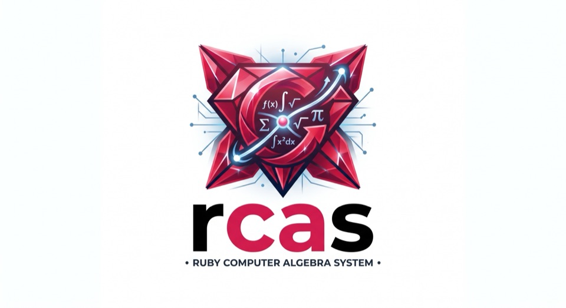

<p align="center">
  <br>
  <em>Reinventing the wheel instead of building a CAS</em>™
</p>

# rcas manual

rcas is a computer algebra system that lives inside Ruby. Symbols are
indeterminates, the ordinary operators build expression trees, and irb is the
REPL. This manual walks through everything that is finished. Every
transcript in it is checked by `test/manual_test.rb`, so the outputs are
exactly what the current code prints.

<p align="center">
  <a href="https://youtu.be/3Lm5DHgfwxo"></a><br>
  <em>Watch the tour - eight minutes, chapter by chapter</em>
</p>

Start a session with

```
$ bin/rcas
```

or use the library from Ruby with `require "rcas"`. In plain Ruby, write
variables as symbols (`:x`) and call functions on the module (`RCAS.sin`,
`RCAS.solve`), or `include RCAS::Functions`, `RCAS::Sets` and
`RCAS::Constants` to get the bare names used below.

The tour above is on [YouTube](https://youtu.be/3Lm5DHgfwxo); the file itself is
[rcas-tour.mp4](https://github.com/no-dashes/rubyCAS/releases/download/screencasts/rcas-tour.mp4)
with the releases, kept out of the repository so a clone stays small, and
[assets/rcas-intro.gif](assets/rcas-intro.gif) is a one-minute version. All
three are recorded from a real session by
[tools/screencast](tools/screencast), the same way the transcripts here are
checked - nothing in them is typed by hand.

<!-- toc -->
- [Sessions and setup](#sessions-and-setup)
- [Courses](#courses)
  - [School](#school)
  - [High school](#high-school)
  - [College](#college)
  - [University (undergraduate)](#university-undergraduate)
- [1. Mathematics](#1-mathematics)
  - [1.1 Expressions](#11-expressions)
    - [Variables and operators](#variables-and-operators)
    - [simplify, expand, factor](#simplify-expand-factor)
    - [Substitution and evaluation](#substitution-and-evaluation)
    - [Equality](#equality)
  - [1.2 Numbers and constants](#12-numbers-and-constants)
    - [Complex parts and rounding](#complex-parts-and-rounding)
    - [Integers and primes](#integers-and-primes)
  - [1.3 Calculus](#13-calculus)
    - [Derivatives](#derivatives)
    - [Antiderivatives](#antiderivatives)
    - [Definite integrals](#definite-integrals)
    - [Integrals that have names](#integrals-that-have-names)
    - [Length, area and volume](#length-area-and-volume)
    - [Numbers when the symbols run out](#numbers-when-the-symbols-run-out)
    - [As many digits as you ask for](#as-many-digits-as-you-ask-for)
    - [Curve sketching](#curve-sketching)
    - [The whole discussion](#the-whole-discussion)
    - [Several variables](#several-variables)
    - [Line and surface integrals](#line-and-surface-integrals)
    - [Green, Stokes and Gauss](#green-stokes-and-gauss)
    - [Series](#series)
    - [Formal power series](#formal-power-series)
    - [Limits](#limits)
    - [Functions defined case by case](#functions-defined-case-by-case)
    - [Fourier series](#fourier-series)
    - [Sums](#sums)
    - [Definite sums: creative telescoping](#definite-sums-creative-telescoping)
    - [Products](#products)
    - [hold and evaluate](#hold-and-evaluate)
    - [Factorials, binomials, gamma](#factorials-binomials-gamma)
    - [Trigonometric and logarithmic rewriting](#trigonometric-and-logarithmic-rewriting)
  - [1.4 Equations and solving](#14-equations-and-solving)
    - [Inequalities](#inequalities)
  - [1.5 Domains and assumptions](#15-domains-and-assumptions)
  - [1.6 Polynomial rings](#16-polynomial-rings)
    - [gcd and division of expressions](#gcd-and-division-of-expressions)
    - [Gröbner bases](#gröbner-bases)
    - [Degree and coefficients](#degree-and-coefficients)
    - [Interpolation](#interpolation)
    - [Named polynomials](#named-polynomials)
    - [Algebraic numbers](#algebraic-numbers)
    - [Finite fields](#finite-fields)
  - [1.7 Linear algebra](#17-linear-algebra)
    - [Factorizations](#factorizations)
    - [Orthogonality and least squares](#orthogonality-and-least-squares)
  - [1.8 Differential equations and recurrences](#18-differential-equations-and-recurrences)
    - [Recurrences](#recurrences)
    - [Systems](#systems)
    - [The Laplace transform](#the-laplace-transform)
  - [1.9 Geometry](#19-geometry)
  - [1.10 Statistics](#110-statistics)
    - [Descriptive statistics](#descriptive-statistics)
    - [Regression](#regression)
    - [Distributions](#distributions)
    - [Hypothesis tests](#hypothesis-tests)
    - [Confidence intervals](#confidence-intervals)
  - [1.11 Plotting](#111-plotting)
    - [Parametric and polar curves](#parametric-and-polar-curves)
    - [Surfaces in space](#surfaces-in-space)
    - [Statistical plots](#statistical-plots)
  - [1.12 The q-analogues](#112-the-q-analogues)
    - [q-summation](#q-summation)
    - [q-difference equations](#q-difference-equations)
  - [1.13 Worked solutions](#113-worked-solutions)
  - [1.14 Random objects](#114-random-objects)
  - [1.15 Performance notes](#115-performance-notes)
- [2. Reference](#2-reference)
- [3. Files](#3-files)
- [4. Sources](#4-sources)
- [5. License](#5-license)
- [Appendix A. Typeset output](#appendix-a-typeset-output)
  - [Pictures](#pictures)
- [Appendix B. rcas-chat](#appendix-b-rcas-chat)
  - [Input](#input)
  - [Claude](#claude)
  - [Output modes](#output-modes)
  - [Help](#help)
  - [Errors](#errors)
  - [Sessions](#sessions)
  - [Commands](#commands)
  - [Options and environment](#options-and-environment)
  - [Files](#files)
- [Appendix C. rcas-app](#appendix-c-rcas-app)
  - [How it is built](#how-it-is-built)
  - [Starting it](#starting-it)
  - [Input](#input)
  - [Output](#output)
  - [Commands](#commands)
  - [In the Dock, the Start menu, the applications list](#in-the-dock-the-start-menu-the-applications-list)
  - [Reaching the session, and nothing else](#reaching-the-session-and-nothing-else)
  - [Options and environment](#options-and-environment)
  - [Files](#files)
- [Appendix D. OpenMath](#appendix-d-openmath)
  - [Objects, not XML](#objects-not-xml)
  - [POPCORN, the notation for people](#popcorn-the-notation-for-people)
  - [What comes back is held](#what-comes-back-is-held)
  - [What travels](#what-travels)
  - [Nothing is lost in silence](#nothing-is-lost-in-silence)
  - [What is not there](#what-is-not-there)
  - [Files](#files)
<!-- /toc -->

## Sessions and setup

`bin/rcas` starts irb with `RCAS::IRB.setup` applied to the top-level
object:

- A bare identifier that is not yet defined (`x`, `foo_bar`) evaluates to
  the symbol of the same name and is assigned to a local variable, so after
  `e = x + 1` the variable `x` holds `:x`. An undefined name applied to
  expressions or numbers, `u(n + 1)` or `f(x)`, is an unknown function
  (the notation `rsolve` uses); with a block or other kinds of arguments
  the usual `NoMethodError` is raised, and `respond_to?` is untouched so
  Ruby's implicit conversions are unaffected. `sqr(2)` is therefore an
  unknown function called `sqr` and prints back as written - but a name one
  letter away from one rcas has says so once: "sqr is an unknown function
  (it prints back as written); did you mean sqrt?". Short names (`u`, `f`,
  `y`) are the ones people really do mean, and are left alone.
- The functions of the reference section, the constants `PI E I oo
  UNDEFINED`, the
  number sets `NN ZZ QQ RR CC` and `GF` are in scope, and `hold { ... }`
  can read the source of blocks typed at the prompt.
- Any name Ruby accepts as an identifier works, Unicode included: `α`,
  `β₁`, `φ`, `δt`. A name starting with an uppercase letter (`X`, `Δt`) is
  a constant to Ruby and therefore not available. `π` and `∞` are the
  constants `pi` and `oo`; results still print as `pi` and `oo` so that
  they can be pasted back.
- Names Ruby already uses cannot become indeterminates this way. Of the
  one- and two-letter names only `p`, `pp` and (with the JSON library)
  `j`, `jj` are affected. rcas' own `eq`, `pi` and `oo` are reserved too;
  everything else short is free.

**Caveat: the one thing rcas takes away from irb.** Everything above only
*adds* to irb. The single exception is that Kernel's printers `p`, `pp`,
`j` and `jj` are undefined on the session object so that `p` can be an
indeterminate (a prime, say). `p(expr)` therefore raises `NoMethodError` in
`bin/rcas` and `bin/rcas-chat`; use `puts expr`, `print`, or
`Kernel.p(expr)`. Plain `irb` with `require "rcas"` is unaffected.
- Results print as text. `show(obj)` typesets a value (Appendix A);
  `bin/rcas-chat` (Appendix B) shows pictures inline.
- `doc(:factor)`, `doc("ZZ")`, `doc(:Matrix)` explain one name: its
  signature, the comment above it in the source, the mathematics behind it
  and the manual sections that cover it. `bin/rcas-chat` has the same under
  `/help factor`.

**Every line is kept.** rcas numbers a session the way Mathematica does:
`In[3]` is the third input of the session and `Out[3]` is its result. A
negative number counts back, so `Out[-1]` is the previous result and
`Out[-2]` the one before it; `In` and `Out` on their own print the whole
table, one line per line. irb's own `_` (the last value) keeps working.

```
rcas> (x + 1)*(x - 1)
=> (x + 1)*(x - 1)
rcas> expand(Out[-1])
=> -1 + x**2
rcas> Out[-1] - Out[-2]
=> -1 + x**2 - (x + 1)*(x - 1)
```

Both tables hand back what was there, **held**. `Out[n]` is the value as it
was computed, never computed again, and `In[n]` is the line as it was
typed, built into an expression with `hold` (1.3) instead of being run: it
gives back the question, not the answer, and `doit` answers it.

```
rcas> integrate(sin(x), x)
=> -cos(x)
rcas> In[-1]
=> integral(sin(x), x)
rcas> In[-2].doit
=> -cos(x)
```

`In[n]` holds exactly as much as `hold { ... }` does: arithmetic, the
functions rcas knows and `integrate`, `diff`, `sum`, `product`, `limit`
stay unevaluated, while any other call is carried out: `In[n]` of a line
that read `factor(Out[1])` is the factorization and not the word, and of an
assignment is the value it assigned. A line that builds no expression at
all — a sentence for Claude, one that does not even parse — comes back as
the text that was typed. `Out.clear` (or `In.clear`) forgets the session
and starts the numbering over.

**The prompt carries the number** of the line to come, so a long session is
easy to refer back to: `rcas[3]> ` in `bin/rcas`, `[3]❯ ` in
`bin/rcas-chat`. Results keep their arrow.

```
[1]❯ (x + 1)*(x - 1)
=> (x + 1)*(x - 1)
[2]❯ expand(Out[1])
=> -1 + x**2
[3]❯ In
[1] (x + 1)*(x - 1)
[2] expand(Out[1])
[3] In
```

`RCAS.numbered = false` in `bin/rcas` (or `RCAS_NUMBERED=0`, or `/numbered
off` in `bin/rcas-chat`) gives the plain `rcas> ` prompt back. The
transcripts in this manual are printed that way, so that every line is the
Ruby you would type and nothing else; `In` and `Out` keep the session
either way.

Without the launcher, `require "rcas"` and use `:x`, `RCAS::ZZ` or
`include RCAS::Sets`, and `RCAS.sin(:x)` / `RCAS.assume(x: RCAS::ZZ)`.
Blocks passed to `hold` work in files and in irb; code assembled with
`eval` is covered too because loading rcas turns on
`RubyVM.keep_script_lines`. This holds under both of Ruby's parsers
(Prism has been the default since 3.4). A block whose source cannot be
read at all, such as `&:to_s` or code given to `ruby -e` under Prism, is
refused rather than evaluated, because evaluating it is exactly what
`hold` was asked not to do.

## Courses

rcas is written for people who are learning the mathematics, not only for
people who want the answer. These four tours say what it can do at each
stage and where to read on; everything in them is a real session.

### School

Exact arithmetic is the point: a third plus a sixth is five sixths, not
0.8333. Ruby divides integers, so write `1/2r` (or `1/2.0` when you do want
a decimal) when you mean a fraction. Prime factorization, greatest common
divisors, simple equations, distances and averages are all here, and `plot`
draws a function in the terminal. `steps` shows the working rather than
only the answer - Euclid's algorithm line by line, say.

```
rcas> 2/3r + 1/6r
=> (5/6)
rcas> factor(360)
=> 2**3*3**2*5
rcas> [gcd(84, 36), lcm(4, 6), divisors(12)]
=> [12, 12, [1, 2, 3, 4, 6, 12]]
rcas> solve(eq(3*x + 5, 17), x)
=> [4]
rcas> solve(2**x - 8, x, domain: RR)
=> [3]
rcas> cbrt(-27)
=> -3
rcas> distance(point(0, 0), point(3, 4))
=> 5
rcas> [mean([2, 4, 4, 5, 5]), median([2, 4, 4, 5, 5]), mode([2, 4, 4, 5, 5])]
=> [4, 4, [4, 5]]
```

`domain: RR` asks for the real solutions. Without it `solve` gives all of
them, and `2**x = 8` also has complex ones (`3 + 2*pi*i*k/log(2)` for every
whole k), since the exponential repeats along the imaginary axis. `cbrt` is
the real cube root, which is -3 at -27; the power `x**(1/3)` is the
principal root of complex analysis, which has no real value for a negative
x (1.2 says more).

Read on: 1.1 Expressions, 1.2 Numbers and constants, 1.9 Geometry,
1.10 Statistics, 1.11 Plotting.

### High school

Polynomials factor, quadratics and inequalities solve, and an inequality
answers with the set of solutions (`[2, 3]` here is the closed interval,
not a pair). A trigonometric equation is answered with the whole
family of its solutions, as a set; `principal: true` asks for the ones in
one period instead. Then the first calculus: derivatives,
curve sketching, definite integrals, sums, and probability. A function may
be given case by case with `piecewise`, and `discontinuities` and `kinks`
name the points where its pieces do not fit together. `discuss` answers
the whole Kurvendiskussion in one report, and `steps` writes the working
out: the rules of differentiation as they are used, the quadratic formula
with its numbers in it, the questions of a curve discussion one at a
time.

```
rcas> factor(x**2 - 5*x + 6)
=> (-2 + x)*(-3 + x)
rcas> solve(x**2 - 5*x + 6, x)
=> [2, 3]
rcas> solve(x**2 - 5*x + 6 <= 0, x)
=> [2, 3]
rcas> solve(sin(x) - 1/2r, x)
=> [{pi/6 + 2*pi*k | k in ZZ}, {5*pi/6 + 2*pi*k | k in ZZ}]
rcas> extrema(x**3 - 3*x, x)
=> [[-1, 2, :maximum], [1, -2, :minimum]]
rcas> integrate(x**2, x, 0, 3)
=> 9
rcas> sum(k, k: 1..100)
=> 5050
rcas> Binomial(10, 1/2r).probability(x >= 8)
=> 7/128
```

Read on: 1.3 Calculus, 1.4 Equations and solving, 1.6 Polynomial rings,
1.9 Geometry, 1.10 Statistics.

### College

Limits and series (`fps` gives the general coefficient, not only the first
terms, and `fourier` does the same for a Fourier series), the techniques of
integration, differential equations, matrices and
their eigenvalues, partial derivatives, and statistics with tests and
confidence intervals. The classical orthogonal polynomials - Legendre,
Chebyshev, Hermite, Laguerre - are in `Poly`. When a symbolic answer does
not exist, `nsolve` and `nintegrate` give the number instead, and say that
it is one, and `evalf(f, 50)` gives fifty digits when sixteen are not
enough. An integrand like `sin(x)/x` gets the name of its
antiderivative (`Si`), arc lengths and solids of revolution have their own
functions, and the named matrix factorizations - `lu`, `qr`, `cholesky`,
`diagonalize`, `jordan` - are all exact. A function of two variables can be
looked at: `plot3d` draws its graph as a surface, in the terminal or as a
picture.

```
rcas> limit(sin(x)/x, x, 0)
=> 1
rcas> series(exp(x), x, 0, 5)
=> 1 + x + x**2/2 + x**3/6 + x**4/24 + O(x**5)
rcas> fps(sin(x), x)
=> sum((-1)**k*x**(1 + 2*k)/(1 + 2*k)!, k, 0, oo)
rcas> integrate(1/(x**2 - 1), x)
=> log(-1 + x)/2 - log(1 + x)/2
rcas> dsolve(eq(D(y, x, 2) + y, 0), y, x)
=> [y = C1*cos(x) + C2*sin(x)]
rcas> matrix([[2, 1], [1, 2]]).eigenvalues
=> [1, 3]
rcas> gradient(x**2*y, [x, y])
=> (2*x*y, x**2)
rcas> plot3d(x**2 - y**2, x: -2..2, y: -2..2).z_range
=> -4.4..4.4
rcas> ttest([5.1, 4.9, 5.6, 5.2, 5.0], mu: 5)
=> one-sample t test: t = 1.32417, df = 4, p = 0.256044 (two-sided)
```

Read on: 1.3 Calculus, 1.7 Linear algebra, 1.8 Differential equations and
recurrences, 1.10 Statistics, 1.11 Plotting.

### University (undergraduate)

Rings and fields as objects: polynomial rings over ZZ, QQ or a finite
field, algebraic numbers with their minimal polynomials, Gröbner bases for
polynomial systems. Laplace transforms and systems of differential
equations for the applied courses, several-variable calculus up to the
line and surface integrals of a vector analysis course - `plot3d` draws
the surface such an integral is taken over - and the number theory of a
first course in it.

```
rcas> QQ[x].(x**4 - 1).factor
=> (-1 + x)*(1 + x)*(1 + x**2)
rcas> groebner([x**2 + y**2 - 1, x - y], [x, y])
=> [x - y, -1/2 + y**2]
rcas> minpoly(sqrt(2) + sqrt(3))
=> 1 - 10*x**2 + x**4
rcas> Poly.cyclotomic(12, x)
=> 1 - x**2 + x**4
rcas> GF(9).elements.first(4)
=> [0, 1, 2, a]
rcas> laplace(t*exp(3*t))
=> 1/(-3 + s)**2
rcas> dsolve([eq(D(x, t), y), eq(D(y, t), -x)], [x, y], t)
=> [x = C1*sin(t) + C2*cos(t), y = C1*cos(t) - C2*sin(t)]
rcas> [legendre(3, 7), order(3, 7)]
=> [-1, 6]
rcas> sumrecursion(binomial(n, k)**2, k, s(n))
=> s(n)*(-2 - 4*n) + s(1 + n)*(1 + n) = 0
rcas> qsolve(eq(u(q*x), (1 - t*x)*u(x)), u, x, q)
=> u(q**n) = C1*qpochhammer(t, q, n)
rcas> stokes([-y, x, 0], [u*cos(v), u*sin(v), 0], u: 0..1, v: 0..2*pi)
=> 2*pi
```

Read on: 1.5 Domains and assumptions, 1.6 Polynomial rings, 1.8
Differential equations and recurrences, 1.12 The q-analogues, and section
4, Sources, for the algorithms and where they come from.

Each name explains itself: `doc(:factor)` (or `/help factor` in the chat)
gives the signature, what the operation is mathematically, how rcas
computes it, the sources and a link to read further.

## 1. Mathematics

### 1.1 Expressions

#### Variables and operators

Inside `bin/rcas` a bare name that is not yet defined becomes an
indeterminate: the session evaluates `x` to the symbol `:x` and remembers
it as a local variable holding that symbol. Arithmetic on symbols builds
expressions and nothing is rewritten until you ask for it.

A word on terms. A Ruby *variable* such as `e` holds a value. A symbol such
as `:x` inside an expression is an *indeterminate*: it stands for nothing
in particular, and `x**2 - 1` is a formal expression, not a computation
waiting for a value. Giving an indeterminate a value is what `subs` and
`call` do; `x.in(ZZ)` restricts what it may stand for without fixing it.
For historical reasons the method that lists the indeterminates of an
expression is called `variables`, as in most computer algebra systems.

```
rcas> x + 1
=> x + 1
rcas> e = (x + 1) * (1 - x)
=> (x + 1)*(1 - x)
rcas> e.to_sexp
=> [:mul, [:add, :x, 1], [:sub, 1, :x]]
rcas> 1 - x
=> 1 - x
rcas> 2 * x**2 / 3
=> 2*x**2/3
```

The tree is printed with the minimum of parentheses that preserves it.
Output is valid Ruby apart from the variable names, so it can be pasted back.

```
rcas> x - (y - 1)
=> x - (y - 1)
rcas> x / (y * z)
=> x/(y*z)
rcas> (x**2)**3
=> (x**2)**3
rcas> -(x + 1)
=> -(x + 1)
```

#### simplify, expand, factor

`simplify` brings an expression into a canonical form: numbers are folded
exactly, like terms and like factors are merged, sums are ordered by
degree. It never distributes products over sums; `expand` does that;
`factor` goes the other way.

```
rcas> (x + x + 3 * x**2 - x**2).simplify
=> 2*x + 2*x**2
rcas> (x * x**2 / x).simplify
=> x**2
rcas> e.expand
=> 1 - x**2
rcas> ((x + y)**3).expand
=> x**3 + 3*x**2*y + 3*x*y**2 + y**3
rcas> (x**4 - 1).factor
=> (-1 + x)*(1 + x)*(1 + x**2)
rcas> (x**2 - y**2).factor
=> (x + y)*(x - y)
rcas> (6*x**2 - x - 2).factor
=> (-2 + 3*x)*(1 + 2*x)
```

Rational expressions: `cancel` puts everything over one denominator with the
polynomial gcd removed, `rationalize` clears square roots from denominators.
`numer` and `denom` return the two halves of that normal form, with integer
coefficients and a positive leading coefficient in the denominator.

```
rcas> ((x**2 - 1) / (x - 1)).cancel
=> 1 + x
rcas> (1 / (a**2 * (-1 - 1/a)) + 1/a).cancel
=> 1/(1 + a)
rcas> (1 / (1 + sqrt(2))).rationalize
=> -1 + 2**(1/2)
rcas> [numer(1/x + 1/(x + 1)), denom(1/x + 1/(x + 1))]
=> [1 + 2*x, x + x**2]
rcas> [numer(x/2), denom(x/2), numer(3/4r), denom(sin(x)/x**2)]
=> [x, 2, 3, x**2]
```

`apart` is the partial fraction decomposition over QQ: a polynomial part,
then one term per power of each irreducible factor of the denominator.
Other indeterminates are parameters; name the one to decompose in when
there are several.

```
rcas> apart(1/(x**2 - 1))
=> 1/(2*(-1 + x)) - 1/(2*(1 + x))
rcas> apart((x + 1)/(x**2*(x - 1)))
=> 2/(-1 + x) - 2/x - 1/x**2
rcas> apart(x**3/(x**2 + 1))
=> x - x/(1 + x**2)
rcas> apart((x**2 + x + 1)/((x - 1)**2*(x**2 + 1)))
=> 3/(2*(-1 + x)**2) - 1/(2*(1 + x**2))
rcas> apart(1/(x**2 - a**2), x)
=> -1/(2*a*(a + x)) - 1/(2*a*(a - x))
rcas> apart(1/(x**2 - 2))
=> 1/(-2 + x**2)
```

The last denominator is irreducible over QQ, so nothing splits; `apart`
does not introduce algebraic numbers. The rewriting methods also exist as
functions, MuPAD and Maple style: `simplify(f)`, `expand(f)`, `cancel(f)`,
`rationalize(f)`.

#### Substitution and evaluation

```
rcas> f = x**2 + y
=> x**2 + y
rcas> f.subs(x: 3)
=> 3**2 + y
rcas> f.subs(x: 3).simplify
=> 9 + y
rcas> f.subs(x**2 => z)
=> z + y
rcas> f.call(x: 3, y: 1)
=> 10
rcas> (x**2 + 1).(9)
=> 82
rcas> (x + y).(1, 2)
=> 3
rcas> [1, 2, 3].map(&(x**2))
=> [1, 4, 9]
rcas> f.variables
=> [:x, :y]
```

`call` (and the `.()` shorthand) returns a plain Ruby number when every
variable is bound. Positional arguments bind the variables in sorted order.
`evalf` evaluates numerically, turning every exact number into a float;
`to_f` does the same for a constant expression.

```
rcas> (sqrt(2) * x).evalf(x: 3)
=> 4.242640687119286
rcas> (PI**2 / 6).to_f
=> 1.6449340668482262
rcas> subs(x**2 + 1, x: 3)
=> 3**2 + 1
rcas> evalf(pi)
=> 3.141592653589793
```

`subs`, `evalf` and `diff` exist as functions as well as methods.

#### Equality

`==` is structural: two expressions are equal when they are the same tree.
Compare canonical forms when you mean mathematical equality.

```
rcas> x + 1 == 1 + x
=> false
rcas> (x + 1).simplify == (1 + x).simplify
=> true
rcas> (x - x).simplify == 0
=> true
```

### 1.2 Numbers and constants

Integers and rationals stay exact, floats stay floats. `1/2` in Ruby is
integer division, so write `1/2r` (or `Rational(1, 2)`) for one half.

```
rcas> (x / 2 + x / 3).simplify
=> 5*x/6
rcas> (x * 1/2r).simplify
=> x/2
rcas> (2**100).to_s.size
=> 31
rcas> sqrt(32)
=> 4*2**(1/2)
rcas> sqrt(-4)
=> 2*i
rcas> log(8)
=> 3*log(2)
rcas> [cbrt(-8), surd(-32, 5), root(-8, 3)]
=> [-2, -2, (-8)**(1/3)]
rcas> root(-8, 3).evalf
=> (1.0+1.7320508075688772i)
```

There are two cube roots of -8 a reader may mean. `x**(1/n)` and
`root(x, n)` are the *principal* root, the one complex analysis uses and
MuPAD, Maple, Mathematica and SymPy write the same way: for -8 it is
`2*exp(i*pi/3) = 1 + i*sqrt(3)`, and it has no real value for any negative
x. `surd(x, n)` is the *real* root (MuPAD's and Maple's name), `-|x|**(1/n)`
for a negative x and an odd n; an even n has none there (`undefined`).
`cbrt(x)` is `surd(x, 3)`, as Mathematica's `CubeRoot` is, since that is
what the cube root key of a calculator gives. Every path agrees with the
choice: `evalf` in Floats and at more digits, `real_domain`
(`x**(1/3)` is real on `[0, oo)`, `surd(x, 3)` everywhere), `solve`
(`surd(x, 3) = -2` at -8, `x**(1/3) = -2` nowhere), and `discuss` and
`plot` of `x**(1/3)`, which add a note pointing at `surd`.

`PI`, `E` and `I` are the exact constants (`pi` and `π` work as bare
names too); `oo` and `∞` are infinity, used as a limit point and a
summation bound. A function
applied to a constant folds right away, the way Ruby folds `1 + 2`; an
operator expression such as `I**2` is kept as written until `simplify`.

```
rcas> [sin(PI/6), cos(PI/4), tan(PI/4), sin(PI)]
=> [1/2, 2**(1/2)/2, 1, 0]
rcas> [sin(π/6), limit(1/x, x: ∞)]
=> [1/2, 0]
rcas> [exp(I*PI), (I**2).simplify, ((1 + 2*I)*(1 - 2*I)).expand]
=> [-1, -1, 5]
rcas> [(E**x).simplify, log(E), (E**2 * E).simplify]
=> [exp(x), 1, exp(3)]
rcas> [asin(1/2r), acos(0), atan(1)]
=> [pi/6, pi/2, pi/4]
rcas> [cos(acos(2)), sin(asin(x + 1)).simplify, acos(cos(5))]
=> [2, 1 + x, acos(cos(5))]
rcas> evalf(acos(2))
=> (0.0-1.3169578969248166i)
rcas> sin(PI/5)
=> sin(pi/5)
rcas> sin(x)
=> sin(x)
```

A function undoes its own inverse whatever the argument is - that is the
direction that always holds, while `acos(cos(5))` is `5` only on the
interval `acos` answers in, so it stays. And `acos` of a number past that
interval is not an error but a value off the real line, which is why
`solve(cos(x) - 2, x)` has an answer at all.

Infinity is a value, not a number: it absorbs what is finite and says so
when a calculation asks it something it cannot answer. `oo - oo`, `oo/oo`
and `0*oo` are `undefined`, which is a constant of its own and stays
undefined through whatever it meets.

```
rcas> [(2*oo).simplify, (oo/2).simplify, (oo**2).simplify, (1/oo).simplify]
=> [oo, oo, oo, 0]
rcas> [(oo - 2).simplify, (oo + oo).simplify]
=> [oo, oo]
rcas> [(oo - oo).simplify, (oo/oo).simplify, (0*oo).simplify]
=> [undefined, undefined, undefined]
rcas> (x*oo).simplify
=> oo*x
```

The last one is not `oo`: the sign of `x` is unknown, and `0*oo` is
undefined, so the product says nothing until `x` does.

A power of an exact 1 is 1, and so is an exact zeroth power, infinity or
not: `1**t` and `t**0` are 1 for every `t`.

```
rcas> [(1**oo).simplify, (oo**0).simplify]
=> [1, 1]
rcas> limit((1 + 1/x)**x, x, oo)
=> e
```

The "indeterminate form 1**oo" of the calculus books is the second line: a
base that *tends* to 1, which is a limit and has to be asked as one.
Substituting `oo` and simplifying answers a different question -
`((1 + 1/x)**x).subs(x: oo).simplify` is `1`, because `1/oo` is 0 first.

The functions are `sin cos tan asin acos atan exp log sinh cosh sqrt zeta`.
`sqrt(x)` is `x**(1/2)`, and `exp(a)*exp(b)` merges into `exp(a + b)`.

```
rcas> (exp(x) * exp(2*x)).simplify
=> exp(3*x)
rcas> (exp(x)**2).simplify
=> exp(2*x)
rcas> sin(-x).simplify
=> -sin(x)
rcas> zeta(2)
=> pi**2/6
```

#### Complex parts and rounding

`re`, `im`, `conj` and `arg` split an expression by its complex
coefficients after expansion. A variable counts as real only once it is
assumed so (`assume(x: RR)`); until then `re(x)` stays `re(x)`, as in
Maple and Mathematica. `arg` is exact for the angles the `atan` table
knows and a float otherwise. `floor`, `ceil`, `round` and `mod` fold on
numbers and stay symbolic on expressions.

```
rcas> [re(3 + 2*I), im((1 + I)**2), conj(2 - 3*I)]
=> [3, 2, 2 + 3*i]
rcas> [arg(-1), arg(I), arg(1 + I), arg(-1 - I)]
=> [pi, pi/2, pi/4, -3*pi/4]
rcas> re(x + I*y)
=> -im(y) + re(x)
rcas> assume(x: RR, y: RR)
=> true
rcas> [re(x + I*y), im((x + I*y)**2), conj(x + I*y)]
=> [x, 2*x*y, x - i*y]
rcas> forget
=> true
rcas> [floor(7/2r), ceil(7/2r), round(5/2r), floor(-7/2r), mod(-7, 3), floor(x)]
=> [3, 4, 3, -4, 2, floor(x)]
```

The same caution applies to the two rules that look like plain algebra,
`exp(u)**v = exp(u*v)` and `log(exp(u)) = u`. Both are about branches, and
both are false off the real line: `exp(2*pi*i)` is 1, whose square root is
1, while `exp(pi*i)` is -1, and `log(exp(2*pi*i))` is `log(1) = 0` rather
than `2*pi*i`. rcas applies them when the choice of branch cannot change -
for an integer exponent, which is a repeated product, and for a `u` that is
known to be real - and otherwise leaves the expression as it stands, so
that simplifying and substituting may be done in either order.

```
rcas> sqrt(exp(x)).simplify
=> exp(x)**(1/2)
rcas> sqrt(exp(x)).subs(x: 2*I*PI).simplify
=> 1
rcas> sqrt(exp(x)).simplify.subs(x: 2*I*PI).simplify
=> 1
rcas> [exp(x)**2, 1/exp(x)].map(&:simplify)
=> [exp(2*x), exp(-x)]
rcas> assume(x: RR)
=> true
rcas> [sqrt(exp(x)).simplify, log(exp(x)).simplify]
=> [exp(x/2), x]
rcas> forget
=> true
```

#### Integers and primes

`factor` on an integer or rational gives its prime factorization, an
object with `unit`, `factors` (prime and exponent pairs), `primes`,
`expand` and `prime?`; `ifactor` is the same function under Maple's name.
Trial division by small primes is followed by Pollard's rho method, which
handles factors of a dozen digits or so; `isprime` is a Miller-Rabin test
that is exact below 3.3e24 and a strong probable-prime test beyond.

```
rcas> factor(360)
=> 2**3*3**2*5
rcas> [factor(360).factors, factor(360).unit, factor(4/9r), factor(-12)]
=> [[[2, 3], [3, 2], [5, 1]], 1, 2**2/3**2, -(2**2*3)]
rcas> factor(2**67 - 1)
=> 193707721*761838257287
rcas> [isprime(97), isprime(2**61 - 1), isprime(2**64 + 1)]
=> [true, true, false]
rcas> [nextprime(100), prevprime(100), divisors(12), totient(12)]
=> [101, 97, [1, 2, 3, 4, 6, 12], 4]
rcas> [invmod(3, 7), chrem([2, 3], [3, 5]), 3.pow(100, 7), 12.gcd(18)]
=> [5, 8, 4, 6]
```

`chrem(residues, moduli)` solves the simultaneous congruences (the moduli
need not be coprime; an inconsistent system raises). Modular powers, gcd
and lcm of integers are Ruby's own `pow(e, m)`, `gcd` and `lcm`.
`bernoulli`, `fibonacci` and `harmonic` give exact values of the classical
sequences and stay symbolic on a symbolic argument.

```
rcas> [bernoulli(12), fibonacci(100), harmonic(4)]
=> [-691/2730, 354224848179261915075, 25/12]
```

Modular arithmetic has its own vocabulary: `congruence(f, x, m)` solves
f = 0 modulo m and returns the residues, `legendre(a, p)` says whether a is
a square modulo an odd prime (`jacobi` extends it to odd composites),
`order(a, m)` is the multiplicative order and `primitive_root(m)` a
generator. `continued_fraction` and `convergents` give the best rational
approximations of a number.

```
rcas> congruence(3*z - 4, z, 7)
=> [6]
rcas> congruence(z**2 - 1, z, 8)
=> [1, 3, 5, 7]
rcas> [legendre(2, 7), legendre(3, 7), jacobi(1001, 9907)]
=> [1, -1, -1]
rcas> [order(3, 7), primitive_root(7)]
=> [6, 3]
rcas> continued_fraction(415/93r)
=> [4, 2, 6, 7]
rcas> convergents(PI.evalf, 4)
=> [(3/1), (22/7), (333/106), (355/113)]
```

### 1.3 Calculus

#### Derivatives

```
rcas> (x**3 + sin(x)).diff(x)
=> cos(x) + 3*x**2
rcas> (x**x).diff(x)
=> x**x*(1 + log(x))
rcas> exp(x**2).diff(x)
=> 2*x*exp(x**2)
rcas> (x**3).diff(x, 2)
=> 6*x
rcas> diff(x**3, x, 2)
=> 6*x
rcas> atan(x).diff(x)
=> 1/(1 + x**2)
```

#### Antiderivatives

`integrate(f, x)` (or `f.integrate(x)`) returns an antiderivative without
the constant. Whatever cannot be integrated stays as an `integral(...)`
node, so partial results remain usable and `diff` undoes `integrate`.
Four layers are tried in order for every term:

1. **Rules.** Linearity and constant factors, a table for `u**n`, `1/u`,
   `c**u` and `exp sin cos tan log atan sinh cosh` of a linear argument,
   derivative-divides substitution (`x*exp(x**2)`, `sin(x)*cos(x)**3`,
   `log(x)/x`), and integration by parts for a polynomial times an
   exponential or trigonometric factor and for a factor that gets simpler
   when differentiated (`log atan asin acos erf erfc`). Absolute values and
   signs of a linear argument belong here too: `abs(u)` is `u*sign(u)`, and
   `sign(u)` is constant on each side of the root of `u`, so it comes out of
   the integral; the constant of integration is then chosen to make the
   antiderivative continuous at that root, which is what a definite integral
   across it needs.
2. **Rational functions, exactly.** Hermite reduction strips repeated
   denominator factors; the logarithmic part comes from the
   Rothstein-Trager resultant, whose rational roots give `log` terms and
   whose quadratic irreducible factors give `log` plus `atan` with square
   roots. When a root has degree three or more, the denominator is split
   into partial fractions over its irreducible factors, and a quartic
   without odd powers, `x**4 + a*x**2 + b`, is decomposed into real
   quadratic factors: `(x**2 + s*x + t)*(x**2 - s*x + t)` with `t = sqrt(b)`
   and `s = sqrt(2*t - a)`, or `(x**2 + p)*(x**2 + q)` when `a**2 - 4*b` is
   positive. That is what turns `1/(x**4 + 1)` into two logarithms and two
   arc tangents. Anything else is left as an `integral(...)`.
3. **Risch-Norman heuristic.** The integrand is written as a Laurent
   polynomial in `x` and its transcendental atoms (`exp(u)`, `log(u)`,
   `sin(u)`/`cos(u)`, `sinh`/`cosh`, `atan`, `c**u`, roots such as
   `x**(1/2)`, polynomial denominators). An ansatz of the same shape plus
   `log` terms is differentiated symbolically, `sin**2 + cos**2 = 1` is
   reduced away, and the undetermined coefficients are found as an exact
   linear system over QQ. A final linear substitution (`v = x + 1`)
   rescues integrands like `x*exp(x)/(x + 1)**2`.
4. **Rationalizing substitutions.** An integrand that is a rational function
   of `x` and `sqrt(a*x**2 + b*x + c)` is split into a rational part and
   `P(x)/sqrt(Q)` pieces, which reduce to `S(x)*sqrt(Q)` plus the two basic
   forms `log(sqrt(Q) + ...)` and `asin(...)`; linear denominators go through
   `x - alpha = 1/t`. Roots of a linear form (`sqrt(x)/(1 + x)`) or of a ratio
   of two linear forms (`sqrt((1 - x)/(1 + x))`, the Möbius substitution), rational
   functions of `exp(k*x)` (also `sinh`, `cosh`) and of `sin(x)`, `cos(x)`
   (`tan(x/2)`, the Weierstrass substitution) become rational functions of
   the new variable and are handed to layer 2. Even powers of `sin` or `cos`
   over an odd power of the other are rewritten with `sin**2 + cos**2 = 1`
   first, so `sin(x)**2/cos(x)` comes out as `log((1 + sin(x))/cos(x)) -
   sin(x)` rather than in `tan(x/2)`.


```
rcas> integrate(abs(x), x)
=> x**2*sign(x)/2
rcas> integrate(abs(x - 1), x: 0..3)
=> 5/2
rcas> integrate(erf(x), x)
=> exp(-x**2)/pi**(1/2) + x*erf(x)
rcas> integrate(x/(x**4 + x**2 + 1), x)
=> 3**(1/2)*atan(3**(1/2)*(1 + 2*x**2)/3)/3
rcas> integrate(1/(x**4 + 1), x: 0..oo)
=> 2**(1/2)*pi/4
rcas> integrate(sqrt((1 - x)/(1 + x)), x)
=> 2*((1 - x)/(1 + x))**(1/2)/(1 + (1 - x)/(1 + x)) - 2*atan(((1 - x)/(1 + x))**(1/2))
rcas> integrate(floor(x), x)
=> integral(floor(x), x)
```

An antiderivative with a parameter says where it stops holding: at the
values that make a denominator of the generic answer vanish, the
integrand is integrated again, and the answer is a `piecewise` - the
branch shows why `a = 0` is different. `generic: true` gives the short
form alone (MuPAD's `IgnoreSpecialCases`).

```
rcas> integrate(cos(a*x), x)
=> piecewise(a.eq(0) => x, :else => sin(a*x)/a)
rcas> integrate(x**a, x)
=> piecewise(a.eq(-1) => log(x), :else => x**(1 + a)/(1 + a))
rcas> integrate(cos(a*x), x, generic: true)
=> sin(a*x)/a
```

A denominator in two parameters gives a value in terms of the other one,
and that branch can have special values of its own. A definite integral
lists its special values the same way:

```
rcas> integrate(exp(a*x)*exp(-b*x), x)
=> piecewise(a.eq(b) => x, :else => exp(a*x - b*x)/(a - b))
rcas> integrate(cos(a*x), x, 0, PI)
=> piecewise(a.eq(0) => pi, :else => sin(pi*a)/a)
```

What rcas does not state yet is when the integral *converges*:
`integrate(x**a, x, 0, 1)` answers `1/(1 + a)` for every `a` other than
-1, although the integral diverges for `a < -1`.

The same machinery gives `sqrt(tan(x))` in logarithms and arc tangents, by
way of the quartic denominator that the substitution `t = sqrt(tan(x))`
leaves behind. An integrand rcas cannot even differentiate, `floor(x)` or an
unknown function, stays an `integral(...)` instead of raising.

Antiderivatives with square roots and logarithms are formal: differentiating
them gives back the integrand wherever both are real, and at a singularity of
the integrand the constant may jump (as in every CAS). Irreducible quadratic
denominators under a root (`1/((x**2 + 1)*sqrt(x**2 + 2))`) and radicands of
degree three or more are left as `integral(...)`, and so is a rational
function whose denominator needs a real factor of degree three or more
(`1/(x**3 - 2)`, `1/(x**8 + 1)`).

The test suite checks every antiderivative by differentiating it and
comparing numerically with the integrand at a few points.

```
rcas> integrate(x**2 * exp(x), x)
=> 2*exp(x) - 2*x*exp(x) + x**2*exp(x)
rcas> integrate(x * log(x), x)
=> -x**2/4 + x**2*log(x)/2
rcas> integrate(1 / (x**2 + 1), x)
=> atan(x)
rcas> integrate(1 / (x**3 + 1), x)
=> log(1 + x)/3 - log(1 - x + x**2)/6 + 3**(1/2)*atan(3**(1/2)*(-1 + 2*x)/3)/3
rcas> integrate((x**3 + 1) / (x**2 * (x + 1)**2), x)
=> -1/x + 3*log(1 + x) - 2*log(x)
rcas> integrate(exp(x) * sin(x), x)
=> -(cos(x)*exp(x))/2 + exp(x)*sin(x)/2
rcas> integrate(sin(x)**2, x)
=> x/2 - cos(x)*sin(x)/2
rcas> integrate(exp(x) / (1 + exp(x)), x)
=> log(1 + exp(x))
rcas> integrate(exp(sqrt(x)) / sqrt(x), x)
=> 2*exp(x**(1/2))
rcas> integrate(exp(-x**4) + x, x)
=> integral(exp(-x**4), x) + x**2/2
rcas> integrate(exp(-x**2), x)
=> pi**(1/2)*erf(x)/2
rcas> integrate(sqrt(x**2 + 1), x)
=> log((1 + x**2)**(1/2) + x)/2 + x*(1 + x**2)**(1/2)/2
rcas> integrate(sqrt(1 - x**2), x)
=> asin(x)/2 + x*(1 - x**2)**(1/2)/2
rcas> integrate(1/(x*sqrt(x**2 - 1)), x)
=> atan((-1 + x**2)**(1/2))
rcas> integrate(sqrt(x)/(1 + x), x)
=> -2*atan(x**(1/2)) + 2*x**(1/2)
rcas> integrate(1/(1 + exp(x)), x)
=> -log(1 + exp(x)) + x
rcas> integrate(1/cos(x), x)
=> log((1 + sin(x))/cos(x))
rcas> integrate(1/(2 + cos(x)), x)
=> 2*3**(1/2)*atan(3**(1/2)*tan(x/2)/3)/3
```

#### Definite integrals

Give the bounds positionally or as a range on the variable; an endless
range means infinity. Improper integrals go through limits.

```
rcas> integrate(x**2, x, 0, 1)
=> 1/3
rcas> integrate(sin(x), x: 0..PI)
=> 2
rcas> integrate(exp(-x), x: 0..)
=> 1
rcas> integrate(1 / (1 + x**2), x: -oo..oo)
=> pi
rcas> integrate(log(x), x: 0..1)
=> -1
rcas> integrate(sqrt(1 - x**2), x: -1..1)
=> pi/2
rcas> integrate(exp(-x**2), x: 0..1)
=> pi**(1/2)*erf(1)/2
rcas> integrate(exp(-x**2), x: -oo..oo)
=> pi**(1/2)
```

`F(b) - F(a)` is the answer only where the integrand is continuous, so a
pole between the bounds splits the integral and each piece is taken to the
pole as a one-sided limit. A divergent integral comes back as `oo` or
`undefined` rather than as the number the unsplit subtraction would give
(`integrate(1/x**2, x, -1, 1)` is not `-2`: the integrand is positive).

```
rcas> integrate(1/x**2, x, -1, 1)
=> oo
rcas> integrate(1/x**3, x, -1, 1)
=> undefined
rcas> integrate(1/x, x, -1, 1)
=> undefined
rcas> integrate(tan(x), x, 0, PI)
=> undefined
rcas> integrate(x, x: -oo..oo)
=> undefined
rcas> integrate(1/(x - 3), x, 0, 1)
=> log(2) - log(3)
```

The antiderivative used on each piece is the real one: `log(abs(u))`, not
`log(u)`, so an integral over negative numbers stays real.

```
rcas> integrate(1/x, x, -2, -1)
=> -log(2)
```

An antiderivative can jump where the integrand does not - the substitution
`t = tan(x/2)`, which is what makes a rational function of `sin` and `cos`
integrable, breaks at every odd multiple of `pi` - so those points split
the integral as well.

```
rcas> integrate(1/(2 + cos(x)), x, 0, 2*PI)
=> 2*3**(1/2)*pi/3
rcas> integrate(1/(2 + cos(x)), x, 0, PI)
=> 3**(1/2)*pi/3
```

The same goes for an `atan(p/q)` in the antiderivative, which jumps where
`q` vanishes: the one for `(x**2 + 1)/(x**4 + 1)` breaks at `x = 0`. And a
pole whose place depends on a parameter may lie between the bounds or not,
so the integral stays formal until an assumption settles it - for `a = 1/2`
the integrand below is positive and the integral diverges, while the
formula a CAS would write down says `-4`.

```
rcas> integrate((x**2 + 1)/(x**4 + 1), x, -3, 3).evalf
=> 3.753289434477252
rcas> integrate(1/(x - a)**2, x, 0, 1)
=> integral(1/(-a + x)**2, x, 0, 1)
rcas> assume(a < 0) { integrate(1/(x - a)**2, x, 0, 1) }
=> -1/(1 - a) - 1/a
```

#### Integrals that have names

Some integrands have no elementary antiderivative but have a named one,
and saying so is more use than an unevaluated `integral(...)`. `Si` and
`Ci` are the sine and cosine integrals, `Ei` the exponential integral and
`li = Ei(log(x))` the logarithmic integral that counts primes.

```
rcas> integrate(sin(x)/x, x)
=> Si(x)
rcas> integrate(exp(x)/x, x)
=> Ei(x)
rcas> integrate(1/log(x), x)
=> li(x)
rcas> integrate(exp(x)/(x + 1), x)
=> Ei(1 + x)/e
rcas> integrate(sin(x)/x, x: 0..oo)
=> pi/2
rcas> integrate(sin(x)/x, x: 0..1).evalf
=> 0.946083070367183
rcas> diff(Si(x), x)
=> sin(x)/x
rcas> dsolve(eq(D(y, x, 2) + y, 1/x), y, x)
=> [y = C1*cos(x) + C2*sin(x) + Ci(x)*sin(x) - Si(x)*cos(x)]
```

They know their own derivatives, their values at `0` and at infinity (so
`integral(sin(x)/x)` from `0` to `oo` is Dirichlet's `pi/2`), and `evalf`
gives their numbers. They also turn up where they should: the equation
`y'' + y = 1/x` above is solved by variation of parameters, and what that
leaves is exactly `Si` and `Ci`.

#### Length, area and volume

The three questions a first course in integration ends with.
`arclength(f, x: a..b)` is `integral(sqrt(1 + f'**2))` for a graph and
`integral(sqrt(x'**2 + y'**2))` for a parametric curve `[x(t), y(t)]`, in
space with three components;
`revolution_volume` and `revolution_surface` turn a graph about the x-axis
(or about the y-axis with `axis: :y`, which is the shell formula). A radius
is the distance to the axis and never negative, so it is `abs(f)` or
`abs(x)` unless the sign on the range has been *proved* - which means
naming the zeros of the radius and finding none inside the range, since a
handful of samples can step over one. The shells stand on one side of the
axis, and a range that crosses it is refused rather than counted twice.

```
rcas> arclength(x**2, x: 0..1)
=> 5**(1/2)/2 - log(2)/4 + log(4 + 2*5**(1/2))/4
rcas> arclength(x**2, x: 0..1).evalf
=> 1.4789428575445975
rcas> arclength([cos(t), sin(t)], t: 0..pi)
=> pi
rcas> revolution_volume(sqrt(x), x: 0..1)
=> pi/2
rcas> revolution_volume(sqrt(1 - x**2), x: -1..1)
=> 4*pi/3
rcas> revolution_surface(x, x: 0..1)
=> 2**(1/2)*pi
rcas> revolution_surface(-1, x: 0..1)
=> 2*pi
rcas> revolution_volume(1, x: -1..0, axis: :y)
=> pi
```

The square root of a polynomial rarely has an elementary antiderivative,
so an arc length often stays an `integral(...)` node; `evalf` finishes it.

#### Numbers when the symbols run out

Not every equation has a solution in closed form, and most functions have
no elementary antiderivative. `nsolve` finds a root as a decimal, from a
bracketing range or a starting point, and `nintegrate` computes a definite
integral, infinite bounds included. `evalf` on an unevaluated `integral`
does the same, so a formal answer can always be turned into a number. These
results are Floats and print as such; an exact answer is never quietly
replaced by one.

```
rcas> nsolve(cos(x) - x, x: 0..1)
=> 0.7390851332151607
rcas> nsolve(x**3 - 2*x - 5, x, 2)
=> 2.0945514815423265
rcas> nintegrate(sin(x)/x, x: 0..1)
=> 0.946083070367183
rcas> nintegrate(exp(-x**2), x: -oo..oo)
=> 1.772453850905516
rcas> integrate(exp(-x**4), x: 0..1).evalf
=> 0.8448385947571024
```

`nintegrate` tries adaptive Simpson first, with a budget it cannot
exceed, and falls back to the tanh-sinh quadrature of the `digits:` form
when that does not settle - so a smooth integrand costs a millisecond and
an endpoint singularity is still no harder than anything else. Simpson's
answer is checked against a second rule whose sample points are nowhere
near its own, because halving the interval can sample a periodic
integrand at the same phase every time and agree with itself about a
wrong number. An integrand neither method settles is reported rather than
subdivided for ever.

A function changes sign across a pole as it does across a root, so a
bracket that contains one is refused rather than answered: `1/x` has no
root between -1 and 1. So is a jump - a step from -1 to 1 changes sign
without ever being 0. The answer is where the bracket has closed to the
last digit a Float carries, not where the value first looks small:
`exp(-50*x)*(x - 1/2)` is 1e-22 at 1 and has its root at 1/2.

```
rcas> nsolve(1/x - 2, x: 0.1..2)
=> 0.5
rcas> nsolve(tan(x), x: 3..4)
=> 3.141592653589793
```

#### As many digits as you ask for

`evalf(f, 50)` (or `evalf(f, digits: 50)`) computes to that many
significant digits instead of the sixteen a Float carries. The tree is
walked in `BigDecimal` with ten guard digits and rounded once at the end,
so the digits that come back are the digits that are right.

```
rcas> evalf(pi, 50)
=> 3.1415926535897932384626433832795028841971693993751
rcas> evalf(pi)
=> 3.141592653589793
rcas> evalf(sqrt(2), 40)
=> 1.41421356237309504880168872420969807857
rcas> evalf(exp(1), 30)
=> 2.71828182845904523536028747135
rcas> evalf(1/3r, 25)
=> 0.3333333333333333333333333
rcas> evalf(sin(1)**2 + cos(1)**2, 40)
=> 1.0
rcas> evalf(solve(x**5 - x - 1, x).first, 40)
=> 1.167303978261418684256045899854842180721
rcas> evalf(0.1 * pi, 50)
=> 0.3141592653589793
```

The last two lines are the point of the exercise. An algebraic number is
refined from its double-precision value by Newton's method, so a root that
has no formula still has all the digits you want. And a `Float` in the
expression carries only its own sixteen digits, so the answer is reported
with sixteen however many were asked for: padding them out to fifty would
be inventing thirty-four.

A zero is the one answer that more digits cannot confirm. A value of
`10**-200` looks like 0 at 30 digits, and like 0 again at 60. So rcas
keeps raising the working precision until the digits appear, and it
returns 0 only when it can *prove* the value is exactly zero. For an
algebraic number that proof is a root separation bound; otherwise it is
a normal form, such as the logarithms of the primes. An identity that
rcas cannot prove is refused rather than rounded:

```
rcas> evalf(sin(pi + 10**-200), 30)
=> -1.0e-200
rcas> evalf(log(6) - log(2) - log(3), 30)
=> 0.0
rcas> evalf(atan(1/2r) + atan(1/3r) - pi/4, 30)
=> RCAS::Precision::NoConvergence: evalf: atan(1/2) + atan(1/3) - pi/4 could not be certified to 30 digits; the working precision ran out before two evaluations agreed (it is 0 to 660 digits, and rcas cannot prove it is exactly 0)
```

The constants, `exp`, `log`, the trigonometric and hyperbolic functions
and their inverses, roots, powers, a finite `sum` and a real `RootOf` are
all there, and so are the ones `BigMath` does not have: `erf` and `erfc`,
`Si`, `Ci`, `Ei` and `li` by their series, `zeta` by Euler-Maclaurin, and
Euler's constant itself by Brent and McMillan's algorithm. `nsolve` and
`nintegrate` take `digits:` too - a root is refined by Newton's method,
and an integral is computed by the double-exponential rule, which handles
a singular endpoint and an infinite range without being asked. A definite
`integral(...)` that nothing could do symbolically goes the same way.

```
rcas> evalf(erf(1), 30)
=> 0.842700792949714869341220635083
rcas> evalf(zeta(3), 30)
=> 1.20205690315959428539973816151
rcas> nsolve(cos(x) - x, x: 0..1, digits: 40)
=> 0.7390851332151606416553120876738734040134
rcas> nintegrate(1/sqrt(x), x: 0..1, digits: 30)
=> 2.0
rcas> nintegrate(exp(-x**2), x: 0..oo, digits: 30)
=> 0.886226925452758013649083741671
rcas> evalf(integrate(exp(-x**4), x: 0..1), 30)
=> 0.8448385947571024007640469307
```

What is left raises `Precision::Unsupported` and names itself, rather than
dressing up sixteen good digits as fifty: an indefinite integral, a
complex value, `zeta` at a fraction, an unknown function, and an argument
so large that the series for it would cancel away more digits than the
working precision can make up. Plain `evalf` still answers what it can.

The result is an `RCAS::Decimal`: a `Numeric` that remembers how many
digits it is good for, prints them, and goes back into an expression like
any other number.

#### Curve sketching

The questions asked of a graph: where it turns, where it bends the other
way, which lines it approaches, what its tangent is, and where it is
defined at all.

```
rcas> extrema(x**3 - 3*x, x)
=> [[-1, 2, :maximum], [1, -2, :minimum]]
rcas> inflections(x**3 - 3*x, x)
=> [0]
rcas> asymptotes((x**2 + 1)/x, x)
=> {:vertical=>[0], :horizontal=>[], :oblique=>[x]}
rcas> tangent(x**2, x, 1)
=> -1 + 2*x
rcas> real_domain(log(x - 1), x)
=> (1, oo)
rcas> real_domain(asin(x)/x, x)
=> [-1, 0) ∪ (0, 1]
rcas> real_domain(log(-1) + x, x)
=> {}
rcas> real_domain(log(2) + x, x)
=> (-oo, oo)
rcas> assume(a < 0) { real_domain(log(a) + x, x) }
=> {}
rcas> real_domain(x**(1/3r), x)
=> [0, oo)
rcas> real_domain(surd(x, 3), x)
=> (-oo, oo)
rcas> real_domain(I*x, x)
=> {}
rcas> assume(x: RR) { solve(im(I*x), x) }
=> [0]
```

`real_domain` collects one condition per denominator, even root and
logarithm, and two for each `asin` or `acos`, which are bounded at both
ends; a condition it cannot solve is named rather than quietly dropped, and
a condition on a constant is decided rather than skipped - `log(-1) + x` is
real nowhere. A condition on a *parameter* is decided from the assumptions
in force (`assume(a < 0)` makes `log(a) + x` real nowhere) and refused by
name when they do not settle it, since the honest answer would then be a
case split on the parameter rather than a set of reals. A point belongs to
the real domain when *every subexpression* is real and defined there -
the rule Mathematica documents for `FunctionDomain` - so an expression that
carries `i`, or a constant such as `log(-2)`, has an empty real domain,
however its value falls: `i*x` is real nowhere as a function. Where the
*value* of an expression is real is a different question, asked as
`solve(im(f) == 0, x)`: `{0}` for `i*x`.

`extrema` returns the point, the value and the kind. The second derivative
decides; where that vanishes too, as for `x**4`, the sign of the first
derivative on either side does. `asymptotes` gives the vertical ones from
the poles and the horizontal or oblique ones from the limits at infinity.

#### The whole discussion

`discuss(f, x)` asks all of those questions at once, in the order a course
asks them, and answers them in one report: where the function is defined,
whether it is symmetric or periodic, its zeros and its value at 0, the
gaps and what happens at them, the limits at infinity together with the
lines the graph approaches, and then the extrema, where it rises and
falls, its inflections and where it bends which way. Continental schools
drill the ritual under a name of its own - *Kurvendiskussion* in German,
*étude de fonction* in French, *studio di funzione* in Italian; English
calls the same work curve sketching.

```
rcas> discuss(x**3 - 3*x, x)
=> f(x) = x**3 - 3*x
     domain       (-oo, oo)
     symmetry     odd: f(-x) = -f(x), symmetric about the origin
     zeros        -3**(1/2), 0, 3**(1/2)
     y intercept  f(0) = 0
     at infinity  f -> -oo as x -> -oo; f -> oo as x -> oo
     asymptotes   none
     extrema      maximum at (-1, 2); minimum at (1, -2)
     monotonic    increasing on (-oo, -1), decreasing on (-1, 1), increasing on (1, oo)
     inflections  (0, 0)
     curvature    concave on (-oo, 0), convex on (0, oo)
rcas> discuss((x**2 + 1)/x, x)
=> f(x) = (x**2 + 1)/x
     domain       (-oo, 0) ∪ (0, oo)
     symmetry     odd: f(-x) = -f(x), symmetric about the origin
     zeros        none
     gaps         0 (pole)
     at infinity  f -> -oo as x -> -oo; f -> oo as x -> oo
     asymptotes   x = 0, y = x
     extrema      maximum at (-1, -2); minimum at (1, 2)
     monotonic    increasing on (-oo, -1), decreasing on (-1, 0), decreasing on (0, 1), increasing on (1, oo)
     inflections  none
     curvature    concave on (-oo, 0), convex on (0, oo)
```

`none` and `not determined` are different answers: the first says there is
nothing to report, the second that rcas could not decide the question, and
neither is quietly dropped. The domain counts a gap that cancels away -
`(x**2 - 1)/(x - 1)` is still undefined at 1 - and only the ends the
domain reaches are asked about at infinity. The monotonicity and the
curvature come from a sign chart: the line is cut at the zeros of `f'`
(of `f''`) and at the gaps, and the sign of each piece is read off sample
points, three of them, so that a piece whose sign is not constant - a zero
the solver missed - is left undecided rather than guessed.

A periodic function is discussed over one period, `[0, T)` for its
period `T`, and every row that repeats says so:

```
rcas> discuss(sin(x), x)
=> f(x) = sin(x)
     domain       (-oo, oo)
     symmetry     odd: f(-x) = -f(x), symmetric about the origin
     period       2*pi
     zeros        0, pi (+ k*2*pi, k an integer)
     y intercept  f(0) = 0
     at infinity  no limit as x -> -oo; no limit as x -> oo
     asymptotes   none
     extrema      maximum at (pi/2, 1); minimum at (3*pi/2, -1) (+ k*2*pi, k an integer)
     monotonic    increasing on (0, pi/2), decreasing on (pi/2, 3*pi/2), increasing on (3*pi/2, 2*pi) (+ k*2*pi, k an integer)
     inflections  (0, 0), (pi, 0) (+ k*2*pi, k an integer)
     curvature    concave on (0, pi), convex on (pi, 2*pi) (+ k*2*pi, k an integer)
```

With `steps` the same questions are worked through one at a time, the way
the answer would be handed in, and the report is the summary at the end.
Either spelling does it: `steps(f, x, :discuss)`, or the block form
`steps { discuss(f, x) }`, since `hold` keeps a discussion unevaluated
like an integral.

```
rcas> steps(x**3 - 3*x, x, :discuss)
=> discuss(x**3 - 3*x, x)
     1. the domain: nothing to exclude, so every real x
       D = (-oo, oo)
     2. symmetry: put -x in for x
       f(-x) = 3*x - x**3
       that is -f(x): the graph is symmetric about the origin
     3. the zeros: solve f(x) = 0
       x = -3**(1/2), 0, 3**(1/2)
       f(0) = 0, where the graph crosses the vertical axis
     4. at infinity: the limits, and the lines the graph approaches
       limit(f, x, -oo) = -oo
       limit(f, x, oo) = oo
     5. the derivatives
       f'(x) = -3 + 3*x**2
       f''(x) = 6*x
       f'''(x) = 6
     6. the extrema: solve f'(x) = 0, then the second derivative decides
       f'(x) = 0 at x = -1, 1
       f''(-1) = -6 < 0: a maximum at (-1, 2)
       f''(1) = 6 > 0: a minimum at (1, -2)
     7. the monotonicity: the sign of f' between its zeros
       f' > 0 on (-oo, -1): increasing
       f' < 0 on (-1, 1): decreasing
       f' > 0 on (1, oo): increasing
     8. the inflections: solve f''(x) = 0
       f''(x) = 0 at x = 0
       f'''(0) = 6, not 0: an inflection at (0, 0)
     9. the curvature: the sign of f''
       f'' < 0 on (-oo, 0): concave
       f'' > 0 on (0, oo): convex
   = f(x) = x**3 - 3*x
     domain       (-oo, oo)
     symmetry     odd: f(-x) = -f(x), symmetric about the origin
     zeros        -3**(1/2), 0, 3**(1/2)
     y intercept  f(0) = 0
     at infinity  f -> -oo as x -> -oo; f -> oo as x -> oo
     asymptotes   none
     extrema      maximum at (-1, 2); minimum at (1, -2)
     monotonic    increasing on (-oo, -1), decreasing on (-1, 1), increasing on (1, oo)
     inflections  (0, 0)
     curvature    concave on (-oo, 0), convex on (0, oo)
```

#### Several variables

`diff` already takes a partial derivative, since it differentiates with
respect to the variable you name. These collect them: the gradient as a
vector, the Hessian and the Jacobian as matrices, the divergence, curl and
Laplacian of a field, iterated integrals over a box, and Lagrange
multipliers for an extreme under a constraint.

```
rcas> gradient(x**2*y, [x, y])
=> (2*x*y, x**2)
rcas> hessian(x**2*y, [x, y])
=> [2*y 2*x]
   [2*x   0]
rcas> jacobian([x*y, x + y], [x, y])
=> [y x]
   [1 1]
rcas> laplacian(x**2 + y**2, [x, y])
=> 4
rcas> curl([y, -x, 0], [x, y, z])
=> (0, 0, -2)
rcas> integrate(x*y, x: 0..1, y: 0..2)
=> 1
rcas> lagrange(x + y, [x**2 + y**2 - 1], [x, y])
=> [{x=>-2**(1/2)/2, y=>-2**(1/2)/2}, {x=>2**(1/2)/2, y=>2**(1/2)/2}]
```

Without the list the coordinates are the names among `x`, `y` and `z`
(or, for a field, as many names as it has components). Any other name is
a parameter, and rcas asks rather than guesses - differentiating by it
would give the gradient a component too many:

```
rcas> gradient(x**2 + a*y)
=> ArgumentError: gradient: a is not a coordinate; pass the coordinates, e.g. gradient(f, [x, y])
rcas> gradient(x**2 + a*y, [x, y])
=> (2*x, a)
```

At a critical point the Hessian says which kind it is: both eigenvalues
positive is a minimum, both negative a maximum, one of each a saddle.

```
rcas> hessian(x**2 - y**2, [x, y]).eigenvalues
=> [2, -2]
```

One of each, so the origin is a saddle - which is what `plot3d(x**2 - y**2,
x: -2..2, y: -2..2)` draws in section 1.11.

#### Line and surface integrals

A line integral adds a function up along a curve, a surface integral over
a surface. Both become ordinary integrals as soon as the curve or the
surface is parametrized: a curve `[x(t), y(t)]` (three components in
space) carries the length element `ds = |r'(t)|dt`, a surface
`[x(u, v), y(u, v), z(u, v)]` the area element `dS = |r_u x r_v|du dv`.
`line_integral(f, curve, t: a..b)` integrates a scalar field against `ds`;
handed a *vector* field it integrates against `dr` instead, which is the
work that field does along the curve. `flux` asks the same question of the
normal: across a plane curve it integrates `F.n ds`, outwards where the
curve runs anticlockwise. The field is read in `x`, `y`, `z` unless
`vars: [u, v]` names other coordinates.

```
rcas> line_integral(1, [cos(t), sin(t)], t: 0..2*pi)
=> 2*pi
rcas> line_integral(x*y, [cos(t), sin(t)], t: 0..pi/2)
=> 1/2
rcas> line_integral(z, [cos(t), sin(t), t], t: 0..2*pi)
=> 2*2**(1/2)*pi**2
rcas> line_integral([-y, x], [cos(t), sin(t)], t: 0..2*pi)
=> 2*pi
rcas> line_integral([2*x*y, x**2], [t, t**2], t: 0..1)
=> 1
rcas> flux([x, y], [cos(t), sin(t)], t: 0..2*pi)
=> 2*pi
rcas> enclosed_area([cos(t)**3, sin(t)**3], t: 0..2*pi)
=> 3*pi/8
```

The last one is Green's theorem read backwards: the area inside a closed
curve is a line integral around it, here around an astroid.

A surface is integrated over its two parameters in the order they are
given, the first one innermost, as for `integrate`. That order also
orients the surface, because the normal is `r_u x r_v` for the first
parameter `u` and the second `v`: exchanging the two ranges turns the
normal round, and the flux changes sign with it. Nothing here is a new
kind of integral, so what `integrate` cannot do stays an `integral(...)`
node and `evalf` finishes it.

```
rcas> surface_integral(1, [u, v, u + v], u: 0..1, v: 0..1)
=> 3**(1/2)
rcas> surface_integral(1, [a*sin(v)*cos(u), a*sin(v)*sin(u), a*cos(v)], v: 0..pi, u: 0..2*pi)
=> 4*pi*a**2
rcas> surface_integral(z**2, [sin(v)*cos(u), sin(v)*sin(u), cos(v)], v: 0..pi, u: 0..2*pi)
=> 4*pi/3
rcas> flux([x, y, z], [sin(v)*cos(u), sin(v)*sin(u), cos(v)], v: 0..pi, u: 0..2*pi)
=> 4*pi
rcas> flux([x, y, z], [sin(v)*cos(u), sin(v)*sin(u), cos(v)], u: 0..2*pi, v: 0..pi)
=> -4*pi
rcas> line_integral(1, [t, exp(t**2)], t: 0..1)
=> integral((1 + 4*t**2*exp(2*t**2))**(1/2), t, 0, 1)
rcas> line_integral(1, [t, exp(t**2)], t: 0..1).evalf
=> 2.1276164146866363
```

The sphere shows what the length element needs: `|r_u x r_v|` is
`sqrt(a**4*sin(v)**2)`, and the square root of a square is the absolute
value. rcas takes the factor out of the root with the sign it has on the
parameter range - `sin(v)` is positive on `0..pi` - and writes `abs(...)`
where the sign changes there, rather than assuming one silently.

A parametrization is also what `plot3d` draws, so the surface can be
looked at before it is integrated over: `plot3d([sin(v)*cos(u),
sin(v)*sin(u), cos(v)], v: 0..pi, u: 0..2*pi)` is the sphere above
(section 1.11).

#### Green, Stokes and Gauss

The three theorems of vector calculus all say the same thing: an integral
over a boundary equals an integral of a derivative over what it bounds.
Green's turns the circulation of `[P, Q]` around the edge of a plane
region into the double integral of `Q_x - P_y` over the region; Stokes's
turns the circulation around the edge of a surface into the flux of the
curl through it; Gauss's turns the flux out of the boundary of a solid
into the triple integral of the divergence over it. Each function computes
the side over the region, which is usually the easier one; the integrals
of the previous section compute the other, so both sides can be put next
to each other and compared.

```
rcas> green([-y, x], x: 0..1, y: 0..1)
=> 2
rcas> green([y**2, x**2], y: 0..x, x: 0..1)
=> 1/3
rcas> stokes([-y, x, 0], [u*cos(v), u*sin(v), 0], u: 0..1, v: 0..2*pi)
=> 2*pi
rcas> line_integral([-y, x, 0], [cos(t), sin(t), 0], t: 0..2*pi)
=> 2*pi
rcas> divergence_theorem([x, y, z], x: 0..1, y: 0..1, z: 0..1)
=> 3
```

The ranges describe the region, innermost first, so the inner bounds may
depend on the outer variable: the second line integrates a triangle,
`0 <= y <= x <= 1`. The third and fourth are the two sides of Stokes's
theorem for the unit disc, computed independently of each other.

A field whose circulation around every closed curve vanishes is the
gradient of a potential, and then the work it does depends only on the
ends of the path. `conservative?` checks that by the symmetry of the
derivatives, and `potential` integrates the field back, component by
component; a field that has no potential says so rather than returning
something that is not one.

```
rcas> conservative?([2*x*y, x**2])
=> true
rcas> potential([2*x*y, x**2])
=> x**2*y
rcas> conservative?([-y, x])
=> false
rcas> potential([-y, x])
=> ArgumentError: potential: (-y, x) is not conservative
```

#### Series

`series(f, x, a, n)` expands around `a` to order `n` with an `O(...)` term;
`taylor` omits the `O`. Laurent and Puiseux series (negative and fractional
powers) and expansions at infinity work.

```
rcas> series(sin(x), x, 0, 8)
=> x - x**3/6 + x**5/120 - x**7/5040 + O(x**8)
rcas> taylor(exp(x), x)
=> 1 + x + x**2/2 + x**3/6 + x**4/24 + x**5/120
rcas> series(log(1 + x), x: 0, n: 4)
=> x - x**2/2 + x**3/3 + O(x**4)
rcas> series(1 / sin(x), x, 0, 4)
=> 1/x + x/6 + 7*x**3/360 + O(x**4)
rcas> series(sqrt(1 + x), x, 0, 4)
=> 1 + x/2 - x**2/8 + x**3/16 + O(x**4)
rcas> series(x / (x + 1), x, oo, 3)
=> 1/x**2 - 1/x + 1 + O(1/x**3)
rcas> taylor((1 + x)**a, x, 0, 3)
=> 1 + a*x + a*x**2*(-1 + a)/2
```

#### Formal power series

`fps(f, x, a)`, also `series(f, x, formal: true)`, gives the *general*
coefficient rather than the first few terms: `f` as `sum(c(k)*(x - a)**k)`
with `c(k)` in closed form. rcas looks for a differential equation with
polynomial coefficients for `f`, reads off the recurrence its Taylor
coefficients obey and solves that; the answer is an ordinary `sum`, so
`doit` sums it back up.

```
rcas> fps(exp(x), x)
=> sum(x**k/k!, k, 0, oo)
rcas> fps(sin(x), x)
=> sum((-1)**k*x**(1 + 2*k)/(1 + 2*k)!, k, 0, oo)
rcas> fps(cosh(x), x)
=> sum(x**(2*k)/(2*k)!, k, 0, oo)
rcas> fps(log(1 + x), x)
=> sum(-((-1)**k*x**k)/k, k, 1, oo)
rcas> fps(atan(x), x)
=> sum((-1)**k*x**(1 + 2*k)/(1 + 2*k), k, 0, oo)
rcas> fps((1 + x)**a, x)
=> sum(x**k*binomial(a, k), k, 0, oo)
rcas> fps(1 / sqrt(1 - 4*x), x)
=> sum(x**k*(2*k)!/k!**2, k, 0, oo)
rcas> series(asin(x), x, formal: true)
=> sum((1/4)**k*x**(1 + 2*k)*(2*k)!/(k!**2*(1 + 2*k)), k, 0, oo)
rcas> fps(exp(x), x, 1)
=> sum((x - 1)**k*e/k!, k, 0, oo)
rcas> fps(sin(x), x).doit
=> sin(x)
```

Every sum starts where its recurrence does: `log(1 + x)` has no constant
term, and coefficients that only settle down later have their first terms
written out in front of the sum.

```
rcas> fps(cos(x)**2, x)
=> 1 + sum((-4)**k*x**(2*k)/(2*(2*k)!), k, 1, oo)
```

The coefficients have to be hypergeometric, that is `c(k + m)/c(k)` a
rational function of `k`. The tangent (Bernoulli numbers), `exp(x)/(1 - x)`
and `x/(1 - x - x**2)` (Fibonacci numbers, a three-term recurrence) are
not, and `fps` says so with a `SeriesError` instead of guessing; `series`
still expands them to an order.

#### Limits

Limits read the leading term of the series. `oo` and `-oo` are valid
points; `dir: :right` or `:left` gives one-sided limits, and a two-sided
limit whose sides disagree stays unevaluated. A factor that oscillates too
fast for a series is handled by the squeeze rule: `sin`, `cos`, `sign`,
`atan`, `erf` and `tanh` are known to be bounded, so a product of one of
them with a factor that tends to zero tends to zero. An oscillation that
is not damped has no limit and says so.

The same argument holds additively, so a sum follows the term that runs
away as long as the rest cannot catch it: either every other term is
bounded (`x**2/4 - sin(x)` is caught between `x**2/4 - 1` and
`x**2/4 + 1`), or the oscillation grows but stays of strictly smaller
order (`x**2 - x*sin(x)` between `x**2 - x` and `x**2 + x`). When two
terms run away at once, the quotient decides: `exp(x) - x` is `oo`
because `x/exp(x)` is `0`, which leaves `exp(x)*(1 - 0)`. An oscillation
that reaches as far as the leading term has no limit again, and
`x + x*sin(x)`, which swings between `0` and `2*x`, stays unevaluated.

A sum that cancels needs no series at all: `sin(x) - sin(x)` is `0`
wherever it is defined, and that is what the limit says.

```
rcas> limit(sin(x) / x, x, 0)
=> 1
rcas> limit((1 - cos(x)) / x**2, x: 0)
=> 1/2
rcas> limit((1 + 1/x)**x, x, oo)
=> e
rcas> limit((3*x**2 + 1) / (2*x**2 - x), x, oo)
=> 3/2
rcas> limit(x * log(x), x: 0, dir: :right)
=> 0
rcas> limit(x**3 * exp(-x), x, oo)
=> 0
rcas> limit(sqrt(x**2 + x) - x, x, oo)
=> 1/2
rcas> [limit(1/x, x: 0, dir: :right), limit(1/x, x: 0, dir: :left), limit(1/x, x, 0)]
=> [oo, -oo, limit(1/x, x, 0)]
rcas> limit(sin(x) / x, x, oo)
=> 0
rcas> limit(exp(-x) * cos(3*x), x, oo)
=> 0
rcas> limit(x * sin(1/x), x, 0)
=> 0
rcas> limit(sin(x), x, oo)
=> limit(sin(x), x, oo)
rcas> limit(x**2/4 - sin(x), x, oo)
=> oo
rcas> limit(x**2 - x*sin(x), x, oo)
=> oo
rcas> limit(exp(x) + 1, x, oo)
=> oo
rcas> limit(x + x*sin(x), x, oo)
=> limit(x + x*sin(x), x, oo)
rcas> limit(exp(x) - x, x, oo)
=> oo
rcas> limit(sin(x) - sin(x), x, oo)
=> 0
```

#### Functions defined case by case

`piecewise(condition => value, ...)` is a function given branch by branch.
The conditions are inequalities (or equations, or `interval(...)`), the
last one may be `:else`, and the first condition that holds decides.
Nothing is chosen while the indeterminate has no value, so the node prints
back as it was written; `call`, `diff`, `integrate`, `limit` and `solve`
all work branch by branch.

```
rcas> pwf = piecewise(x < 0 => -x, :else => x**2)
=> piecewise(x < 0 => -x, :else => x**2)
rcas> pwf.call(x: -3)
=> 3
rcas> diff(pwf, x)
=> piecewise(x < 0 => -1, :else => 2*x)
rcas> kinks(pwf)
=> [0]
rcas> integrate(pwf, x)
=> piecewise(x < 0 => -x**2/2, :else => x**3/3)
rcas> integrate(pwf, x: -2..3)
=> 11
rcas> solve(eq(pwf, 4), x)
=> [-4, 2]
```

The interesting points of such a function are the ones where the pieces
meet. `discontinuities` lists the jumps (the one-sided limits exist but
disagree, or the value is not the limit) and `kinks` the corners, where
the function is continuous but the two slopes differ. A two-sided limit
at a jump stays unevaluated, as always.

```
rcas> jump = piecewise(x < 0 => 0, :else => 1)
=> piecewise(x < 0 => 0, :else => 1)
rcas> [limit(jump, x, 0, :left), limit(jump, x, 0, :right)]
=> [0, 1]
rcas> limit(jump, x, 0)
=> limit(piecewise(x < 0 => 0, :else => 1), x, 0)
rcas> discontinuities(jump)
=> [0]
```

The antiderivative deserves a second look. Each branch is integrated on
its own, and then shifted by the constant that makes it continue the
branch before it at their common endpoint: without that, every piece
would still be an antiderivative of its own piece, but the function would
jump at `1` and a definite integral across it would come out wrong.

```
rcas> fee = piecewise(x < 1 => 1, :else => x)
=> piecewise(x < 1 => 1, :else => x)
rcas> integrate(fee, x)
=> piecewise(x < 1 => x, :else => 1/2 + x**2/2)
rcas> integrate(fee, x: 0..2)
=> 5/2
```

#### Fourier series

`fourier(f, x: a..b)` writes the periodic function that agrees with `f` on
`[a, b]` as a sum of sines and cosines. With `n:` it returns the partial
sum with that many harmonics (four by default), with `formal: true` the
whole series as a `sum(...)` node with the general coefficient - the same
pair `series`/`fps` makes for power series.

```
rcas> fourier(x, x: -pi..pi, formal: true)
=> sum(-2*(-1)**k*sin(k*x)/k, k, 1, oo)
rcas> fourier(x, x: -pi..pi)
=> -sin(2*x) + 2*sin(3*x)/3 - sin(4*x)/2 + 2*sin(x)
rcas> fourier(x**2, x: -pi..pi, formal: true)
=> pi**2/3 + sum(4*(-1)**k*cos(k*x)/k**2, k, 1, oo)
```

The coefficients are the integrals `(2/T)*integral(f*cos(k*omega*x))` and
the same with `sin`, and they come out in closed form because the index is
an integer while they are computed: `sin(k*pi)` is then `0` and
`cos(k*pi)` is `(-1)**k`. (`assume(k: ZZ)` gives you those two identities
anywhere else.)

A function defined case by case is fair game, and the square wave is the
classic: only odd harmonics survive, and the partial sum overshoots at the
jump however many terms are taken - Gibbs' phenomenon.

```
rcas> wave = piecewise(x < 0 => -1, :else => 1)
=> piecewise(x < 0 => -1, :else => 1)
rcas> fourier(wave, x: -pi..pi, formal: true)
=> sum(sin(k*x)*(2/k - 2*(-1)**k/k)/pi, k, 1, oo)
rcas> fourier(wave, x: -pi..pi, n: 3)
=> 4*sin(3*x)/(3*pi) + 4*sin(x)/pi
rcas> plot(fourier(wave, x: -pi..pi, n: 9), x: -pi..pi, height: 12, title: "nine harmonics")
=> nine harmonics
    1.301 ┤⠀⠀⠀⠀⠀⠀⠀⠀⠀⠀⠀⠀⠀⠀⠀⠀⠀⠀⠀⠀⠀⠀⠀⠀⠀⠀⠀⠀⠀⠀⠅⠀⣠⣄⠀⠀⠀⠀⠀⠀⠀⠀⠀⠀⠀⠀⠀⠀⠀⠀⠀⠀⠀⠀⠀⢀⡤⣄⠀⠀
          │⠀⠀⠀⠀⠀⠀⠀⠀⠀⠀⠀⠀⠀⠀⠀⠀⠀⠀⠀⠀⠀⠀⠀⠀⠀⠀⠀⠀⠀⠀⠅⢰⠁⠀⠳⣄⣠⠔⠋⠙⠢⢄⡤⠖⠋⠓⠢⢄⡤⠖⠉⠙⢦⣀⣠⠊⠀⠸⡀⠀
          │⠀⠀⠀⠀⠀⠀⠀⠀⠀⠀⠀⠀⠀⠀⠀⠀⠀⠀⠀⠀⠀⠀⠀⠀⠀⠀⠀⠀⠀⠀⠅⡇⠀⠀⠀⠀⠀⠀⠀⠀⠀⠀⠀⠀⠀⠀⠀⠀⠀⠀⠀⠀⠀⠀⠀⠀⠀⠀⢣⠀
          │⠀⠀⠀⠀⠀⠀⠀⠀⠀⠀⠀⠀⠀⠀⠀⠀⠀⠀⠀⠀⠀⠀⠀⠀⠀⠀⠀⠀⠀⠀⢵⠁⠀⠀⠀⠀⠀⠀⠀⠀⠀⠀⠀⠀⠀⠀⠀⠀⠀⠀⠀⠀⠀⠀⠀⠀⠀⠀⠘⡄
          │⠀⠀⠀⠀⠀⠀⠀⠀⠀⠀⠀⠀⠀⠀⠀⠀⠀⠀⠀⠀⠀⠀⠀⠀⠀⠀⠀⠀⠀⠀⡝⠀⠀⠀⠀⠀⠀⠀⠀⠀⠀⠀⠀⠀⠀⠀⠀⠀⠀⠀⠀⠀⠀⠀⠀⠀⠀⠀⠀⡇
          │⠀⠀⠀⠀⠀⠀⠀⠀⠀⠀⠀⠀⠀⠀⠀⠀⠀⠀⠀⠀⠀⠀⠀⠀⠀⠀⠀⠀⠀⠀⡇⠀⠀⠀⠀⠀⠀⠀⠀⠀⠀⠀⠀⠀⠀⠀⠀⠀⠀⠀⠀⠀⠀⠀⠀⠀⠀⠀⠀⢱
          │⢣⠀⠁⠀⠁⠀⠁⠀⠁⠀⠁⠀⠁⠀⠁⠀⠁⠀⠁⠀⠁⠀⠁⠀⠁⠀⠁⠀⠁⢰⠅⠀⠁⠀⠁⠀⠁⠀⠁⠀⠁⠀⠁⠀⠁⠀⠁⠀⠁⠀⠁⠀⠁⠀⠁⠀⠁⠀⠁⠀
          │⢸⠀⠀⠀⠀⠀⠀⠀⠀⠀⠀⠀⠀⠀⠀⠀⠀⠀⠀⠀⠀⠀⠀⠀⠀⠀⠀⠀⠀⡸⠅⠀⠀⠀⠀⠀⠀⠀⠀⠀⠀⠀⠀⠀⠀⠀⠀⠀⠀⠀⠀⠀⠀⠀⠀⠀⠀⠀⠀⠀
          │⠈⡆⠀⠀⠀⠀⠀⠀⠀⠀⠀⠀⠀⠀⠀⠀⠀⠀⠀⠀⠀⠀⠀⠀⠀⠀⠀⠀⢀⠇⠅⠀⠀⠀⠀⠀⠀⠀⠀⠀⠀⠀⠀⠀⠀⠀⠀⠀⠀⠀⠀⠀⠀⠀⠀⠀⠀⠀⠀⠀
          │⠀⢣⠀⠀⠀⠀⠀⠀⠀⠀⠀⠀⠀⠀⠀⠀⠀⠀⠀⠀⠀⠀⠀⠀⠀⠀⠀⠀⢸⠀⠅⠀⠀⠀⠀⠀⠀⠀⠀⠀⠀⠀⠀⠀⠀⠀⠀⠀⠀⠀⠀⠀⠀⠀⠀⠀⠀⠀⠀⠀
          │⠀⠈⡆⠀⡠⠋⠉⠳⣄⣀⠴⠚⠑⠢⢤⣠⠴⠚⠑⠢⣄⣠⠔⠋⠙⢦⠀⢀⠇⠀⠅⠀⠀⠀⠀⠀⠀⠀⠀⠀⠀⠀⠀⠀⠀⠀⠀⠀⠀⠀⠀⠀⠀⠀⠀⠀⠀⠀⠀⠀
   -1.301 ┤⠀⠀⠙⠚⠁⠀⠀⠀⠀⠀⠀⠀⠀⠀⠀⠀⠀⠀⠀⠀⠀⠀⠀⠀⠀⠀⠙⠋⠀⠀⠅⠀⠀⠀⠀⠀⠀⠀⠀⠀⠀⠀⠀⠀⠀⠀⠀⠀⠀⠀⠀⠀⠀⠀⠀⠀⠀⠀⠀⠀
          └────────────────────────────────────────────────────────────
           -3.142                                                 3.142
```

On a half interval `kind: :sine` and `kind: :cosine` expand the odd and
the even extension of `f`, the two series that solve a boundary value
problem with fixed or with insulated ends. Any interval works; the period
is its length.

```
rcas> fourier(x, x: 0..1, kind: :sine, formal: true)
=> sum(-2*(-1)**k*sin(pi*k*x)/(pi*k), k, 1, oo)
rcas> fourier(x, x: 0..2, n: 2)
=> 1 - sin(2*pi*x)/pi - 2*sin(pi*x)/pi
```

Convergence is not checked: the series is written down formally, the way a
table does. At a jump it converges to the mean of the two one-sided
values, which is what the plot above shows at `0`.

#### Sums

`sum(f, k, a, b)` or `sum(f, k: a..b)`; `k: a..` sums to infinity and
`a...b` excludes `b`. Polynomials in `k` get closed forms, hypergeometric
terms go through Gosper's algorithm, `1/n**s` to infinity uses the zeta
function, and finite sums with integer bounds are added up exactly when
nothing else applies.

```
rcas> sum(k, k: 1..n)
=> n*(1 + n)/2
rcas> sum(k**2, k, 1, n)
=> n*(1 + 2*n)*(1 + n)/6
rcas> sum(2**k, k: 0..n)
=> -1 + 2*2**n
rcas> sum(k * 2**k, k: 1..n)
=> 2 + 2*2**n*(-1 + n)
rcas> sum(1 / (k*(k + 1)), k: 1..n)
=> n/(1 + n)
rcas> sum(1 / (k*(k + 1)), k: 1..)
=> 1
rcas> sum(k / 2**k, k: 1..)
=> 2
rcas> sum(1/n**2, n: 1..)
=> pi**2/6
rcas> sum(1/n**4, n: 1..)
=> pi**4/90
rcas> sum(1/n**3, n: 1..)
=> zeta(3)
rcas> sum(1/n**2, n: 1..10)
=> 1968329/1270080
rcas> sum(1/k, k: 1..n)
=> harmonic(n)
rcas> [sum(k, k, 1, 0), sum(1/k, k, 3, 1), sum(k, k, 5, 1), product(k, k, 3, 1)]
=> [0, -1/2, -9, 1/2]
```

A sum whose upper bound is below its lower one follows Karr's convention
[Kar81]: `sum(f, k, a, b)` is `-sum(f, k, b + 1, a - 1)` for `b < a - 1`, and
the product is the reciprocal. It is the only convention under which a
closed form `F(n)` holds for every integer `n` and
`sum(f, k, a, b) + sum(f, k, b + 1, c) = sum(f, k, a, c)` holds for all
`a, b, c` without conditions; Maple and SymPy use it too. The empty sum
`b = a - 1` is 0, and the empty product 1, under any convention.

#### Definite sums: creative telescoping

Gosper's algorithm answers the *indefinite* question, whether a term has an
antidifference. For a definite sum such as `sum(binomial(n, k)**2, k: 0..n)`
there is a second question, and Zeilberger's algorithm answers it: the sum
obeys a linear recurrence in `n`, and the algorithm finds one together with
a proof.

`sumrecursion(F, k, s(n))` returns that recurrence for `S(n) = sum_k F(n, k)`
in an unknown sequence you name, so that `rsolve` can take it from there.

```
rcas> sumrecursion(binomial(n, k)**2, k, s(n))
=> s(n)*(-2 - 4*n) + s(1 + n)*(1 + n) = 0
rcas> rsolve(Out[-1], s, n, init: {0 => 1})
=> s(n) = 2**(2*n)*gamma(1/2 + n)/(pi**(1/2)*n!)
```

`sum` does the same by itself when nothing simpler works, so the closed
form of a definite hypergeometric sum comes out in one step. The gammas
that the algorithm leaves are read back as a binomial coefficient where
one fits: the shape is guessed and then checked at several integers, so
the name on the answer is one rcas has verified.

```
rcas> sum(binomial(n, k)**2, k: 0..n)
=> binomial(2*n, n)
rcas> Out[-1].subs(n => 5).simplify
=> 252
```

The order of the recurrence is whatever the sum needs. Three binomial
coefficients need two, and then no hypergeometric closed form exists at
all - the recurrence is all there is, and `sum` says so by staying
unevaluated:

```
rcas> sumrecursion(binomial(n, k)**3, k, s(n))
=> s(1 + n)*(-16 - 21*n - 7*n**2) + s(n)*(-8 - 16*n - 8*n**2) + s(2 + n)*(4 + 4*n + n**2) = 0
rcas> sum(binomial(n, k)**3, k: 0..n)
=> sum(binomial(n, k)**3, k, 0, n)
```

`sumcertificate(F, k, s(n))` gives the rational function `R` behind it: with
`G(k) = R*F(n, k)`, the identity `sum_j sigma_j*F(n + j, k) = G(k + 1) - G(k)`
can be checked by hand, and summing it over `k` is the proof of the
recurrence.

```
rcas> sumcertificate(binomial(n, k), k, s(n))
=> k/(-1 + k - n)
```

That last step needs the boundary terms to vanish, that is `F(n, k) = 0`
outside the range summed over. Binomial coefficients see to that
themselves; a term such as `binomial(n, k)/(k + 1)`, with its pole at
`k = -1`, does not, and rather than hand back a recurrence the sum does not
obey, `sumrecursion` says what went wrong.

#### Products

`product(f, k, a, b)` or `product(f, k: a..b)`. Constants give powers,
`a**u(k)` gives `a**sum(u)`, and a polynomial in `k` whose factors are
linear over QQ gives factorials (integer shifts) or `gamma` values
(rational shifts), since the product of `k + r` from `a` to `b` is
`gamma(b + r + 1)/gamma(a + r)`. A shift that is a parameter gives the same
ratio, generically: the root is taken to be outside the range. Anything else
with integer bounds is multiplied out; otherwise the product stays formal.

```
rcas> product(k, k: 1..n)
=> n!
rcas> product(2*k, k: 1..n)
=> 2**n*n!
rcas> product(2*k - 1, k: 1..n)
=> 2**n*gamma(1/2 + n)/pi**(1/2)
rcas> product(a**k, k: 1..n)
=> a**(n*(1 + n)/2)
rcas> product((k + 1)/k, k: 1..n)
=> 1 + n
rcas> product(k + b, k: 1..n)
=> gamma(1 + b + n)/gamma(1 + b)
rcas> product(k, k: 1..5)
=> 120
rcas> product(factorial(k), k: 1..n)
=> product(k!, k, 1, n)
```

#### hold and evaluate

Ruby folds `1 + 2` before rcas sees it. `hold { ... }` reads the block's
source instead and keeps it as written. Inside the block `integrate`,
`diff`, `sum`, `limit` and `discuss` stay formal; `evaluate` (aliases
`unhold`, `doit`) computes them, like MuPAD's `eval`. Everything else works on held
expressions as usual.

```
rcas> hold { 1 + 2 }
=> 1 + 2
rcas> hold { 1 + 2 }.simplify
=> 3
rcas> hold { 1/2 }
=> 1/2
rcas> f = hold { (sin(x)**2).integrate(x) }
=> integral(sin(x)**2, x)
rcas> f.evaluate
=> x/2 - cos(x)*sin(x)/2
rcas> hold { sum(1/n**2, n: 1..) }
=> sum(1/n**2, n, 1, oo)
rcas> evaluate(hold { sum(1/n**2, n: 1..) })
=> pi**2/6
rcas> hold { diff(x**3, x, 2) }
=> D(x**3, x, 2)
rcas> hold { (x + 1)**2 }.expand
=> 1 + 2*x + x**2
rcas> hold { x**2 - 3 == 0 }
=> x**2 - 3 = 0
rcas> hold { x**2 - 3 == 0 }.solve
=> [-3**(1/2), 3**(1/2)]
```

Inside `hold`, `==` builds an equation and `!=` a "not equal" relation
(outside `hold` both compare structure); `<`, `<=`, `>`, `>=` build
inequalities as they do everywhere.

```
rcas> hold { x**2 - 3 != 0 }.solve
=> (-oo, -3**(1/2)) ∪ (-3**(1/2), 3**(1/2)) ∪ (3**(1/2), oo)
```

#### Factorials, binomials, gamma

`factorial(n)` prints as `n!`. Values fold exactly, including half-integers
through the gamma function; `(k + 2)!/k!` cancels to a polynomial, which is
what lets `sum` handle terms with factorials and binomials.

```
rcas> [factorial(5), factorial(1/2r), gamma(5/2r), gamma(0.5)]
=> [120, pi**(1/2)/2, 3*pi**(1/2)/4, 1.772453850905516]
rcas> [binomial(5, 2), binomial(n, 2), binomial(n, 1), binomial(5, 7)]
=> [10, binomial(n, 2), n, 0]
rcas> factorial(n + 1)
=> (n + 1)!
rcas> (factorial(k + 2) / factorial(k)).simplify
=> (1 + k)*(2 + k)
rcas> sum(x**k / factorial(k), k: 0..)
=> exp(x)
rcas> [sum(1 / factorial(k), k: 0..), sum(1 / factorial(k), k: 2..)]
=> [e, -2 + e]
rcas> sum((-1)**k * x**(2*k) / factorial(2*k), k: 0..)
=> cos(x)
rcas> sum((-1)**(k + 1) * x**k / k, k: 1..)
=> log(1 + x)
rcas> sum((-1)**k / (2*k + 1), k: 0..)
=> pi/4
rcas> [sum(binomial(n, k) * x**k, k: 0..n), sum(binomial(n, k), k: 0..n)]
=> [(1 + x)**n, 2**n]
rcas> sum(k * factorial(k), k: 1..n)
=> -1 + (1 + n)!
rcas> sum(k / factorial(k + 1), k: 1..)
=> 1
```

The infinite sums come from the classical power series (`exp`, `sin`,
`cos`, `sinh`, `cosh`, `log(1 + x)`, `atan`, the binomial theorem),
recognised from the ratio of consecutive terms; the finite ones from
Gosper's algorithm.

#### Trigonometric and logarithmic rewriting

`simplify` is a canonical form and leaves `sin(x)**2 + cos(x)**2` alone.
`trigsimp` tries the rewritings with `sin**2 + cos**2 = 1` (with `tan`
written as `sin/cos`, with and without `expand_trig`) and returns the
shortest result; `expand_trig` writes out sums and multiples of angles.

```
rcas> expand_trig(sin(x + y))
=> cos(x)*sin(y) + cos(y)*sin(x)
rcas> expand_trig(cos(2*x))
=> cos(x)**2 - sin(x)**2
rcas> expand_trig(sin(3*x))
=> 3*cos(x)**2*sin(x) - sin(x)**3
rcas> trigsimp(sin(x)**2 + cos(x)**2)
=> 1
rcas> trigsimp(sin(x)**4 - cos(x)**4)
=> 1 - 2*cos(x)**2
rcas> trigsimp((1 - cos(x)**2) / sin(x))
=> sin(x)
rcas> trigsimp(tan(x) * cos(x))
=> sin(x)
rcas> trigsimp(2*sin(x)*cos(x) - sin(2*x))
=> 0
rcas> trigsimp(1 / cos(x)**2 - tan(x)**2)
=> 1
rcas> expand_log(log(x**2 * y / 3))
=> -log(3) + log(x**2*y)
rcas> assume(x > 0, y > 0) { expand_log(log(x**2 * y / 3)) }
=> -log(3) + 2*log(x) + log(y)
rcas> expand_log(log(x**2 * y / 3), force: true)
=> -log(3) + 2*log(x) + log(y)
rcas> logcombine(2*log(x) - log(y) + 1)
=> 1 + 2*log(x) - log(y)
rcas> assume(x > 0, y > 0) { logcombine(2*log(x) - log(y) + 1) }
=> 1 + log(x**2/y)
rcas> [log(x**2), 2*log(x)].map { |g| g.subs(x: -1).simplify }
=> [0, 2*i*pi]
```

`log(a*b) = log(a) + log(b)` and `log(a**n) = n*log(a)` are rules about
positive numbers, and the last line is why: at `x = -1` the two sides
differ by `2*pi*i`. So `expand_log` and `logcombine` apply them only where
the positivity of an argument is *proved* - a positive constant, or a sign
you have assumed - and leave the rest inside one logarithm, as
Mathematica, Maple, MuPAD and SymPy do. `force: true` is the textbook
manipulation, every argument taken as positive; with it the answer is
yours to check.

### 1.4 Equations and solving

`eq(lhs, rhs)` (or `lhs.eq(rhs)`) builds an equation. `solve` takes an
equation or an expression that is meant to be zero, and a variable; it
returns an array of solutions.

```
rcas> solve(x**2 - 3*x + 2, x)
=> [1, 2]
rcas> solve(eq(x**2, -1), x)
=> [-i, i]
rcas> solve(x**2 - 2, x)
=> [-2**(1/2), 2**(1/2)]
rcas> solve(x**3 - 8, x)
=> [2, -1 - i*3**(1/2), -1 + i*3**(1/2)]
rcas> solve(a*x**2 + b*x + c, x)
=> [(-(-4*a*c + b**2)**(1/2) - b)/(2*a), ((-4*a*c + b**2)**(1/2) - b)/(2*a)]
rcas> solve(x**3 - x - 1, x).first
=> RootOf(-1 - x + x**3, 0)
rcas> solve(x**3 - x - 1, x).first.evalf
=> 1.324717957244746
rcas> solve(1/(x - 1) - 1/(x + 1) - 1, x)
=> [-3**(1/2), 3**(1/2)]
rcas> solve(x + sqrt(x) - 6, x)
=> [4]
```

Real solutions come back in ascending order, and `0 = 0` - which every
number solves - answers with the set rather than an error.

```
rcas> solve(x**4 - 5*x**2 + 4, x)
=> [-2, -1, 1, 2]
rcas> solve(x - x, x)
=> (-oo, oo)
```

A product is solved factor by factor, since it vanishes exactly where one
of its factors does - and that holds for a product the normal form has
already multiplied out, which is found through the term table rather than
by factoring. Every factor has to be solvable: one that is not would mean
roots missing from the answer with nothing to say so, and the message
names `nsolve` instead.

```
rcas> solve((x + 1)*(x - 2)*sin(x), x, principal: true)
=> [-1, 0, 2, pi]
rcas> solve(exp(x)*(x - 2), x)
=> [2]
rcas> solve((x - 2)*log(x)/x, x)
=> [1, 2]
```

An equation with one radical is squared, one with several logarithms is
combined into one, and both are then checked against the equation they
came from: raising to a power and merging logarithms invent solutions, and
the check is the step a student is told not to skip.

```
rcas> solve(eq(sqrt(x + 1), x - 1), x)
=> [3]
rcas> solve(eq(sqrt(x + 3), x + 1), x)
=> [1]
rcas> solve(eq(log(x) + log(x - 3), 1), x)
=> [3/2 + (9 + 4*e)**(1/2)/2]
```

(`x = 0` solves `x + 1 = (x - 1)**2` and `x = -2` solves `x + 3 = (x +
1)**2`; neither solves the equation with the radical in it.)

Polynomials are solved exactly by factoring over the rationals, the
quadratic formula, k-th roots for binomials and the symbolic quadratic
formula; an irreducible factor of degree three or more with numeric
coefficients gets floating-point roots. Transcendental equations are
reduced to a polynomial in one atom and inverted.

`solve` is complete over the complex numbers, as MuPAD and SymPy's
`solveset` are: every solution comes back, and an equation with infinitely
many comes back as families. An exponential repeats along the imaginary
axis, `exp(x + 2*pi*i) = exp(x)`, so `exp(x) = 5` is solved by
`log(5) + 2*pi*i*k` for every whole `k`. `domain: RR` asks for the real
solutions only, which is the school answer; `principal: true` keeps one
period.

```
rcas> solve(exp(x) - 5, x)
=> [{2*i*pi*k + log(5) | k in ZZ}]
rcas> solve(exp(x) - 5, x, domain: RR)
=> [log(5)]
rcas> solve(exp(2*x) - 3*exp(x) + 2, x)
=> [{2*i*pi*k | k in ZZ}, {2*i*pi*k + log(2) | k in ZZ}]
rcas> solve(exp(2*x) - 3*exp(x) + 2, x, domain: RR)
=> [0, log(2)]
rcas> solve(exp(x) + 1, x)
=> [{i*pi + 2*i*pi*k | k in ZZ}]
rcas> solve(2**x - 8, x, domain: RR)
=> [3]
rcas> solve(log(x) - 2, x)
=> [exp(2)]
rcas> solve(sin(x) - 1/2r, x, principal: true)
=> [pi/6, 5*pi/6]
rcas> solve(cos(x), x, principal: true)
=> [-pi/2, pi/2]
```

An equation with `abs` or `sign` in it is split into its cases - `|u|` is
`u` where `u >= 0` and `-u` where `u <= 0`, and `sign(u)` is 1, -1 or 0 in
the same three places - which makes 2**n ordinary equations. Every
candidate is substituted back into the original, so only the roots lying
in the case they came from survive.

```
rcas> solve(abs(x) - 1, x)
=> [-1, 1]
rcas> solve(abs(x - 2) - 3, x)
=> [-1, 5]
rcas> solve(abs(x**2 - 4) - 1, x)
=> [-5**(1/2), -3**(1/2), 3**(1/2), 5**(1/2)]
rcas> solve(abs(x) + abs(x - 1) - 3, x)
=> [-1, 2]
rcas> solve(abs(x) + 1, x)
=> []
```

Systems take an array of equations and an array of unknowns and return an
array of hashes. Linear systems are solved for the pivot unknowns in terms
of the free ones. Polynomial systems with rational coefficients go through
a lex Gröbner basis (see 1.6): it is triangular, so the last unknown has a
univariate polynomial whose roots are substituted back one unknown at a
time. A system with infinitely many solutions raises an error that shows
the basis; two equations with parameters go through a resultant.

```
rcas> solve([eq(x + y, 3), eq(x - y, 1)], [x, y])
=> [{x=>2, y=>1}]
rcas> solve([x + y + z - 1, x - y], [x, y, z])
=> [{x=>1/2 - z/2, y=>1/2 - z/2}]
rcas> solve([x + y - 1, x + y - 2], [x, y])
=> []
rcas> solve([x**2 + y**2 - 25, x + y - 7], [x, y])
=> [{x=>4, y=>3}, {x=>3, y=>4}]
rcas> solve([x**2 - y, y**2 - x], [x, y])
=> [{x=>1, y=>1}, {x=>0, y=>0}, {x=>-1/2 + i*3**(1/2)/2, y=>-1/2 - i*3**(1/2)/2}, {x=>-1/2 - i*3**(1/2)/2, y=>-1/2 + i*3**(1/2)/2}]
rcas> solve([x**2 - 1, y - x, z**2 - x], [x, y, z])
=> [{x=>1, y=>1, z=>1}, {x=>1, y=>1, z=>-1}, {x=>-1, y=>-1, z=>-i}, {x=>-1, y=>-1, z=>i}]
```

A trigonometric equation has infinitely many solutions, and a list of
numbers cannot say so. `solve` answers with one set per period - an image
set, `{pi/6 + 2*pi*k | k in ZZ}`, which is the form MuPAD uses and the
general solution a trigonometry course writes. `principal: true` asks for
the solutions in one period instead, which is the textbook's other answer
and what the analysis inside rcas works with.

```
rcas> solve(sin(x) - 1/2r, x)
=> [{pi/6 + 2*pi*k | k in ZZ}, {5*pi/6 + 2*pi*k | k in ZZ}]
rcas> solve(sin(x) - 1/2r, x, principal: true)
=> [pi/6, 5*pi/6]
rcas> solve(tan(x) - 1, x)
=> [{pi/4 + pi*k | k in ZZ}]
rcas> solve(sin(2*x) - 1/2r, x)
=> [{pi/12 + pi*k | k in ZZ}, {5*pi/12 + pi*k | k in ZZ}]
```

Sets that say the same thing twice, or that together make a finer one, are
merged: `sin(x) = 0` is solved at `0` and at `pi` over a period of `2*pi`,
which is every multiple of `pi`, and that is what a student writes. Where
the whole of a number set solves the equation, it is named.

```
rcas> solve(sin(x), x)
=> [{pi*k | k in ZZ}]
rcas> solve(sin(x)**2 - 1, x)
=> [{pi/2 + pi*k | k in ZZ}]
rcas> solve(sin(x)*cos(x), x)
=> [{pi*k/2 | k in ZZ}]
rcas> solve(sin(PI*x), x)
=> [ZZ]
```

An equation whose terms all have the same degree in `sin` and `cos` is a
polynomial in `tan`, which is how `sin(x) + cos(x) = 0` is solved.

```
rcas> solve(sin(x) + cos(x), x)
=> [{3*pi/4 + pi*k | k in ZZ}]
rcas> solve(sin(x)**2 - cos(x)**2, x)
=> [{pi/4 + pi*k/2 | k in ZZ}]
rcas> solve(cos(x)**2 - 1/2r, x)
=> [{pi/4 + pi*k/2 | k in ZZ}]
```

A term short of that common degree by an even number is raised to it with
`sin(x)**2 + cos(x)**2 = 1`, so that `1/2` is read as
`(sin(x)**2 + cos(x)**2)/2`: that is the trick the identity is taught for,
and it turns `sin(x)*cos(x) = 1/2` into `tan(x) = 1`. Read the other way
round, the same identity settles the equations that have no solutions at
all and the ones that have every solution. `tan(x) = i` is in the first
group for a different reason: the tangent omits exactly `i` and `-i` from
the complex plane, which is why `atan(i)` has no value.

```
rcas> solve(sin(x)*cos(x) - 1/2r, x)
=> [{pi/4 + pi*k | k in ZZ}]
rcas> solve(sin(x)**2 + cos(x)**2, x)
=> []
rcas> solve(sin(x)**2 + cos(x)**2 - 1, x)
=> (-oo, oo)
rcas> solve(tan(x) - I, x)
=> []
```

A base of modulus one repeats as well, which is what `cos(pi*x)` becomes
when `x` is known to be an integer.

```
rcas> assume(x: ZZ) { solve(cos(PI*x) + 1, x) }
=> [{1 + 2*k | k in ZZ}]
rcas> solve((-1)**x - 1, x)
=> [{2*k | k in ZZ}]
rcas> solve((-1)**x - 2, x)
=> [{2*k - i*log(2)/pi | k in ZZ}]
rcas> solve(2**x - 4, x, domain: RR)
=> [2]
```

`(-1)**x` takes the value 2 too, off the integers: it is `exp(i*pi*x)`.

The set carries the domain of its parameter, which is what lets the family
be checked: sine and cosine repeat every `2*pi` and the tangent every
`pi`, so a whole period added to the argument drops out once the multiple
is known to be a whole number - and the set knows, so nothing has to be
declared first. `set.map { }` applies a function to the member and answers
with the set of results, or with the value itself when the parameter has
gone; `at(k)` picks one member out.

```
rcas> assume(k: ZZ) { sin(x + 2*pi*k).simplify }
=> sin(x)
rcas> solve(sin(x) - 1/2r, x).map { |set| set.map { |e| sin(e).simplify } }
=> [1/2, 1/2]
rcas> solve(sin(x), x).first.at(3)
=> 3*pi
```

Where the unknown lives is part of the question. A domain declared with
`assume` (or named for one call with `domain:`) keeps out the solutions
that demonstrably do not lie in it, and a declared sign does the same:
`x**2 = 4` has one solution for a positive `x`, and `sin(x) = 0` has one
for an integer one, since `pi` is not an integer. Nothing is dropped on a
guess - a solution rcas cannot place stays in the list, which is why the
family with a parameter in it survives a declared `ZZ` (it does hold for
`k = 0`).

```
rcas> assume(x: ZZ)
=> true
rcas> solve(hold { sin(x) == 0 }, x)
=> [0]
rcas> solve(x**2 - 2, x)
=> []
rcas> solve(x**2 - 4, x)
=> [-2, 2]
rcas> forget
=> true
rcas> solve(x**2 - 2, x, domain: ZZ)
=> []
rcas> solve(x**2 + 1, x, domain: RR)
=> []
rcas> solve(x**2 - 4, x, domain: NN)
=> [2]
rcas> assume(x > 0)
=> true
rcas> solve(x**2 - 4, x)
=> [2]
rcas> forget
=> true
rcas> solve(hold { sin(x) == 0 }, x, domain: ZZ)
=> [0]
```

Membership is decided exactly where it can be: `1/2` is not an integer by
its value, `2**(1/2)` is irrational because its minimal polynomial has
degree two, and `pi` and `e` are irrational because they are
transcendental. A constant rcas cannot place - `log(2)`, whose
irrationality it has no way to state - is left in the list rather than
thrown away.

Roots of irreducible polynomials of degree three or more are exact
`RootOf` objects, except for binomials `a*x**n + b` and biquadratics
`a*x**4 + b*x**2 + c`, which come out in radicals; `evalf` gives the
number, and arithmetic with `RootOf` is exact (see algebraic numbers below).

```
rcas> solve(x**3 - x - 1, x)
=> [RootOf(-1 - x + x**3, 0), RootOf(-1 - x + x**3, 1), RootOf(-1 - x + x**3, 2)]
rcas> solve(x**4 - 4*x**2 + 1, x)
=> [-(2 + 3**(1/2))**(1/2), -(2 - 3**(1/2))**(1/2), (2 - 3**(1/2))**(1/2), (2 + 3**(1/2))**(1/2)]
```

Equation objects support sidewise arithmetic, `subs`, `swap`, `holds?`,
`lhs`, `rhs` and `solve`.

```
rcas> eqn = eq(x + 1, 3)
=> x + 1 = 3
rcas> (eqn - 1).simplify
=> x = 2
rcas> eqn.solve
=> [2]
rcas> eqn.holds?(x: 2)
=> true
```

#### Inequalities

`<`, `<=`, `>`, `>=` between an expression (or bare symbol) and a number or
expression build an inequality; `solve` returns the solution set as a
union of intervals. Polynomial and rational inequalities go through a sign
chart on the real roots, absolute values by splitting the line at the zeros
of their arguments; a list of inequalities is intersected.

```
rcas> solve(x**2 < 4, x)
=> (-2, 2)
rcas> solve(x**2 >= 4, x)
=> (-oo, -2] ∪ [2, oo)
rcas> solve(x**2 - 2 < 0, x)
=> (-2**(1/2), 2**(1/2))
rcas> solve((x - 1) / (x + 1) >= 0, x)
=> (-oo, -1) ∪ [1, oo)
rcas> solve(abs(x - 1) <= 2, x)
=> [-1, 3]
rcas> solve(abs(2*x + 1) < abs(x), x)
=> (-1, -1/3)
rcas> solve([x > 1, x < 3], x)
=> (1, 3)
rcas> [solve(x**2 + 1 < 0, x), solve(x**2 <= 0, x), solve(x**2 + 1 > 0, x)]
=> [{}, {0}, (-oo, oo)]
rcas> solve(x**2 < 4, x).include?(1)
=> true
rcas> (x**2 < 4).holds?(x: 3)
=> false
```

With one parameter in the inequality the answer depends on it, and
`solve` returns the cases: the parameter line is split where roots become
real, coincide or the degree drops, each piece is solved exactly, and pieces
with the same solution are merged. `at(value)` picks the case for a
concrete parameter.

```
rcas> solve(x**2 - a >= 0, x)
=> a <= 0: (-oo, oo)
   a > 0:  (-oo, -a**(1/2)] ∪ [a**(1/2), oo)
rcas> solve((x - a) * (x - 1) < 0, x)
=> a < 1: (a, 1)
   a = 1: {}
   a > 1: (1, a)
rcas> solve(a*x - 1 > 0, x)
=> a < 0: (-oo, 1/a)
   a = 0: {}
   a > 0: (1/a, oo)
rcas> solve(x**2 - a >= 0, x).at(4)
=> (-oo, -2] ∪ [2, oo)
```

`abs` and `sign` are functions (`abs(-x)` simplifies to `abs(x)`, the
derivative of `abs(x)` is `sign(x)`). Comparing two bare symbols keeps
Ruby's meaning; write `x.to_expr < y` or `lt`-style code with an
expression on the left for that case.

### 1.5 Domains and assumptions

`NN ZZ QQ RR CC` are the number sets (NN includes 0). They answer
`include?` (`===` too) for numbers and expressions, compare as sets, and
know which are rings and fields. `v.in?(d)` is the same question asked of
the value, and every value answers it: an expression, a polynomial, a
vector, a matrix, a field element. Membership of a number is by value for
exact types (`4/2r` is an integer) and by type for floats (floats are reals).

```
rcas> [NN.include?(3), NN.include?(-3), ZZ.include?(-3), QQ === 1/2r, RR.include?(2.0)]
=> [true, false, true, true, true]
rcas> NN < ZZ && ZZ < QQ && QQ < RR && RR < CC
=> true
rcas> [ZZ.ring?, ZZ.field?, QQ.field?]
=> [true, false, true]
```

`ℕ ℤ ℚ ℝ ℂ` are the same sets under their usual symbols; they are constants,
so `ℤ[x]` is `ZZ[x]`. Output stays ASCII unless you ask otherwise:
`RCAS.unicode = true` (or `/unicode on` in `bin/rcas-chat`, or
`RCAS_UNICODE=1`) prints `ℤ`, `π` and `∞` instead of `ZZ`, `pi` and `oo`.
Typeset output is unaffected, since LaTeX has its own names for them.

```
rcas> [ℤ == ZZ, ℚ[x] == QQ[x], ℝ.include?(2.0)]
=> [true, true, true]
rcas> RCAS.unicode = true
=> true
rcas> [ZZ[x], PI, OO]
=> [ℤ[x], π, ∞]
rcas> RCAS.unicode = false
=> false
```

A variable becomes a member of a set with `x.in(ZZ)` or `assume(x: ZZ)`.
Expressions then infer the smallest set that must contain their value.
A sign is an assumption too: `assume(x > 0)` (or `>=`, `<`, `<=`) lets
simplification cancel a square against a square root and resolve `abs`,
which it cannot do for an unknown sign, since `sqrt(x**2)` is `abs(x)`.

```
rcas> assume(x > 0)
=> true
rcas> sqrt(x**2).simplify
=> x
rcas> abs(x).simplify
=> x
rcas> assumptions
=> {:x=>x > 0}
rcas> forget
=> true
```

```
rcas> x.in(ZZ); n.in(NN); assume(y: QQ)
=> true
rcas> [x.domain, (x + 1).domain, (x / 2).domain, (n - 1).domain, sqrt(n).domain, sqrt(x).domain]
=> [ZZ, ZZ, QQ, ZZ, RR, CC]
rcas> [ZZ.include?(x**2 + 1), ZZ.include?(x / 2), (x / 2).in?(QQ)]
=> [true, false, true]
rcas> [(QQ**[2, 2]).identity.in?(ZZ**[2, 2]), ((QQ**[2, 2]).identity / 2).in?(ZZ**[2, 2])]
=> [true, false]
rcas> ZZ[x].(x**2 - 1).in?(QQ[x])
=> true
rcas> (t + 1).domain
=> nil
rcas> assumptions
=> {:x=>x in ZZ, :n=>n in NN, :y=>y in QQ}
rcas> forget
=> true
```

The inferred domain is a claim about every value the expression takes, so
it makes none where the expression may have no value: `1/x` is undefined
at 0, which a real x may be, and its domain is `nil` until `x != 0` is
known. With `x > 0` assumed it is `RR`. (Building a matrix asks the
other question, whether an entry is real where it has a value, so
`matrix([[1/x]])` for a real x works.)

```
rcas> assume(x: RR) { [(1/x).domain, (1/(x**2 + 1)).domain] }
=> [nil, RR]
rcas> assume(x > 0) { (1/x).domain }
=> RR
```

An assumption is a statement, and `assumptions` lists it as one: a sign was
always written `x > 0`, and a domain is now `x in ZZ` rather than the bare
set. `x.in?(ZZ)` still answers true or false, but inside `hold { }` it is
kept as that statement, the way `==` is kept as an equation - so a
condition can be written down, typeset and carried around.

```
rcas> hold { x.in?(ZZ) }
=> x in ZZ
rcas> Out[-1].to_latex
=> "x \\in \\mathbb{Z}"
rcas> assume(x: ZZ) { hold { x.in?(ZZ) }.holds? }
=> true
```

A declared sign also lets a root come apart: `sqrt(c**2*w)` is `c*sqrt(w)`
whenever `c` cannot be negative, whatever `w` does, and what is left keeps
its root.

```
rcas> assume(a > 0) { sqrt(a**2*x**2).simplify }
=> a*(x**2)**(1/2)
rcas> assume(a > 0, x > 0) { sqrt(a**2*x**2).simplify }
=> a*x
```

An assumption that is only meant for one calculation takes a block. It
holds inside, and whatever was declared before comes back afterwards -
however the block ends, and including an `assume` or a `forget` made
inside it. The value is the block's, so it reads as one expression.

```
rcas> assume(x: ZZ) { solve(eq(x/3, 1/2r), x) }
=> []
rcas> assumptions
=> {}
rcas> assume(x: RR)
=> true
rcas> assume(x: ZZ) { assumptions }
=> {:x=>x in ZZ}
rcas> assumptions
=> {:x=>x in RR}
rcas> forget
=> true
```

### 1.6 Polynomial rings

The brackets name indeterminates, so `ZZ[x]` is a polynomial ring and not
an element of `ZZ`; for the element write `ZZ.(3)`, the same spelling a
polynomial ring and a finite field use.

```
rcas> [ZZ.(3), QQ.(1/2r)]
=> [3, 1/2]
```

`ZZ[x]`, `QQ[x, y]`, `RR[t]` are polynomial rings. `R.(expr)` converts an
expression into a ring element, an `RCAS::Polynomial` stored as a map from
exponents to coefficients. Rings are sets as well.

```
rcas> R = ZZ[x]
=> ZZ[x]
rcas> [R.include?(x**2 + 1), R.include?(x / 2), QQ[x].include?(x / 2), R.include?(1 / x)]
=> [true, false, true, false]
rcas> ZZ[x] < QQ[x] && QQ[x] < QQ[x, y]
=> true
rcas> R.fraction_field
=> Frac(ZZ[x])
rcas> f = R.(x**2 - 1)
=> -1 + x**2
rcas> [f.degree, f.coefficients, f.leading_coefficient, f.derivative]
=> [2, [-1, 0, 1], 1, 2*x]
```

Arithmetic mixes freely with expressions and numbers. Coefficients widen as
needed, new variables extend the ring, and a non-polynomial partner falls
back to a plain expression.

```
rcas> [f + 1, 2 * f, x * f, f**2]
=> [x**2, -2 + 2*x**2, -x + x**3, 1 - 2*x**2 + x**4]
rcas> (f + 1/2r).ring
=> QQ[x]
rcas> (f + y).ring
=> ZZ[x, y]
rcas> f + sin(x)
=> -1 + x**2 + sin(x)
```

Division, gcd and factorization:

```
rcas> f / (x - 1)
=> 1 + x
rcas> (f**2).divmod(R.(x - 1))
=> [-1 - x + x**2 + x**3, 0]
rcas> f.gcd(x**2 + 2*x + 1)
=> 1 + x
rcas> R.(2*x + 2).gcd(4*x**2 - 4)
=> 2 + 2*x
rcas> QQ[x].(x**2 + 1).xgcd(x)
=> [1, 1, -x]
rcas> f.lcm(x**2 + 2*x + 1)
=> -1 - x + x**2 + x**3
rcas> R.(x**2 + x + 1).discriminant
=> -3
rcas> ZZ[x, a, b, c].(a*x**2 + b*x + c).discriminant(x)
=> -4*a*c + b**2
rcas> R.(x**6 - 1).factor
=> (-1 + x)*(1 + x)*(1 + x + x**2)*(1 - x + x**2)
rcas> QQ[x].(x**2 - 1/4r).factor
=> (1/4)*(-1 + 2*x)*(1 + 2*x)
rcas> ZZ[x, y].(x**4 - y**4).factor
=> (x + y)*(x - y)*(x**2 + y**2)
rcas> R.(x**3 - x).roots
=> [-1, 0, 1]
rcas> R.((x + 1)**2 * (x - 1)**3 * x).squarefree_decomposition
=> [[x, 1], [1 + x, 2], [-1 + x, 3]]
```

`factor` returns a factorization object with `unit`, `factors` (pairs of
polynomial and multiplicity), `expand` and `to_expr`. Factorization is
exact over ZZ and QQ (squarefree decomposition, Cantor-Zassenhaus, Hensel
lifting, recombination; Kronecker substitution for several variables). gcd
over ZZ and QQ works in any number of variables.

```
rcas> fact = R.(2*x**2 + 4*x + 2).factor
=> 2*(1 + x)**2
rcas> [fact.unit, fact.factors.size, fact.expand]
=> [2, 1, 2 + 4*x + 2*x**2]
rcas> ZZ[x, y].(x**2 * y - y).gcd(x * y**2 - y**2)
=> -y + x*y
```

#### gcd and division of expressions

`gcd`, `lcm`, `quo`, `rem` and `divmod` work on plain expressions as well
as on ring elements and integers. Division is over QQ; with several
indeterminates, name the one to divide by and the others become
parameters.

```
rcas> [gcd(12, 18), gcd(2*x + 2, 4*x**2 - 4), lcm(x**2 - 1, x**2 + 2*x + 1)]
=> [6, 2 + 2*x, -1 - x + x**2 + x**3]
rcas> [quo(x**3 - 1, x - 1), rem(x**3 + 1, x - 1), divmod(x**2 + 1, 2*x)]
=> [1 + x + x**2, 2, [x/2, 1]]
rcas> divmod(a*x**2 + x - a, x - 1, x)
=> [1 + a + a*x, 1]
```

#### Gröbner bases

`groebner(polys, vars)` returns the reduced Gröbner basis of the ideal the
polynomials generate, over `QQ[vars]` (or `Frac(QQ[params])[vars]` when
other symbols occur in the coefficients). The default monomial order is
`:lex` with the variables compared in the order given; `order: :grlex`
and `:grevlex` are the graded orders. `reduce(f, basis, vars)` is the
normal form of `f` modulo the basis, zero exactly when `f` lies in the
ideal. A lex basis is triangular, which is how `solve` handles polynomial
systems (1.4).

```
rcas> g = groebner([x**2 + y**2 - 1, x - y], [x, y])
=> [x - y, -1/2 + y**2]
rcas> reduce(x**3, g, [x, y])
=> y/2
rcas> reduce(x**2 - y**2, g, [x, y])
=> 0
rcas> groebner([x + y + z, x*y + y*z + z*x, x*y*z - 1], [x, y, z])
=> [x + y + z, y**2 + y*z + z**2, -1 + z**3]
rcas> groebner([x**2 - y, y**2 - x], [x, y], order: :grevlex)
=> [-y + x**2, -x + y**2]
rcas> groebner([x**2 - a, x - y], [x, y])
=> [x - y, -a + y**2]
```

#### Degree and coefficients

`degree`, `ldegree`, `lcoeff`, `tcoeff`, `coeff`, `coeffs` and `collect`
read the polynomial structure of a plain expression, without building a
ring first. They expand internally, so the input need not be expanded, and
coefficients come back in canonical form. All of them are also methods on
expressions (`f.degree(x)`, `f.coeff(x, 2)`).

```
rcas> f = a*x**2 + b*x + c
=> a*x**2 + b*x + c
rcas> [degree(f, x), lcoeff(f, x), tcoeff(f, x), coeff(f, x, 1), coeff(f, x**2)]
=> [2, a, c, b, a]
rcas> coeffs(f, x)
=> [c, b, a]
rcas> [degree((x + 1)**3, x), coeffs((x + 1)**4, x), ldegree(x**3 - 2*x, x)]
=> [3, [1, 4, 6, 4, 1], 1]
rcas> collect((x + y)**2 + a*x, x)
=> y**2 + (a + 2*y)*x + x**2
rcas> collect(a*x**2 - x**2 + b*x - 3*x + 1, x)
=> 1 + (-3 + b)*x + (-1 + a)*x**2
```

Without an indeterminate the whole expression is examined: `degree` is the
total degree, `coeffs` lists the coefficients of the canonical sum in
printed order, and `lcoeff`/`tcoeff` belong to its last and first term.
The zero polynomial has degree -1, as in `ZZ[x]`, and no coefficients.

```
rcas> [degree(x**2*y + x*y**3), coeffs((x + y)**2), degree(x**2 + 1, y)]
=> [4, [1, 2, 1], 0]
rcas> [degree(0), coeffs(0, x), degree(pi*x**2 + sqrt(2), x)]
=> [-1, [], 2]
```

An expression that is not a polynomial in the indeterminate (`sin(x)`,
`1/x`, `x**n`, `sqrt(x)`) raises a `DomainError` instead of guessing;
`degree(x*sin(y), x)` is fine because `sin(y)` is a constant with respect
to `x`. `coeff(f, x, k)` needs an integer `k`; rational exponents are not
polynomial terms.

`resultant(f, g, x)` and `discriminant(f, x)` are computed from the
Sylvester matrix; every other symbol is a parameter.

```
rcas> resultant(x**2 - 1, x + 3, x)
=> 8
rcas> resultant(x**2 + y**2 - 1, x - y, x)
=> -1 + 2*y**2
rcas> discriminant(x**2 + b*x + c, x)
=> -4*c + b**2
rcas> discriminant(x**3 + a*x + b, x)
=> -27*b**2 - 4*a**3
```

#### Interpolation

`interpolate(points, x)` returns the polynomial of least degree through the
points, given as pairs or as a hash, by Newton's divided differences. The
arithmetic is exact, so nodes and values may be rationals, algebraic
numbers or parameters.

```
rcas> interpolate([[0, 1], [1, 3], [2, 7]], x)
=> 1 + x + x**2
rcas> interpolate([[1, 1], [2, 4], [3, 9], [4, 16]], x)
=> x**2
rcas> interpolate({0 => a, 1 => b}, x)
=> a - a*x + b*x
```

#### Named polynomials

The classical families have a namespace of their own, `Poly`: there are many
of them, and the bare names are needed elsewhere - `legendre` is the Legendre
symbol, `bernoulli` the Bernoulli number, `fibonacci` the Fibonacci number.
Each takes the degree and, after it, the indeterminate, which defaults to
`x`; the answer is an ordinary expanded expression.

| family | call |
|---|---|
| Chebyshev, first and second kind | `Poly.chebyshev_t(n, x)`, `Poly.chebyshev_u(n, x)` |
| Legendre | `Poly.legendre(n, x)` |
| Hermite, physicists' and probabilists' | `Poly.hermite(n, x)`, `Poly.hermite_prob(n, x)` |
| Laguerre, generalized | `Poly.laguerre(n, x)`, `Poly.laguerre(n, x, alpha: 1)` |
| Gegenbauer (ultraspherical) | `Poly.gegenbauer(n, x, alpha: 2)` |
| Jacobi | `Poly.jacobi(n, x, alpha: 1, beta: 2)` |
| Bernoulli, Euler | `Poly.bernoulli(n, x)`, `Poly.euler(n, x)` |
| cyclotomic | `Poly.cyclotomic(n, x)` |
| Swinnerton-Dyer | `Poly.swinnerton_dyer(n, x)` |
| Abel | `Poly.abel(n, x, a: 1)` |
| Fibonacci, Lucas | `Poly.fibonacci(n, x)`, `Poly.lucas(n, x)` |
| Bell (Touchard) | `Poly.bell(n, x)` |

```
rcas> Poly.chebyshev_t(5, x)
=> 5*x - 20*x**3 + 16*x**5
rcas> Poly.legendre(4, x)
=> 3/8 - 15*x**2/4 + 35*x**4/8
rcas> Poly.hermite(3, x)
=> -12*x + 8*x**3
rcas> Poly.laguerre(3, x)
=> 1 - 3*x + 3*x**2/2 - x**3/6
```

Each family is run from its three-term recurrence on exact coefficients, so
the identities that define it come back exactly: the Legendre polynomials
are orthogonal on `[-1, 1]`, the roots of `P_n` are the nodes of Gauss
quadrature, and the derivative of `T_n` is `n*U_(n-1)`.

```
rcas> integrate(Poly.legendre(2, x)*Poly.legendre(3, x), x: -1..1)
=> 0
rcas> integrate(Poly.legendre(3, x)**2, x: -1..1)
=> 2/7
rcas> solve(Poly.legendre(3, x), x)
=> [-15**(1/2)/5, 0, 15**(1/2)/5]
rcas> nsolve(Poly.legendre(5, x), x: 0.9)
=> 0.906179845938664
rcas> (diff(Poly.chebyshev_t(4, x), x) - 4*Poly.chebyshev_u(3, x)).simplify
=> 0
```

The second argument is any expression, not only an indeterminate, and a
number gives a number: `T_n(cos(t))` is the polynomial in the cosine that
equals `cos(n*t)`.

```
rcas> Poly.chebyshev_t(3, cos(t))
=> -3*cos(t) + 4*cos(t)**3
rcas> Poly.hermite(3, 2)
=> 40
rcas> Poly.legendre(2, 1 + y)
=> 1 + 3*y + 3*y**2/2
```

The parameters of the three families that have them stay symbolic unless a
value is given, so the general member can be looked at; with values they
specialize, and Legendre, Chebyshev and Gegenbauer are the special cases of
Jacobi.

```
rcas> Poly.gegenbauer(2, x)
=> -alpha + 2*alpha*x**2 + 2*alpha**2*x**2
rcas> Poly.jacobi(1, x)
=> alpha/2 - beta/2 + x + alpha*x/2 + beta*x/2
rcas> Poly.laguerre(2, x, alpha: 1)
=> 3 - 3*x + x**2/2
rcas> (Poly.jacobi(2, x, alpha: 0, beta: 0) - Poly.legendre(2, x)).simplify
=> 0
rcas> (Poly.gegenbauer(3, x, alpha: 1) - Poly.chebyshev_u(3, x)).simplify
=> 0
```

Beside the orthogonal families are those that count and those of number
theory. `Poly.bernoulli(n, x)` is the polynomial with
`B_n(x + 1) - B_n(x) = n*x**(n - 1)`, which is where Faulhaber's sums of
powers come from; `Poly.bell(n, x)` has the number of ways of splitting `n`
labelled objects into `k` blocks as the coefficient of `x**k`, so its value
at 1 is the Bell number.

```
rcas> Poly.bernoulli(4, x)
=> -1/30 + x**2 - 2*x**3 + x**4
rcas> (Poly.bernoulli(3, x + 1) - Poly.bernoulli(3, x)).simplify
=> 3*x**2
rcas> Poly.euler(3, x)
=> 1/4 - 3*x**2/2 + x**3
rcas> Poly.bell(4, x)
=> x + 7*x**2 + 6*x**3 + x**4
rcas> Poly.bell(6, 1)
=> 203
rcas> Poly.fibonacci(6, x)
=> 3*x + 4*x**3 + x**5
rcas> Poly.abel(3, x)
=> 9*x - 6*x**2 + x**3
```

The cyclotomic polynomial `Phi_n` is the minimal polynomial of a primitive
`n`-th root of unity: the `Phi_d` over the divisors `d` of `n` multiply to
`x**n - 1`, which is how rcas computes them, and their coefficients are
small but not always 0 and ±1 - `Phi_105` is the first with a -2. The
Swinnerton-Dyer polynomial is the minimal polynomial of
`sqrt(2) + sqrt(3) + ...` over the first `n` primes: irreducible over the
rationals, of degree `2**n`, and reducible modulo every prime, which makes
it the standard hard case for factorization.

```
rcas> Poly.cyclotomic(12, x)
=> 1 - x**2 + x**4
rcas> Poly.cyclotomic(105, x).degree(x)
=> 48
rcas> coeff(Poly.cyclotomic(105, x), x, 7)
=> -2
rcas> Poly.swinnerton_dyer(2, x)
=> 1 - 10*x**2 + x**4
rcas> minpoly(sqrt(2) + sqrt(3))
=> 1 - 10*x**2 + x**4
rcas> factor(Poly.swinnerton_dyer(2, x), extension: sqrt(2))
=> (-1 + 2*2**(1/2)*x + x**2)*(-1 - 2*2**(1/2)*x + x**2)
rcas> Poly.swinnerton_dyer(3, x)
=> 576 - 960*x**2 + 352*x**4 - 40*x**6 + x**8
```

`doc("Poly.legendre")` (`/help Poly.legendre` in the chat) gives the
recurrence used, the weight the family is orthogonal for, and where to read
on; `doc(:Poly)` lists them all.

#### Algebraic numbers

Constant expressions built from rationals, `i`, radicals (`sqrt(2)`,
`cbrt(2)`, `root(5, 4)`) and `RootOf` are recognised as elements of a
number field `QQ(alpha)`, where arithmetic is exact. This is what makes
zero tests on such constants exact, clears denominators in general, gives
minimal polynomials, exact eigenvectors, and factorization over an
extension field.

```
rcas> K = QQ.adjoin(sqrt(2))
=> QQ(2**(1/2))
rcas> [K.degree, K.include?(1 + sqrt(2)), K.include?(sqrt(3)), K < RR]
=> [2, true, false, true]
rcas> (1 / (1 + sqrt(2))).rationalize
=> -1 + 2**(1/2)
rcas> (1 / (1/2r + sqrt(5)/2)).rationalize
=> -1/2 + 5**(1/2)/2
rcas> ((1 + sqrt(2))**3).rationalize
=> 7 + 5*2**(1/2)
rcas> minpoly(sqrt(2) + sqrt(3))
=> 1 - 10*x**2 + x**4
rcas> minpoly(cbrt(2))
=> -2 + x**3
rcas> minpoly(-1/2r + I*sqrt(3)/2)
=> 1 + x + x**2
rcas> factor(x**2 - 2, extension: sqrt(2))
=> (-2**(1/2) + x)*(2**(1/2) + x)
rcas> factor(x**4 + 1, extension: sqrt(2))
=> (1 + 2**(1/2)*x + x**2)*(1 - 2**(1/2)*x + x**2)
rcas> factor(x**2 + 1, extension: I)
=> (-i + x)*(i + x)
rcas> QQ[x].(x**3 - 2).factor(extension: cbrt(2))
=> (-2**(1/3) + x)*(2**(2/3) + 2**(1/3)*x + x**2)
rcas> r = solve(x**3 - x - 1, x).first
=> RootOf(-1 - x + x**3, 0)
rcas> (1 / r).rationalize
=> -1 + RootOf(-1 - x + x**3, 0)**2
rcas> QQ.matrix([[1, 1], [1, 0]]).eigenvectors.map { |l, m, vs| vs.first }
=> [(1/2 - 5**(1/2)/2, 1), (1/2 + 5**(1/2)/2, 1)]
```

Fields with one generator (any radical or `RootOf`) and fields generated
by two square roots are supported; other combinations fall back to
numeric zero tests.

#### Finite fields

`GF(p)` and `GF(p**n)` are fields; `GF(9, :b)` names the generator. Elements
are plain values that print as residues (or as polynomials in the
generator) and promote into expressions when they meet a symbol, so
polynomial rings, vectors and matrices over them work like everywhere else.

```
rcas> F = GF(7)
=> GF(7)
rcas> [F.(10), F.(1/2r), F.(3) * F.(5), F.(3)**-1, 1 / F.(3)]
=> [3, 4, 1, 5, 5]
rcas> [F.primitive_element, F.log(6), F.(3).order]
=> [3, 3, 6]
rcas> R = F[x]
=> GF(7)[x]
rcas> R.(x**2 + 10*x + 1)
=> 1 + 3*x + x**2
rcas> R.(x**7 - x).factor
=> (1 + x)*(2 + x)*(3 + x)*(4 + x)*(5 + x)*(6 + x)*x
rcas> [R.(x**2 + 1).irreducible?, R.(x**2 - 2).roots, F.solve(x**2 + x + 1, x)]
=> [true, [3, 4], [2, 4]]
rcas> GF(2)[x].(x**8 + x).factor
=> (1 + x)*x*(1 + x + x**3)*(1 + x**2 + x**3)
rcas> GF(3)[x].(x**6 + 1).factor
=> (1 + x**2)**3
rcas> m = (F**[2, 2])[[1, 2], [3, 4]]
=> [1 2]
   [3 4]
rcas> [m.det, m.rank, m.solve([1, 0])]
=> [5, 2, (5, 5)]
rcas> m.inverse
=> [5 1]
   [5 3]
rcas> m.charpoly
=> 5 + 2*x + x**2
```

Extension fields use the lexicographically smallest monic irreducible
polynomial of the right degree (`modulus` lists its coefficients from the
constant term up):

```
rcas> K = GF(8)
=> GF(8)
rcas> K.modulus
=> [1, 1, 0, 1]
rcas> a = K.gen
=> a
rcas> [a**3, a**7, a**-1, (a + 1) * (a**2 + a)]
=> [1 + a, 1, 1 + a**2, 1]
rcas> [K.primitive_element, K.log(a**5), a.order, K.frobenius(a)]
=> [a, 5, 7, a**2]
rcas> K.minpoly(a**3)
=> 1 + x**2 + x**3
rcas> K[x].(x**3 + x + 1).factor
=> ((a + a**2) + x)*(a + x)*(a**2 + x)
rcas> GF(9, :b)[x].(x**2 + 1).factor
=> (2*b + x)*(b + x)
rcas> GF(25).primitive_element
=> 1 + a
```

Factorization over any finite field is squarefree decomposition in
characteristic `p` followed by Cantor-Zassenhaus; `GF(6)` and other
non-prime-powers are rejected.

### 1.7 Linear algebra

`QQ**3` is a vector space, `QQ**[2, 3]` a space of 2x3 matrices (over ZZ
they are free modules with the same API). Indexing a space builds an
element and checks every entry belongs to the domain.

```
rcas> V = QQ**3
=> QQ**3
rcas> v = V[1, 2, 3]
=> (1, 2, 3)
rcas> w = V[1/2r, 0, -1]
=> (1/2, 0, -1)
rcas> [v + w, 2 * v, v / 2, v * w, v.cross(w), v.norm]
=> [(3/2, 2, 2), (2, 4, 6), (1/2, 1, 3/2), -5/2, (-2, 5/2, -1), 14**(1/2)]
rcas> (v / 2).space
=> QQ**3
rcas> V.basis
=> [(1, 0, 0), (0, 1, 0), (0, 0, 1)]
```

`vector(1, 2, 3)` (or `vector([1, 2, 3])`) and `matrix([[1, 2], [3, 4]])`
build elements with the domain inferred from the entries; pass it first
to choose: `vector(QQ, 1, 2, 3)`.

A space is a domain like any other, so it compares with `<`, joins, and is
what its elements answer `domain` with - the same word an expression uses
for the smallest number set that must contain it. `base` is the other
direction: the domain the entries come from. A square space of matrices is
a ring, a shape that is not square is not one, and a space of vectors is
neither (it is a module).

```
rcas> vector([1, 2, 3]).space
=> ZZ**3
rcas> vector(QQ, 1, 2, 3).space
=> QQ**3
rcas> vector([1, 2, 3]).domain
=> ZZ**3
rcas> vector([1, 2, 3]).base
=> ZZ
rcas> [(ZZ**3) < (QQ**3), (ZZ**[2, 2]).ring?, (QQ**[2, 2]).field?]
=> [true, true, false]
```

A space is a ring but not a domain of *numbers*, and polynomial
coefficients are numbers, so there is no `(QQ**[2, 2])[x]`: on a space the
brackets are the element constructor, and asking for the ring says so. The
direction that does work is the other one - matrices whose entries are
polynomials.

```
rcas> (QQ**[2, 2])[x]
=> RCAS::DomainError: QQ**[2, 2] is not a domain of numbers: polynomial coefficients are scalars. Matrices of polynomials are (QQ[x])**[2, 2]
rcas> (ZZ[t]**[2, 2])[[1, t], [0, 1]]
=> [1 t]
   [0 1]
rcas> (ZZ[t]**[2, 2])[[1, t], [0, 1]].base
=> ZZ[t]
```

`v * w` is the dot product. Result spaces follow the scalars: dividing an
integer vector by 2 lands in `QQ**3`. Entries outside the domain are
rejected, and an undeclared symbolic entry tells you what to declare.

```
rcas> (ZZ**3)[1, 2, 3].space
=> ZZ**3
rcas> ((ZZ**3)[1, 2, 3] / 2).space
=> QQ**3
```

Matrices:

```
rcas> A = QQ**[2, 2]
=> QQ**[2, 2]
rcas> a = A[[1, 2], [3, 4]]
=> [1 2]
   [3 4]
rcas> [a.det, a.trace, a.rank]
=> [-2, 5, 2]
rcas> a.inverse
=> [ -2    1]
   [3/2 -1/2]
rcas> a * a.inverse == A.identity
=> true
rcas> a**3
=> [37  54]
   [81 118]
rcas> a.transpose
=> [1 3]
   [2 4]
rcas> a * (QQ**2)[1, 1]
=> (3, 7)
rcas> a.solve([5, 6])
=> (-4, 9/2)
rcas> a.charpoly
=> -2 - 5*x + x**2
rcas> b = (QQ**[2, 3])[[1, 2, 3], [2, 4, 6]]
=> [1 2 3]
   [2 4 6]
rcas> [b.rank, b.kernel]
=> [1, [(-2, 1, 0), (-3, 0, 1)]]
rcas> b.rref
=> [1 2 3]
   [0 0 0]
rcas> matrix([[1, 2], [3, 4]]).space
=> ZZ**[2, 2]
rcas> ZZ.matrix([[2, 0], [0, 2]]).inverse.space
=> QQ**[2, 2]
```

Eigenvalues are the roots of the characteristic polynomial, exact whenever
`solve` is; `eigenvectors` lists `[eigenvalue, multiplicity, basis]`.

```
rcas> m = QQ.matrix([[2, 1], [1, 2]])
=> [2 1]
   [1 2]
rcas> m.eigenvalues
=> [1, 3]
rcas> m.eigenvectors
=> [[1, 1, [(-1, 1)]], [3, 1, [(1, 1)]]]
rcas> m.diagonalizable?
=> true
rcas> QQ.matrix([[1, 1], [1, 0]]).eigenvalues
=> [1/2 - 5**(1/2)/2, 1/2 + 5**(1/2)/2]
rcas> QQ.matrix([[1, 1], [0, 1]]).diagonalizable?
=> false
```

Symbolic entries are allowed once their variables are declared. When every
entry is a polynomial or rational function in one indeterminate with
rational coefficients, `det`, `inverse`, `solve` and `kernel` work by
evaluation and interpolation: a degree bound for the result, exact
elimination at that many rational points, Newton interpolation back
(Horn, *Faktorisierung in Schief-Polynomringen*, Kassel 2008, chapter 6).
An 8x8 matrix of cubics takes a few hundredths of a second where cofactor
expansion would not finish. Anything else falls back to cofactor expansion
and row reduction over expressions, so keep those small.

```
rcas> m = QQ[x].matrix([[1, x**2], [x**2 + 1, x - 2]])
=> [       1  x**2]
   [x**2 + 1 x - 2]
rcas> m.det
=> -2 + x - x**2 - x**4
rcas> m.solve([x - 1, x + 1])
=> ((-2 + 3*x + x**3)/(2 - x + x**2 + x**4), (-2 - x**2 + x**3)/(2 - x + x**2 + x**4))
rcas> m.inverse
=> [   (2 - x)/(2 - x + x**2 + x**4) x**2/(2 - x + x**2 + x**4)]
   [(1 + x**2)/(2 - x + x**2 + x**4)   -1/(2 - x + x**2 + x**4)]
```

```
rcas> x.in(RR)
=> x
rcas> sm = RR.matrix([[x, 1], [1, x]])
=> [x 1]
   [1 x]
rcas> sm.det
=> -1 + x**2
rcas> sm.inverse
=> [ x/(-1 + x**2) -1/(-1 + x**2)]
   [-1/(-1 + x**2)  x/(-1 + x**2)]
rcas> sm.charpoly(l)
=> -1 + l**2 - 2*l*x + x**2
rcas> forget
=> true
```

#### Factorizations

The named factorizations of a square matrix, all exact. `lu` gives
`[l, u, p]` with `p*a == l*u` (rows are swapped only to get away from a
zero pivot, since exact arithmetic has no rounding to steer around), `qr`
gives `[q, r]` with orthonormal columns in `q`, `cholesky` the `l` with
`a == l*l.transpose` for a symmetric positive definite `a`, `diagonalize`
the pair `[p, d]` and `jordan` the pair `[p, j]`, both with
`a == p*d*p.inverse`.

```
rcas> am = matrix([[0, 1], [2, 3]])
=> [0 1]
   [2 3]
rcas> lmat, umat, pmat = lu(am); umat
=> [2 3]
   [0 1]
rcas> pmat*am == lmat*umat
=> true
rcas> qmat, rmat = qr(matrix([[1, 1], [1, 0]])); qmat
=> [2**(1/2)/2  2**(1/2)/2]
   [2**(1/2)/2 -2**(1/2)/2]
rcas> cholesky(matrix([[4, 12], [12, 37]]))
=> [2 0]
   [6 1]
rcas> jordan(matrix([[5, 4, 2, 1], [0, 1, -1, -1], [-1, -1, 3, 0], [1, 1, -1, 2]])).last
=> [1 0 0 0]
   [0 2 0 0]
   [0 0 4 1]
   [0 0 0 4]
```

`jordan` is the one that always exists: for each eigenvalue it works out
the kernels of `(a - lambda)**k` and picks a basis of chains
`v, (a - lambda)*v, ...` inside them, one Jordan block per chain. The
matrix above has eigenvalues 1, 2 and a double 4 with only one eigenvector,
so the block for 4 has size two. `diagonalize` refuses such a matrix and
says why.

#### Orthogonality and least squares

`gram_schmidt` turns a basis into an orthogonal one, or an orthonormal one
with `normalize: true`, by subtracting from each vector its projection onto
the earlier ones. `project(v, onto: u)` is that projection, for one vector
or for a list spanning a subspace. The sum of the single projections is the
projection onto the span only for pairwise orthogonal targets, so a list
that is not orthogonal is orthogonalised first and dependent generators
drop out: projecting onto a list that spans the whole space gives the
vector back. `least_squares(A, b)` solves the normal
equations, which is the best fit when `A*x = b` has no solution; it is the
matrix form of `linreg` (section 1.10). The normal equations use the
conjugate transpose, so complex entries get the complex best fit: for the
column (1, 2i), the value of z that minimises `|z - 1|**2 + |2*i*z|**2`
is 1/5. Vectors of different lengths live in different spaces, and
`project`, `gram_schmidt` and `least_squares` refuse to mix them.

```
rcas> gram_schmidt([vector(1, 1, 0), vector(1, 0, 1)])
=> [(1, 1, 0), (1/2, -1/2, 1)]
rcas> gram_schmidt([vector(1, 1, 0), vector(1, 0, 1)], normalize: true)
=> [(2**(1/2)/2, 2**(1/2)/2, 0), (2**(1/2)*3**(1/2)/6, -(2**(1/2)*3**(1/2))/6, 2**(1/2)*3**(1/2)/3)]
rcas> project(vector(1, 2), onto: vector(1, 0))
=> (1, 0)
rcas> project(vector(1, 2, 3), onto: [vector(1, 1, 0), vector(0, 1, 1)])
=> (1/3, 8/3, 7/3)
rcas> project(vector(1, 0), onto: [vector(1, 0), vector(1, 1)])
=> (1, 0)
rcas> least_squares(matrix([[1, 1], [1, 2], [1, 3]]), vector(1, 2, 4))
=> (-2/3, 3/2)
rcas> least_squares(matrix([[1], [2*I]]), vector(1, 0))
=> (1/5)
```

### 1.8 Differential equations and recurrences

`D(y, x, n)` is the n-th derivative of an unknown function `y`. `dsolve`
handles separable and linear first-order equations and linear equations
of any order with constant coefficients, returning equations `y = ...`
with constants `C1`, `C2`, ...

```
rcas> dsolve(eq(D(y, x), 2*x*y), y, x)
=> [y = C1*exp(x**2)]
rcas> dsolve(D(y, x) - x/y, y, x)
=> [y = -(2*C1 + x**2)**(1/2), y = (2*C1 + x**2)**(1/2)]
rcas> dsolve(eq(D(y, x) + 2*y, exp(x)), y, x)
=> [y = exp(-2*x)*(C1 + exp(3*x)/3)]
rcas> dsolve(D(y, x, 2) - 3*D(y, x) + 2*y, y, x)
=> [y = C1*exp(x) + C2*exp(2*x)]
rcas> dsolve(D(y, x, 2) + y, y, x)
=> [y = C1*cos(x) + C2*sin(x)]
rcas> dsolve(D(y, x, 2) + 2*D(y, x) + 5*y, y, x)
=> [y = exp(-x)*(C1*cos(2*x) + C2*sin(2*x))]
rcas> dsolve(D(y, x, 4) - 2*D(y, x, 2) + y, y, x)
=> [y = exp(-x)*(C1 + C2*x) + exp(x)*(C3 + C4*x)]
```

A forcing term that is a sum of polynomials times exponentials times
sines or cosines is handled by undetermined coefficients, resonance
included; a second-order equation with any other forcing term goes
through variation of parameters, and an integral rcas cannot do stays in
the answer as `integral(...)`.

```
rcas> dsolve(eq(D(y, x, 2) + y, x*exp(x)), y, x)
=> [y = exp(x)*(-1/2 + x/2) + C1*cos(x) + C2*sin(x)]
rcas> dsolve(eq(D(y, x, 2) + 4*y, cos(2*x)), y, x)
=> [y = C1*cos(2*x) + C2*sin(2*x) + x*sin(2*x)/4]
rcas> dsolve(eq(D(y, x, 2) - 2*D(y, x) + y, exp(x)/x), y, x)
=> [y = -(x*exp(x)) + exp(x)*(C1 + C2*x) + x*exp(x)*log(x)]
rcas> dsolve(eq(D(y, x, 2) + y, 1/cos(x)), y, x)
=> [y = C1*cos(x) + C2*sin(x) + cos(x)*log(cos(x)) + x*sin(x)]
```

#### Recurrences

`rsolve(equation, u, n)` solves linear recurrences with constant
coefficients. The unknown sequence is written as a function of the index,
`u(n + 1)`: in `bin/rcas` an undefined name applied to an expression is
exactly that. Characteristic roots give the homogeneous part (a repeated
root brings factors `n`, `n**2`, ...), forcing terms of the form
polynomial times `b**n` go through undetermined coefficients, and `init:`
fixes the constants from initial values.

```
rcas> rsolve(eq(u(n + 2), u(n + 1) + u(n)), u, n)
=> u(n) = C2*(1/2 + 5**(1/2)/2)**n + C1*(1/2 - 5**(1/2)/2)**n
rcas> rsolve(eq(u(n + 2), u(n + 1) + u(n)), u, n, init: {0 => 0, 1 => 1})
=> u(n) = 5**(1/2)*(1/2 + 5**(1/2)/2)**n/5 - 5**(1/2)*(1/2 - 5**(1/2)/2)**n/5
rcas> rsolve(eq(u(n + 1), 2*u(n) + 1), u, n, init: {0 => 0})
=> u(n) = -1 + 2**n
rcas> rsolve(eq(u(n + 2), 4*u(n + 1) - 4*u(n)), u, n, init: {0 => 1, 1 => 4})
=> u(n) = 2**n*(1 + n)
rcas> rsolve(eq(u(n + 1), u(n) + n), u, n, init: {0 => 0})
=> u(n) = -n/2 + n**2/2
rcas> rsolve(eq(u(n + 1), 3*u(n) + 2**n), u, n)
=> u(n) = -2**n + 3**n*C1
```

**Polynomial coefficients.** When a coefficient depends on `n`, the
characteristic polynomial has nothing to say and Petkovsek's algorithm
takes over. It finds the *hypergeometric* solutions, the ones whose ratio
`u(n + 1)/u(n)` is a rational function - which is what a factorial is:

```
rcas> rsolve(eq(u(n + 1), n*u(n)), u, n)
=> u(n) = C1*(-1 + n)!
rcas> rsolve(eq(u(n + 1), 2*(n + 1)*u(n)), u, n, init: {0 => 1})
=> u(n) = 2**n*n!
rcas> rsolve(eq((n + 2)*u(n + 1), u(n)), u, n)
=> u(n) = C1/(1 + n)!
```

A recurrence of order `r` has an `r`-dimensional solution space, and only
as many hypergeometric solutions as that span it. `hyper` lists what there
is, and `rsolve` refuses to pass off a part of the solution space as the
whole of it:

```
rcas> hyper(eq((n + 2)*u(n + 2), (2*n + 3)*u(n + 1) - (n + 1)*u(n)), u, n)
=> [1]
rcas> hyper(eq(u(n + 2), u(n + 1) + (n + 1)*u(n)), u, n)
=> []
```

The first has the constant solution and a second one that is not
hypergeometric, so `rsolve` reports one of two; the second has none at all.

#### Systems

`dsolve` takes a list of equations and a list of unknown functions. A
linear system with constant coefficients is solved through the eigenvalues
of its matrix: real ones give exponentials, a conjugate pair gives a
damped rotation, and a repeated eigenvalue with too few eigenvectors gives
the `t*exp(lambda*t)` terms of a Jordan chain. A constant forcing term adds
the steady state.

```
rcas> dsolve([eq(D(x, t), y), eq(D(y, t), -x)], [x, y], t)
=> [x = C1*sin(t) + C2*cos(t), y = C1*cos(t) - C2*sin(t)]
rcas> dsolve([eq(D(x, t), x + 2*y), eq(D(y, t), 3*x + 2*y)], [x, y], t)
=> [x = 2*C1*exp(4*t)/3 - C2*exp(-t), y = C1*exp(4*t) + C2*exp(-t)]
rcas> dsolve([eq(D(x, t), x), eq(D(y, t), x + y)], [x, y], t)
=> [x = C2*exp(t), y = C1*exp(t) + C2*t*exp(t)]
```

#### The Laplace transform

The transform turns differentiation into multiplication by `s`, which is
why it solves linear equations by algebra. rcas computes it from the table
with two rules, the first shift and multiplication by `t`, and inverts a
rational transform through partial fractions.

```
rcas> laplace(exp(3*t), t, s)
=> 1/(-3 + s)
rcas> laplace(t*sin(t), t, s)
=> 2*s/(1 + s**2)**2
rcas> laplace(exp(-t)*sin(2*t), t, s)
=> 2/(4 + (1 + s)**2)
rcas> inverse_laplace(1/(s**2 + 2*s + 5), s, t)
=> exp(-t)*sin(2*t)/2
rcas> inverse_laplace(1/((s - 1)*(s - 2)), s, t)
=> exp(2*t) - exp(t)
```

### 1.9 Geometry

Plane geometry with exact coordinates. `point(x, y)`, `line(p, q)` (or
`line(p, slope: m)`) and `circle(centre, r)` are the figures; a line is kept
as `a*x + b*y + c = 0`, so vertical lines need no special case. The
questions are `distance` (between points, from a point to a line, between
parallel lines), `midpoint`, `angle`, `area`, `perimeter`, `collinear?`,
`centroid`, `intersect`, `circumcircle`, `perpendicular_bisector`,
`parallel_through` and `perpendicular_through`.

```
rcas> p1 = point(0, 0)
=> (0, 0)
rcas> p2 = point(4, 0)
=> (4, 0)
rcas> p3 = point(0, 3)
=> (0, 3)
rcas> [distance(p1, p2), distance(p2, p3), area(p1, p2, p3)]
=> [4, 5, 6]
rcas> angle(p2, p1, p3)
=> pi/2
rcas> angle(p1, p2, p3)
=> acos(4/5)
rcas> line(p2, p3)
=> -12 + 3*x + 4*y = 0
rcas> distance(p1, line(p2, p3))
=> 12/5
rcas> circumcircle(p1, p2, p3)
=> circle((2, 3/2), 5/2)
rcas> intersect(line(p1, p3), circle(p1, 2))
=> [(0, 2), (0, -2)]
rcas> perpendicular_bisector(p1, p2)
=> -2 + x = 0
rcas> circle(point(1, 2), 3).equation
=> (-1 + x)**2 + (-2 + y)**2 = 9
```

Nothing is rounded: a distance is a square root, a right angle is exactly
`pi/2`, and an angle that is not a familiar one stays as `acos(...)` until
`evalf` is asked for a number. Coordinates may be symbolic.

```
rcas> midpoint(point(0, 0), point(px, py))
=> (px/2, py/2)
rcas> distance(point(0, 0), point(px, py))
=> (px**2 + py**2)**(1/2)
rcas> collinear?(point(0, 0), point(1, 1), point(2, 2))
=> true
```

Not implemented: three dimensions, conics other than circles, and
transformations (rotations, reflections) as objects.

### 1.10 Statistics

#### Descriptive statistics

The functions take a list of values and return exact results; symbolic
values are fine wherever no ordering is needed. `variance`, `stdev` and
`covariance` divide by `n - 1` unless `sample: false`, `skewness` and
`kurtosis` are the standardized central moments (3 for a normal sample),
and `quantile` interpolates between order statistics the way R and Excel
do by default.

```
rcas> data = [2, 4, 4, 4, 5, 5, 7, 9]
=> [2, 4, 4, 4, 5, 5, 7, 9]
rcas> [mean(data), median(data), mode(data), variance(data), stdev(data, sample: false)]
=> [5, 9/2, 4, 32/7, 2]
rcas> [quantile(data, 1/4r), quartiles([1, 2, 3, 4, 5, 6, 7, 8]), iqr([1, 2, 3, 4, 5, 6, 7, 8])]
=> [4, [11/4, 9/2, 25/4], 7/2]
rcas> [skewness([1, 2, 3, 10]), kurtosis([1, 2, 3, 4]), moment([1, 2, 3, 4], 2, central: false)]
=> [18*2**(1/2)/25, 41/25, 15/2]
rcas> [geometric_mean([2, 8]), harmonic_mean([1, 2, 4]), frequencies([3, 1, 3, 2, 3])]
=> [4, 12/7, {1=>1, 2=>1, 3=>3}]
rcas> [mean([d1, d2, d3]), variance([d1, d2])]
=> [d1/3 + d2/3 + d3/3, d1**2/2 - d1*d2 + d2**2/2]
```

#### Regression

`covariance` and `correlation` take two lists; `linreg(xs, ys, x)` is the
least squares line as an expression in `x`.

Section 1.11 draws these: `histogram`, `boxplot`, `barchart` and
`scatter(xs, ys, fit: true)` with the least squares line.

```
rcas> [covariance([1, 2, 3], [2, 4, 7]), correlation([1, 2, 3], [2, 4, 6])]
=> [5/2, 1]
rcas> linreg([1, 2, 3], [2, 4, 7], x)
=> -2/3 + 5*x/2
```

#### Distributions

`Normal(mu, sigma)`, `Uniform(a, b)`, `Exponential(rate)`, `Bernoulli(p)`,
`Binomial(n, p)`, `Poisson(rate)`, `Geometric(p)` (failures before the
first success, `k = 0, 1, ...`), `DiscreteUniform(a, b)` and the three
sampling distributions `StudentT(nu)`, `ChiSquare(k)`, `FRatio(d1, d2)`
are distribution objects, with symbolic parameters allowed. They answer `pdf`
(density or probability mass), `cdf`, `quantile`, `mean`, `variance`,
`stdev`, `median`, `skewness`, `kurtosis`, `probability` of a range or an
inequality, `expectation(f, x)` of a function (an integral or sum over the
support, formal when rcas cannot do it), `moment(k)` and `sample(n)`. An
inequality is solved for the random variable before its probability is
taken, so `probability(-x <= 0)` is `probability(x >= 0)` and not
`probability(x <= 0)`. The
normal CDF is written with the error function `erf`, and a tail beyond
the mean with its complement `erfc`, which keeps its digits where `erf` is
1 to working precision; the quantile is numeric except at `1/2`.

A density or CDF at a symbolic point keeps the support in it as a
`piecewise`, because the formula alone is wrong off the support and a
later substitution would not know: `Uniform(0, 1).probability(x <= a)` at
`a = 2` is 1, not 2. A discrete distribution says one thing more: its
mass sits on the whole numbers, so the pmf is 0 off them (`k in ZZ` is a
condition like any other) and the cdf counts up to `floor(k)`. Once the
point is known to lie on the support (an assumption does it), the formula
is all that is left. A moment that does
not exist is not a number either: the Cauchy distribution `StudentT(1)` has
no mean (`undefined`), and its variance is `oo`.

A parameter that is a number is checked when the distribution is built -
`Binomial(10, 1.5)` and `Normal(0, 0)` are refused rather than answering
with a negative probability - but a symbolic parameter is not, since
`Normal(mu, sigma)` is a legitimate object and rcas does not know the sign
of `sigma` unless you say so.

```
rcas> X = Normal(0, 1)
=> Normal(0, 1)
rcas> [X.pdf(x), X.cdf(x)]
=> [2**(1/2)*exp(-x**2/2)/(2*pi**(1/2)), 1/2 + erf(2**(1/2)*x/2)/2]
rcas> [X.probability(x > 1), X.probability(-1..1).evalf, X.quantile(0.975)]
=> [erfc(2**(1/2)/2)/2, 0.6826894921370861, 1.9599639845400538]
rcas> Normal(mu, sigma).pdf(x)
=> 2**(1/2)*exp(-(-mu + x)**2/(2*sigma**2))/(2*pi**(1/2)*sigma)
rcas> B = Binomial(10, 1/2r)
=> Binomial(10, 1/2)
rcas> [B.pdf(3), B.cdf(3), B.probability(x >= 8), B.mean, B.variance]
=> [15/128, 11/64, 7/128, 5, 5/2]
rcas> [B.probability(2*x >= 16), Uniform(0, 1).probability(-x <= 0)]
=> [7/128, 1]
rcas> [Poisson(rate).pdf(k), DiscreteUniform(1, 6).cdf(k)]
=> [piecewise(k < 0 => 0, k in ZZ => rate**k*exp(-rate)/k!, :else => 0), piecewise(k < 1 => 0, 6 <= k => 1, :else => floor(k)/6)]
rcas> assume(k: NN) { [Poisson(rate).pdf(k), Geometric(1/2r).cdf(k)] }
=> [rate**k*exp(-rate)/k!, 1 - (1/2)**k/2]
rcas> D = DiscreteUniform(1, 6)
=> DiscreteUniform(1, 6)
rcas> [D.mean, D.variance, D.probability(x >= 5), D.sample(5, random: Random.new(1))]
=> [7/2, 35/12, 1/3, [3, 5, 1, 2, 1]]
rcas> [Uniform(0, 1).expectation(x**2, x), Exponential(2).quantile(1/2r), Exponential(rate).cdf(x)]
=> [1/3, log(2)/2, piecewise(x < 0 => 0, :else => 1 - exp(-(rate*x)))]
rcas> [Normal(0, 1).expectation(x**2, x), Normal(mu, sigma).moment(2), Exponential(rate).moment(2)]
=> [1, mu**2 + sigma**2, 2/rate**2]
```

The densities are exact; the CDFs of `StudentT`, `ChiSquare` and `FRatio`
are exact where a closed form exists (`nu = 1, 2` for `StudentT`, even `k`
for `ChiSquare`) and numeric otherwise, from the regularized incomplete
gamma and beta functions. Quantiles other than the ones a formula gives
are numeric.

```
rcas> [StudentT(1).cdf(1), ChiSquare(2).cdf(x), StudentT(10).quantile(0.975)]
=> [3/4, 1 - exp(-x/2), 2.228138851986274]
rcas> [ChiSquare(3).quantile(0.95), FRatio(3, 10).quantile(0.95), Normal(0, 1).quantile(0.975)]
=> [7.8147279032511765, 3.708264819046842, 1.9599639845400538]
rcas> ChiSquare(k).pdf(x)
=> 2**(-k/2)*x**(-1 + k/2)*exp(-x/2)/gamma(k/2)
rcas> StudentT(nu).pdf(t)
=> gamma(1/2 + nu/2)*(1 + t**2/nu)**(-1/2 - nu/2)/(gamma(nu/2)*(pi*nu)**(1/2))
```

`erf` and `erfc` are ordinary functions: exact at 0 and at infinity,
numeric on floats, with derivative `2*exp(-x**2)/sqrt(pi)`, a Taylor
series, and `integrate` knows `exp(a*x**2 + b*x + c)` for `a < 0`
(section 1.3).

#### Hypothesis tests

Each test returns a result object that prints as one line and answers
`statistic`, `pvalue`, `parameters`, `distribution` and
`reject?(alpha)` (0.05 by default). `alternative:` is `:two_sided` (the
default), `:less` or `:greater`. The test statistics stay exact when the
data is exact; the p values come from the t, chi-square, F and normal
CDFs and are numeric, except in the binomial test, which is exact.

`ttest(data, mu: 0)` is the one-sample t test, `ttest(xs, ys)` Welch's
two-sample test (`equal_variance: true` for the pooled one, `paired:
true` for the paired one) and `ztest(data, sigma:, mu: 0)` the test with
a known standard deviation.

```
rcas> ttest([5.1, 4.9, 5.6, 5.2, 5.0], mu: 5)
=> one-sample t test: t = 1.32417, df = 4, p = 0.256044 (two-sided)
rcas> ttest([1, 2, 3, 4, 5], mu: 1, alternative: :greater)
=> one-sample t test: t = 2.82843, df = 4, p = 0.0237103 (greater)
rcas> ttest([12, 15, 14, 16, 13], [10, 11, 9, 12, 10])
=> Welch t test: t = 4.12948, df = 7.27456, p = 0.0040545 (two-sided)
rcas> ttest([12, 15, 14, 16, 13], [10, 11, 9, 12, 10], paired: true).reject?(0.01)
=> true
rcas> ztest([101, 99, 104, 98, 103], sigma: 2, mu: 100)
=> z test: z = 1.11803, n = 5, p = 0.263552 (two-sided)
```

`chisquare_test(counts)` is the goodness-of-fit test against `expected:`
(counts or probabilities, uniform by default; `df:` lowers the degrees of
freedom for estimated parameters), and `chisquare_test(rows)` on a table
of rows is the test of independence, without a continuity correction.
`ftest(xs, ys)` compares two variances, and `binomial_test(k, n, p:)` is
the exact test: its p value is the sum of the probabilities of the
outcomes no more likely than the observed one, and stays a rational.

```
rcas> chisquare_test([18, 22, 20, 25, 15])
=> chi-square goodness of fit: X^2 = 29/10, df = 4, p = 0.574697 (greater)
rcas> chisquare_test([[30, 20], [15, 35]])
=> chi-square test of independence: X^2 = 100/11, df = 1, p = 0.00256883 (greater)
rcas> ftest([12, 15, 14, 16, 13], [10, 11, 9, 12, 10])
=> F test of two variances: F = 25/13, df1 = 4, df2 = 4, p = 0.542062 (two-sided)
rcas> binomial_test(9, 10)
=> exact binomial test: k = 9, n = 10, p = 11/512 (two-sided)
```

#### Confidence intervals

`confidence_interval(data, level: 0.95)` is the Student t interval for
the mean, the normal one when `sigma:` is given, and the chi-square
interval for the spread with `parameter: :variance` or `:stdev`.
`proportion_interval(k, n)` is Wilson's score interval. All of them
return an `Interval` (section 1.4), so `include?` works.

```
rcas> confidence_interval([5.1, 4.9, 5.6, 5.2, 5.0])
=> [4.8245208615073345, 5.495479138492666]
rcas> confidence_interval([5.1, 4.9, 5.6, 5.2, 5.0], sigma: 0.3)
=> [4.897043237827026, 5.422956762172975]
rcas> confidence_interval([5.1, 4.9, 5.6, 5.2, 5.0], parameter: :stdev)
=> [0.1618768601247171, 0.7763919787687236]
rcas> proportion_interval(41, 100)
=> [0.3186731302113651, 0.5079856994658921]
```

Not implemented: analysis of variance, non-parametric tests (Wilcoxon,
Kolmogorov-Smirnov), multiple regression and time series.

### 1.11 Plotting

`plot(f)` samples a function and draws it with Unicode braille dots, which
needs nothing but a terminal; the result is what `inspect` shows, so a plot
appears as soon as you type it. The range is `-10..10` unless you give one.
Values that are complex, infinite or undefined leave a gap, and a jump
across a pole breaks the line instead of drawing a vertical stroke: a
segment with both ends outside the picture is not drawn, so the run-up to
a pole leaves the frame where the graph does and no line is drawn across
the asymptote. The scale is the range of the values, cut back to Tukey's
far-out fence when a few samples beside a pole would otherwise flatten
everything else. The axes are dotted guides, drawn when the origin is
inside the picture.

```
rcas> plot(sin(x), x: 0..2*PI, width: 30, height: 6)
=>  1.1 ┤⠀⠀⠀⠀⣀⡤⠖⠒⠒⠤⣄⠀⠀⠀⠀⠀⠀⠀⠀⠀⠀⠀⠀⠀⠀⠀⠀⠀⠀⠀
        │⠀⠀⣠⠞⠁⠀⠀⠀⠀⠀⠈⠙⢦⡀⠀⠀⠀⠀⠀⠀⠀⠀⠀⠀⠀⠀⠀⠀⠀⠀
        │⣠⠞⠁⠀⠀⠀⠀⠀⠀⠀⠀⠀⠀⠙⢆⡀⠀⠀⠀⠀⠀⠀⠀⠀⠀⠀⠀⠀⠀⠀
        │⠁⠀⠁⠀⠁⠀⠁⠀⠁⠀⠁⠀⠁⠀⠁⠱⣅⠀⠁⠀⠁⠀⠁⠀⠁⠀⠁⢀⡵⠋
        │⠀⠀⠀⠀⠀⠀⠀⠀⠀⠀⠀⠀⠀⠀⠀⠀⠈⠳⣄⡀⠀⠀⠀⠀⠀⢀⡴⠋⠀⠀
   -1.1 ┤⠀⠀⠀⠀⠀⠀⠀⠀⠀⠀⠀⠀⠀⠀⠀⠀⠀⠀⠀⠙⠒⠤⠤⠴⠚⠉⠀⠀⠀⠀
        └──────────────────────────────
         0                        6.283
rcas> plot(1/x, x: -3..3, width: 30, height: 6)
=>  5.111 ┤⠀⠀⠀⠀⠀⠀⠀⠀⠀⠀⠀⠀⠀⠀⠀⠍⡆⠀⠀⠀⠀⠀⠀⠀⠀⠀⠀⠀⠀⠀
          │⠀⠀⠀⠀⠀⠀⠀⠀⠀⠀⠀⠀⠀⠀⠀⠅⠹⣄⠀⠀⠀⠀⠀⠀⠀⠀⠀⠀⠀⠀
          │⠀⠀⠀⠀⠀⠀⠀⠀⠀⠀⠀⠀⠀⠀⠀⠅⠀⠈⠙⠒⠢⠤⠤⠤⠤⢤⣀⣀⣀⣀
          │⠉⠉⠉⠙⠓⠒⠓⠒⠓⠦⠥⣄⡁⠀⠁⠅⠁⠀⠁⠀⠁⠀⠁⠀⠁⠀⠁⠀⠁⠀
          │⠀⠀⠀⠀⠀⠀⠀⠀⠀⠀⠀⠀⠙⣆⠀⠅⠀⠀⠀⠀⠀⠀⠀⠀⠀⠀⠀⠀⠀⠀
   -5.105 ┤⠀⠀⠀⠀⠀⠀⠀⠀⠀⠀⠀⠀⠀⠸⡀⠅⠀⠀⠀⠀⠀⠀⠀⠀⠀⠀⠀⠀⠀⠀
          └──────────────────────────────
           -3                           3
```

`plot([f, g], x: a..b)` draws several functions and names them underneath,
`plot(distribution)` draws a density (a discrete one as stems over its
support), and `scatter(xs, ys)` draws data points.

```
rcas> plot([x**2, x**3], x: -1..1, width: 30, height: 6)
=>  1.1 ┤⠲⣄⡀⠀⠀⠀⠀⠀⠀⠀⠀⠀⠀⠀⠀⠅⠀⠀⠀⠀⠀⠀⠀⠀⠀⠀⠀⢀⣠⡶
        │⠀⠀⠙⠲⢤⣀⠀⠀⠀⠀⠀⠀⠀⠀⠀⠅⠀⠀⠀⠀⠀⠀⠀⠀⣀⣤⣶⠟⠁⠀
        │⠀⠀⠀⠀⠀⠈⠉⠓⠲⠤⢄⣀⣀⣀⣀⣅⣀⣀⣀⣠⣤⣶⠾⠝⠛⠉⠀⠀⠀⠀
        │⠁⠀⠁⠀⣁⡤⠕⠒⠋⠉⠉⠉⠉⠉⠉⠅⠁⠀⠁⠀⠁⠀⠁⠀⠁⠀⠁⠀⠁⠀
        │⠀⢀⡴⠋⠁⠀⠀⠀⠀⠀⠀⠀⠀⠀⠀⠅⠀⠀⠀⠀⠀⠀⠀⠀⠀⠀⠀⠀⠀⠀
   -1.1 ┤⠞⠉⠀⠀⠀⠀⠀⠀⠀⠀⠀⠀⠀⠀⠀⠅⠀⠀⠀⠀⠀⠀⠀⠀⠀⠀⠀⠀⠀⠀
        └──────────────────────────────
         -1                           1
     x**2, x**3
rcas> plot(Binomial(6, 1/2r), width: 30, height: 6)
=> Binomial(6, 1/2)
   0.3273 ┤⠀⠀⠀⠀⠀⠀⠀⠀⠀⠀⠀⠀⠀⠀⠀⡆⠀⠀⠀⠀⠀⠀⠀⠀⠀⠀⠀⠀⠀⠀
          │⠀⠀⠀⠀⠀⠀⠀⠀⠀⠀⡀⠀⠀⠀⠀⡇⠀⠀⠀⢀⠀⠀⠀⠀⠀⠀⠀⠀⠀⠀
          │⠀⠀⠀⠀⠀⠀⠀⠀⠀⠀⡇⠀⠀⠀⠀⡇⠀⠀⠀⢸⠀⠀⠀⠀⠀⠀⠀⠀⠀⠀
          │⠀⠀⠀⠀⠀⠀⠀⠀⠀⠀⡇⠀⠀⠀⠀⡇⠀⠀⠀⢸⠀⠀⠀⠀⠀⠀⠀⠀⠀⠀
          │⠀⠀⠀⠀⠀⡇⠀⠀⠀⠀⡇⠀⠀⠀⠀⡇⠀⠀⠀⢸⠀⠀⠀⠀⢸⠀⠀⠀⠀⠀
        0 ┤⡄⠀⠀⠀⠀⡇⠀⠀⠀⠀⡇⠀⠀⠀⠀⡇⠀⠀⠀⢸⠀⠀⠀⠀⢸⠀⠀⠀⠀⢠
          └──────────────────────────────
           0                            6
rcas> scatter([1, 2, 3, 4], [2, 4, 7, 8], width: 30, height: 6)
=> 8.3 ┤⠀⠀⠀⠀⠀⠀⠀⠀⠀⠀⠀⠀⠀⠀⠀⠀⠀⠀⠀⠀⠀⠀⠀⠀⠀⠀⠀⠀⠂⠀
       │⠀⠀⠀⠀⠀⠀⠀⠀⠀⠀⠀⠀⠀⠀⠀⠀⠀⠀⠀⠂⠀⠀⠀⠀⠀⠀⠀⠀⠀⠀
       │⠀⠀⠀⠀⠀⠀⠀⠀⠀⠀⠀⠀⠀⠀⠀⠀⠀⠀⠀⠀⠀⠀⠀⠀⠀⠀⠀⠀⠀⠀
       │⠀⠀⠀⠀⠀⠀⠀⠀⠀⠀⢀⠀⠀⠀⠀⠀⠀⠀⠀⠀⠀⠀⠀⠀⠀⠀⠀⠀⠀⠀
       │⠀⠀⠀⠀⠀⠀⠀⠀⠀⠀⠀⠀⠀⠀⠀⠀⠀⠀⠀⠀⠀⠀⠀⠀⠀⠀⠀⠀⠀⠀
   1.7 ┤⠀⠠⠀⠀⠀⠀⠀⠀⠀⠀⠀⠀⠀⠀⠀⠀⠀⠀⠀⠀⠀⠀⠀⠀⠀⠀⠀⠀⠀⠀
       └──────────────────────────────
        0.85                      4.15
```

#### Parametric and polar curves

`parametric([x(t), y(t)], t: a..b)` draws a curve that need not be the
graph of a function: the points are joined in the order the parameter runs
through them, so the curve may loop and cross itself. `polar(r, t: a..b)`
is the same for `r` as a function of the angle, drawn as
`(r*cos(t), r*sin(t))`; the angle runs over a full turn unless another
range is given.

```
rcas> parametric([cos(t), sin(t)], t: 0..2*pi, width: 40, height: 12, title: "the unit circle")
=> the unit circle
    1.1 ┤⠀⠀⠀⠀⠀⠀⠀⠀⠀⠀⠀⠀⠀⢀⣀⣀⣠⠤⠤⠤⠥⠤⠤⣄⣀⣀⡀⠀⠀⠀⠀⠀⠀⠀⠀⠀⠀⠀⠀⠀
        │⠀⠀⠀⠀⠀⠀⠀⠀⣀⠤⠖⠚⠉⠉⠀⠀⠀⠀⠀⠀⠅⠀⠀⠀⠀⠀⠉⠉⠓⠲⠤⣀⠀⠀⠀⠀⠀⠀⠀⠀
        │⠀⠀⠀⠀⠀⣠⠔⠋⠀⠀⠀⠀⠀⠀⠀⠀⠀⠀⠀⠀⠅⠀⠀⠀⠀⠀⠀⠀⠀⠀⠀⠀⠙⠢⣄⠀⠀⠀⠀⠀
        │⠀⠀⠀⣠⠞⠀⠀⠀⠀⠀⠀⠀⠀⠀⠀⠀⠀⠀⠀⠀⠅⠀⠀⠀⠀⠀⠀⠀⠀⠀⠀⠀⠀⠀⠀⠳⣄⠀⠀⠀
        │⠀⠀⣰⠃⠀⠀⠀⠀⠀⠀⠀⠀⠀⠀⠀⠀⠀⠀⠀⠀⠅⠀⠀⠀⠀⠀⠀⠀⠀⠀⠀⠀⠀⠀⠀⠀⠘⣆⠀⠀
        │⠀⠀⡇⠀⠀⠀⠀⠀⠀⠀⠀⠀⠀⠀⠀⠀⠀⠀⠀⠀⠅⠀⠀⠀⠀⠀⠀⠀⠀⠀⠀⠀⠀⠀⠀⠀⠀⢸⠀⠀
        │⠁⠀⡇⠀⠁⠀⠁⠀⠁⠀⠁⠀⠁⠀⠁⠀⠁⠀⠁⠀⠅⠀⠁⠀⠁⠀⠁⠀⠁⠀⠁⠀⠁⠀⠁⠀⠁⢸⠁⠀
        │⠀⠀⠹⡄⠀⠀⠀⠀⠀⠀⠀⠀⠀⠀⠀⠀⠀⠀⠀⠀⠅⠀⠀⠀⠀⠀⠀⠀⠀⠀⠀⠀⠀⠀⠀⠀⢠⠏⠀⠀
        │⠀⠀⠀⠙⢦⠀⠀⠀⠀⠀⠀⠀⠀⠀⠀⠀⠀⠀⠀⠀⠅⠀⠀⠀⠀⠀⠀⠀⠀⠀⠀⠀⠀⠀⠀⡴⠋⠀⠀⠀
        │⠀⠀⠀⠀⠀⠙⠢⣄⠀⠀⠀⠀⠀⠀⠀⠀⠀⠀⠀⠀⠅⠀⠀⠀⠀⠀⠀⠀⠀⠀⠀⠀⣠⠔⠋⠀⠀⠀⠀⠀
        │⠀⠀⠀⠀⠀⠀⠀⠀⠉⠒⠦⢤⣀⣀⠀⠀⠀⠀⠀⠀⠅⠀⠀⠀⠀⠀⣀⣀⡤⠴⠒⠉⠀⠀⠀⠀⠀⠀⠀⠀
   -1.1 ┤⠀⠀⠀⠀⠀⠀⠀⠀⠀⠀⠀⠀⠀⠈⠉⠉⠙⠒⠒⠒⠗⠒⠒⠋⠉⠉⠁⠀⠀⠀⠀⠀⠀⠀⠀⠀⠀⠀⠀⠀
        └────────────────────────────────────────
         -1.1                                 1.1
rcas> polar(1 + cos(t), width: 40, height: 12, title: "r = 1 + cos(t)")
=> r = 1 + cos(t)
    1.429 ┤⠀⠀⠀⠀⠀⠀⠅⠀⠀⠀⠀⣀⣀⣀⡤⠤⠤⠤⠤⠤⠤⢄⣀⣀⣀⠀⠀⠀⠀⠀⠀⠀⠀⠀⠀⠀⠀⠀⠀⠀
          │⠀⠀⠀⠀⠀⢀⣥⠴⠒⠊⠉⠀⠀⠀⠀⠀⠀⠀⠀⠀⠀⠀⠀⠀⠀⠉⠉⠒⠒⠤⣀⠀⠀⠀⠀⠀⠀⠀⠀⠀
          │⠀⠀⠀⡠⠞⠉⠅⠀⠀⠀⠀⠀⠀⠀⠀⠀⠀⠀⠀⠀⠀⠀⠀⠀⠀⠀⠀⠀⠀⠀⠀⠉⠒⢤⡀⠀⠀⠀⠀⠀
          │⠀⠀⡞⠁⠀⠀⠅⠀⠀⠀⠀⠀⠀⠀⠀⠀⠀⠀⠀⠀⠀⠀⠀⠀⠀⠀⠀⠀⠀⠀⠀⠀⠀⠀⠈⠢⡀⠀⠀⠀
          │⠀⠀⡇⠀⠀⠀⠅⠀⠀⠀⠀⠀⠀⠀⠀⠀⠀⠀⠀⠀⠀⠀⠀⠀⠀⠀⠀⠀⠀⠀⠀⠀⠀⠀⠀⠀⠘⣆⠀⠀
          │⠀⠀⠘⠦⣄⣀⡅⠀⠀⠀⠀⠀⠀⠀⠀⠀⠀⠀⠀⠀⠀⠀⠀⠀⠀⠀⠀⠀⠀⠀⠀⠀⠀⠀⠀⠀⠀⢸⠀⠀
          │⠁⠀⢡⠖⠋⠉⠅⠀⠁⠀⠁⠀⠁⠀⠁⠀⠁⠀⠁⠀⠁⠀⠁⠀⠁⠀⠁⠀⠁⠀⠁⠀⠁⠀⠁⠀⠁⢸⠁⠀
          │⠀⠀⡇⠀⠀⠀⠅⠀⠀⠀⠀⠀⠀⠀⠀⠀⠀⠀⠀⠀⠀⠀⠀⠀⠀⠀⠀⠀⠀⠀⠀⠀⠀⠀⠀⠀⢠⠏⠀⠀
          │⠀⠀⢧⡀⠀⠀⠅⠀⠀⠀⠀⠀⠀⠀⠀⠀⠀⠀⠀⠀⠀⠀⠀⠀⠀⠀⠀⠀⠀⠀⠀⠀⠀⠀⢀⠔⠁⠀⠀⠀
          │⠀⠀⠀⠑⢦⣀⠅⠀⠀⠀⠀⠀⠀⠀⠀⠀⠀⠀⠀⠀⠀⠀⠀⠀⠀⠀⠀⠀⠀⠀⠀⣀⠤⠚⠁⠀⠀⠀⠀⠀
          │⠀⠀⠀⠀⠀⠈⠝⠲⠤⢄⣀⠀⠀⠀⠀⠀⠀⠀⠀⠀⠀⠀⠀⠀⠀⣀⣀⠤⠤⠒⠉⠀⠀⠀⠀⠀⠀⠀⠀⠀
   -1.429 ┤⠀⠀⠀⠀⠀⠀⠅⠀⠀⠀⠀⠉⠉⠉⠓⠒⠒⠒⠒⠒⠒⠊⠉⠉⠉⠀⠀⠀⠀⠀⠀⠀⠀⠀⠀⠀⠀⠀⠀⠀
          └────────────────────────────────────────
           -0.3625                            2.112
```

#### Surfaces in space

`plot3d(f, x: a..b, y: c..d)` draws the graph `z = f(x, y)` over a
rectangle of the plane, and `plot3d([X, Y, Z], u: .., v: ..)` a surface
given by a parametrization, as `parametric` does for a curve. The surface
is sampled on a mesh and projected in parallel from a point above it and
to one side; `view: [azimuth, elevation]` in degrees moves that point.
The quadrilaterals of the mesh are then painted from the back forwards,
each rubbing out what lies inside it before drawing its own edges, so
what you see is a surface and not a net you can see through. The three
ranges are named underneath: a projected picture has no axis to hang
numbers on.

```
rcas> plot3d(x**2 + y**2, x: -2..2, y: -2..2, width: 52, height: 14)
=> ⠀⠀⠀⠀⠀⠀⠀⠀⠀⠀⠀⠀⠀⠀⠀⠀⠀⠀⠀⠀⢀⡠⡺⡕⠒⠢⠤⣀⣀⠀⠀⠀⠀⠀⠀⠀⠀⠀⠀⠀⠀⠀⠀⠀⠀⠀⠀⠀⠀⠀⠀⠀
   ⠀⠀⠀⠀⠀⠀⠀⠀⠀⠀⠀⠀⠀⠀⠀⠀⠀⠀⢀⠔⠁⢀⠇⠘⡄⠀⠀⠀⠀⠉⠑⠒⠤⠤⣀⡀⠀⠀⠀⠀⠀⠀⠀⠀⠀⠀⠀⠀⠀⠀⠀⠀
   ⠀⠀⠀⠀⠀⠀⠀⠀⠀⠀⠀⠀⠀⠀⠀⠀⡠⠊⠁⠀⠀⡸⠀⠀⠘⡄⠀⠀⠀⠀⠀⠀⠀⠀⠀⠈⠉⢑⡆⠀⠀⠀⠀⠀⠀⠀⠀⠀⠀⠀⠀⠀
   ⠀⠀⠀⠀⠀⠀⠀⠀⠀⠀⠀⠀⠀⢀⠔⠊⠀⠀⠀⠀⡰⠱⡀⠀⠀⡜⠢⡀⠀⠀⠀⠀⠀⠀⠀⠀⡠⢺⠀⠀⠀⠀⠀⠀⠀⠀⠀⠀⠀⠀⠀⠀
   ⠀⠀⠀⠀⠀⠀⠀⠀⠀⠀⠀⠀⠀⠐⡄⠀⠀⠀⠀⡰⠁⠀⠱⡀⢠⠃⠀⠈⠢⣀⣀⠀⠀⣀⠤⡲⠁⡇⠀⠀⠀⠀⠀⠀⠀⠀⠀⠀⠀⠀⠀⠀
   ⠀⠀⠀⠀⠀⠀⠀⠀⠀⠀⠀⠀⠀⠀⠈⢆⣀⠀⡔⠱⡀⠀⠀⠱⡘⠀⠀⠀⢰⠁⠀⢩⠋⠀⢠⢃⡼⠀⠀⠀⠀⠀⠀⠀⠀⠀⠀⠀⠀⠀⠀⠀
   ⠀⠀⠀⠀⠀⠀⠀⠀⠀⠀⠀⠀⠀⠀⠀⠈⢣⠉⢆⠀⠘⡄⠀⢰⠉⠢⢄⠀⣇⢄⠀⡎⠀⢀⡨⡳⠁⠀⠀⠀⠀⠀⠀⠀⠀⠀⠀⠀⠀⠀⠀⠀
   ⠀⠀⠀⠀⠀⠀⠀⠀⠀⠀⠀⠀⠀⠀⠀⠀⠀⢳⣌⢆⠀⠈⢆⠃⠀⠀⠀⡩⠃⠈⢲⠕⠊⣝⠔⠁⠀⠀⠀⠀⠀⠀⠀⠀⠀⠀⠀⠀⠀⠀⠀⠀
   ⠀⠀⠀⠀⠀⠀⠀⠀⠀⠀⠀⠀⠀⠀⠀⠀⠀⠀⠳⡑⢤⢔⣁⣑⠤⠒⠉⢆⠀⢀⡔⢉⡾⠋⠀⠀⠀⠀⠀⠀⠀⠀⠀⠀⠀⠀⠀⠀⠀⠀⠀⠀
   ⠀⠀⠀⠀⠀⠀⠀⠀⠀⠀⠀⠀⠀⠀⠀⠀⠀⢀⡠⠊⠚⢦⠀⠘⢄⠀⠀⣀⠧⢎⡠⠋⠒⠒⠤⢄⣀⡀⠀⠀⠀⠀⠀⠀⠀⠀⠀⠀⠀⠀⠀⠀
   ⠀⠀⠀⠀⠀⠀⠀⠀⠀⠀⠀⠀⠀⠀⠀⢀⠔⠁⠀⠀⠀⠀⠉⠛⠺⠶⢭⡠⠔⠉⠀⠀⠀⠀⠀⠀⡠⠜⠁⠀⠀⠀⠀⠀⠀⠀⠀⠀⠀⠀⠀⠀
   ⠀⠀⠀⠀⠀⠀⠀⠀⠀⠀⠀⠀⠀⠠⢎⣁⡀⠀⠀⠀⠀⠀⠀⠀⠀⠀⠀⠀⠀⠀⠀⠀⠀⢀⡠⠊⠀⠀⠀⠀⠀⠀⠀⠀⠀⠀⠀⠀⠀⠀⠀⠀
   ⠀⠀⠀⠀⠀⠀⠀⠀⠀⠀⠀⠀⠀⠀⠀⠀⠈⠉⠒⠒⠤⢄⣀⠀⠀⠀⠀⠀⠀⠀⠀⢀⠔⠁⠀⠀⠀⠀⠀⠀⠀⠀⠀⠀⠀⠀⠀⠀⠀⠀⠀⠀
   ⠀⠀⠀⠀⠀⠀⠀⠀⠀⠀⠀⠀⠀⠀⠀⠀⠀⠀⠀⠀⠀⠀⠀⠉⠉⠒⠢⠤⢄⡠⠊⠁⠀⠀⠀⠀⠀⠀⠀⠀⠀⠀⠀⠀⠀⠀⠀⠀⠀⠀⠀⠀
   x: -2..2   y: -2..2   z: -0.4..8.4
```

The box is drawn as its floor and the two walls behind the surface. Each
axis is scaled to that box on its own, because the height of a graph is
not measured in the units of its base; a surface in space keeps one scale
for all three instead, so that a sphere comes out round. `equal: true` or
`equal: false` settles it either way.

```
rcas> plot3d([cos(theta)*sin(phi), sin(theta)*sin(phi), cos(phi)], theta: 0..2*pi, phi: 0..pi, width: 52, height: 18)
=> ⠀⠀⠀⠀⠀⠀⠀⠀⠀⠀⠀⠀⠀⠀⠀⠀⠀⠀⠀⢀⡠⢺⠑⠒⠢⠤⢄⣀⠀⠀⠀⠀⠀⠀⠀⠀⠀⠀⠀⠀⠀⠀⠀⠀⠀⠀⠀⠀⠀⠀⠀⠀
   ⠀⠀⠀⠀⠀⠀⠀⠀⠀⠀⠀⠀⠀⠀⠀⠀⠀⢀⠔⠁⠀⢸⠀⠀⠀⠀⠀⠀⠉⠉⠒⠢⠤⢄⣀⡀⠀⠀⠀⠀⠀⠀⠀⠀⠀⠀⠀⠀⠀⠀⠀⠀
   ⠀⠀⠀⠀⠀⠀⠀⠀⠀⠀⠀⠀⠀⠀⠀⡠⠔⠁⠀⠀⠀⢸⠀⠀⠀⠀⠀⠀⠀⠀⠀⠀⠀⠀⠀⠈⠉⠒⠒⠤⠤⣀⠀⠀⠀⠀⠀⠀⠀⠀⠀⠀
   ⠀⠀⠀⠀⠀⠀⠀⠀⠀⠀⠀⠀⠀⡠⠊⠀⠀⠀⠀⠀⠀⢸⠀⠀⣀⢀⣀⢀⠀⠀⠀⠀⠀⠀⠀⠀⠀⠀⠀⠀⠀⠀⠀⠀⠀⠀⠀⠀⠀⠀⠀⠀
   ⠀⠀⠀⠀⠀⠀⠀⠀⠀⠀⢀⠔⠊⠀⠀⠀⠀⠀⠀⢀⡠⠼⡲⣛⠶⡿⢎⢗⠵⢯⢖⡄⠀⠀⠀⠀⠀⠀⠀⠀⠀⠀⠀⠀⠀⠀⠀⠀⠀⠀⠀⠀
   ⠀⠀⠀⠀⠀⠀⠀⠀⠀⠀⠁⠀⠀⠀⠀⠀⠀⠀⡰⡏⡠⠒⠑⢢⠴⢅⣘⡤⠝⠣⡀⠈⢑⠦⡀⠀⠀⠀⠀⠀⠀⠀⠀⠀⠀⠀⠀⠀⠀⠀⠀⠀
   ⠀⠀⠀⠀⠀⠀⠀⠀⠀⠀⠀⠀⠀⠀⠀⠀⠀⡜⡜⠭⣀⠀⢀⠎⠀⠀⠀⢇⠀⠀⢈⡱⢎⠀⠑⡄⠀⠀⠀⠀⠀⠀⠀⠀⠀⠀⠀⠀⠀⠀⠀⠀
   ⠀⠀⠀⠀⠀⠀⠀⠀⠀⠀⠀⠀⠀⠀⠀⠀⢀⠏⠀⠀⠀⠉⡞⠒⠒⠤⠤⢼⠔⠊⠁⠀⠈⢆⢸⢸⠀⠀⠀⠀⠀⠀⠀⠀⠀⠀⠀⠀⠀⠀⠀⠀
   ⠀⠀⠀⠀⠀⠀⠀⠀⠀⠀⠀⠀⠀⠀⠀⠀⡎⠉⠢⢄⠀⢸⠀⠀⠀⠀⠀⠘⡄⠀⠀⢀⡠⠜⢆⢀⡇⠀⠀⠀⠀⠀⠀⠀⠀⠀⠀⠀⠀⠀⠀⠀
   ⠀⠀⠀⠀⠀⠀⠀⠀⠀⠀⠀⠀⠀⠀⠀⢰⣁⠀⠀⠀⠉⡗⠒⠒⠲⠤⠤⠤⡧⠒⠉⠁⠀⠀⠸⣸⠀⠀⠀⠀⠀⠀⠀⠀⠀⠀⠀⠀⠀⠀⠀⠀
   ⠀⠀⠀⠀⠀⠀⠀⠀⠀⠀⠀⠀⠀⠀⠀⠀⡇⠑⠦⡀⢠⠃⠀⠀⠀⠀⠀⠀⢣⠀⠀⠀⣀⡠⢔⠇⠀⠀⠀⠀⠀⠀⠀⠀⠀⠀⠀⠀⠀⠀⠀⠀
   ⠀⠀⠀⠀⠀⠀⠀⠀⠀⠀⠀⠀⠀⠀⠀⠀⠘⢤⡀⠈⢹⠒⠒⠒⠲⠤⠤⠤⢼⠔⠊⠉⠀⢀⣜⡀⠀⠀⠀⠀⠀⠀⠀⠀⠀⠀⠀⠀⠀⠀⠀⠀
   ⠀⠀⠀⠀⠀⠀⠀⠀⠀⠀⠀⠀⠀⠀⠀⡠⠔⠉⠪⣑⠬⣆⣀⣀⣀⠀⠀⠀⡞⣀⠤⠔⢊⠏⠀⠈⠉⠒⠒⠤⠤⣀⠀⠀⠀⠀⠀⠀⠀⠀⠀⠀
   ⠀⠀⠀⠀⠀⠀⠀⠀⠀⠀⠀⠀⠀⡠⠊⠀⠀⠀⠀⠀⠑⠵⣀⣀⣈⣉⣉⣩⣫⠤⠒⠊⠁⠀⠀⠀⠀⠀⠀⡠⠔⠁⠀⠀⠀⠀⠀⠀⠀⠀⠀⠀
   ⠀⠀⠀⠀⠀⠀⠀⠀⠀⠀⢀⠔⠊⠀⠀⠀⠀⠀⠀⠀⠀⠀⠀⠉⠉⠉⠉⠉⠀⠀⠀⠀⠀⠀⠀⠀⠀⡠⠊⠀⠀⠀⠀⠀⠀⠀⠀⠀⠀⠀⠀⠀
   ⠀⠀⠀⠀⠀⠀⠀⠀⠀⠀⠉⠒⠒⠤⠤⣀⡀⠀⠀⠀⠀⠀⠀⠀⠀⠀⠀⠀⠀⠀⠀⠀⠀⠀⢀⠔⠊⠀⠀⠀⠀⠀⠀⠀⠀⠀⠀⠀⠀⠀⠀⠀
   ⠀⠀⠀⠀⠀⠀⠀⠀⠀⠀⠀⠀⠀⠀⠀⠀⠈⠉⠑⠒⠤⠤⣀⣀⠀⠀⠀⠀⠀⠀⠀⠀⢀⠔⠁⠀⠀⠀⠀⠀⠀⠀⠀⠀⠀⠀⠀⠀⠀⠀⠀⠀
   ⠀⠀⠀⠀⠀⠀⠀⠀⠀⠀⠀⠀⠀⠀⠀⠀⠀⠀⠀⠀⠀⠀⠀⠀⠉⠑⠒⠢⠤⢄⡠⠊⠁⠀⠀⠀⠀⠀⠀⠀⠀⠀⠀⠀⠀⠀⠀⠀⠀⠀⠀⠀
   x: -1.1..1.1   y: -1.1..1.1   z: -1.1..1.1
```

`n:` is the mesh (24 points a side), `z:` cuts the box down to a range of
heights - a point outside it is a hole, as a pole is a gap in `plot` -
and a value that is complex or infinite leaves a hole in the same way. The
upper half of the unit sphere, drawn over the square around its disc,
shows it: outside the disc the root is complex, and the mesh is torn there
rather than stitched shut over nothing.

```
rcas> plot3d(sqrt(1 - x**2 - y**2), x: -1..1, y: -1..1, width: 46, height: 12)
=> ⠀⠀⠀⠀⠀⠀⠀⠀⠀⠀⠀⠀⠀⠀⠀⠀⠀⠀⣀⠔⡏⠒⠢⠤⢄⣀⠀⠀⠀⠀⠀⠀⠀⠀⠀⠀⠀⠀⠀⠀⠀⠀⠀⠀⠀⠀
   ⠀⠀⠀⠀⠀⠀⠀⠀⠀⠀⠀⠀⠀⠀⠀⠀⡠⠊⠀⠀⡇⠀⠀⠀⠀⠀⠉⠑⠒⠤⠤⣀⡀⠀⠀⠀⠀⠀⠀⠀⠀⠀⠀⠀⠀⠀
   ⠀⠀⠀⠀⠀⠀⠀⠀⠀⠀⠀⠀⠀⢀⠤⠊⠀⠀⠀⠀⡇⢀⡠⢄⣀⠀⠀⠀⠀⠀⠀⠀⠈⠁⠀⠀⠀⠀⠀⠀⠀⠀⠀⠀⠀⠀
   ⠀⠀⠀⠀⠀⠀⠀⠀⠀⠀⠀⠀⠐⠁⠀⠀⠀⠀⢀⡠⢟⠟⠤⢄⡠⠋⢆⡀⠀⠀⠀⠀⠀⠀⠀⠀⠀⠀⠀⠀⠀⠀⠀⠀⠀⠀
   ⠀⠀⠀⠀⠀⠀⠀⠀⠀⠀⠀⠀⠀⠀⠀⠀⠀⢀⠎⢀⠎⠀⠀⡜⠘⢄⠈⢲⠀⠀⠀⠀⠀⠀⠀⠀⠀⠀⠀⠀⠀⠀⠀⠀⠀⠀
   ⠀⠀⠀⠀⠀⠀⠀⠀⠀⠀⠀⠀⠀⠀⠀⠀⢀⣎⠔⠊⡗⠢⢜⠀⠀⠀⢣⠒⢳⡀⠀⠀⠀⠀⠀⠀⠀⠀⠀⠀⠀⠀⠀⠀⠀⠀
   ⠀⠀⠀⠀⠀⠀⠀⠀⠀⠀⠀⠀⠀⠀⠀⠀⠈⠀⠀⢀⠧⣀⡈⢢⠀⢀⠇⠀⠀⠳⠀⠀⠀⠀⠀⠀⠀⠀⠀⠀⠀⠀⠀⠀⠀⠀
   ⠀⠀⠀⠀⠀⠀⠀⠀⠀⠀⠀⠀⠀⠀⠀⠀⠀⡠⠒⠁⠀⠀⠈⠉⠱⡜⠤⢄⣀⠀⠀⠀⠀⠀⠀⠀⠀⠀⠀⠀⠀⠀⠀⠀⠀⠀
   ⠀⠀⠀⠀⠀⠀⠀⠀⠀⠀⠀⠀⠀⠀⠀⡠⠊⠀⠀⠀⠀⠀⠀⠀⠀⠀⠀⠀⠀⠉⠉⠒⢢⠄⠀⠀⠀⠀⠀⠀⠀⠀⠀⠀⠀⠀
   ⠀⠀⠀⠀⠀⠀⠀⠀⠀⠀⠀⠀⢀⡔⠉⠀⠀⠀⠀⠀⠀⠀⠀⠀⠀⠀⠀⠀⠀⠀⡠⠒⠁⠀⠀⠀⠀⠀⠀⠀⠀⠀⠀⠀⠀⠀
   ⠀⠀⠀⠀⠀⠀⠀⠀⠀⠀⠀⠀⠀⠈⠉⠒⠒⠤⢄⣀⠀⠀⠀⠀⠀⠀⠀⠀⡠⠊⠀⠀⠀⠀⠀⠀⠀⠀⠀⠀⠀⠀⠀⠀⠀⠀
   ⠀⠀⠀⠀⠀⠀⠀⠀⠀⠀⠀⠀⠀⠀⠀⠀⠀⠀⠀⠀⠉⠑⠒⠢⠤⣀⠔⠉⠀⠀⠀⠀⠀⠀⠀⠀⠀⠀⠀⠀⠀⠀⠀⠀⠀⠀
   x: -1..1   y: -1..1   z: -0.05..1.05
```

`view:` says where the surface is looked at from - the azimuth turns it,
the elevation raises the eye above it. From almost overhead a saddle shows
what it is: two directions rising away from the origin and two falling.

```
rcas> plot3d(x*y, x: -2..2, y: -2..2, view: [20, 70], width: 44, height: 12, title: "z = x*y from above")
=> z = x*y from above
   ⠀⠀⠀⠀⠀⠀⠀⠀⠀⠀⠀⠀⠀⠀⠀⠀⢠⠗⠲⢦⠤⣀⡀⠀⠀⠀⠀⠀⠀⠀⠀⠀⠀⠀⠀⠀⠀⠀⠀⠀⠀⠀⠀⠀
   ⠀⠀⠀⠀⠀⠀⠀⠀⠀⠀⠀⠀⠀⠀⠀⢀⢾⠀⠀⠀⢉⠦⢌⠉⠒⠤⢄⣀⠀⠀⠀⠀⠀⠀⠀⠀⠀⠀⠀⠀⠀⠀⠀⠀
   ⠀⠀⠀⠀⠀⠀⠀⠀⠀⠀⠀⠀⠀⠀⠀⡜⡧⣀⠀⠀⡜⠀⠀⠑⢢⣀⠀⠀⠉⠑⠒⠤⠀⠀⠀⠀⠀⠀⠀⠀⠀⠀⠀⠀
   ⠀⠀⠀⠀⠀⠀⠀⠀⠀⠀⠀⠀⠀⠀⡰⡹⠀⠀⠉⡺⠤⣀⠀⢠⠃⠀⠑⠤⡀⠀⠀⠀⠀⠀⠀⠀⠀⠀⠀⠀⠀⠀⠀⠀
   ⠀⠀⠀⠀⠀⠀⠀⠀⠀⠀⠀⠀⠀⢠⢣⡃⠀⠀⢠⠃⠀⠀⢉⠗⠤⣀⠀⡜⠈⠑⢄⡀⠀⠀⠀⠀⠀⠀⠀⠀⠀⠀⠀⠀
   ⠀⠀⠀⠀⠀⠀⠀⠀⠀⠀⠀⠀⢀⠎⡜⠈⠉⢑⠗⠤⢄⡀⡸⠀⠀⠀⡝⠒⠤⣀⢀⡞⠀⠀⠀⠀⠀⠀⠀⠀⠀⠀⠀⠀
   ⠀⠀⠀⠀⠀⠀⠀⠀⠀⠀⠀⠀⡜⢠⠃⠀⠀⡸⠀⠀⠀⡸⠉⠒⠒⡴⢅⣀⡀⢠⡳⠁⠀⠀⠀⠀⠀⠀⠀⠀⠀⠀⠀⠀
   ⠀⠀⠀⠀⠀⠀⠀⠀⠀⠀⠀⠀⠀⡜⠉⠑⢒⠗⠒⠤⢴⠥⢄⣀⣰⠁⠀⠀⡸⢡⠃⠀⠀⠀⠀⠀⠀⠀⠀⠀⠀⠀⠀⠀
   ⠀⠀⠀⠀⠀⠀⠀⠀⠀⠀⠀⠀⢰⠁⠀⠀⡎⠀⠀⢠⠃⠀⠀⡜⠀⠉⠉⡲⢁⠎⠀⠀⠀⠀⠀⠀⠀⠀⠀⠀⠀⠀⠀⠀
   ⠀⠀⠀⠀⠀⠀⠀⠀⠀⠀⠀⠀⠓⠶⢖⣚⠒⠒⠒⠓⠒⠒⠚⠒⠒⠒⠒⠁⡜⠀⠀⠀⠀⠀⠀⠀⠀⠀⠀⠀⠀⠀⠀⠀
   ⠀⠀⠀⠀⠀⠀⠀⠀⠀⠀⠀⠀⠀⠀⠀⠀⠉⠑⠒⠤⣀⡀⠀⠀⠀⠀⠀⡰⠁⠀⠀⠀⠀⠀⠀⠀⠀⠀⠀⠀⠀⠀⠀⠀
   ⠀⠀⠀⠀⠀⠀⠀⠀⠀⠀⠀⠀⠀⠀⠀⠀⠀⠀⠀⠀⠀⠈⠉⠒⠢⠤⣠⠃⠀⠀⠀⠀⠀⠀⠀⠀⠀⠀⠀⠀⠀⠀⠀⠀
   x: -2..2   y: -2..2   z: -4.4..4.4
```

In the terminal the surface is a wireframe, and the mesh is taken as
coarsely as the braille dots of neighbouring lines need in order not to
merge; `to_svg`, `save("f.svg")`, `to_png` and `show` draw every line of
it and fill each face with a colour that follows its height.

Three things this does not do. A surface given *implicitly* has to be
solved or parametrized first: `plot3d` takes a graph or a parametrization
and nothing else. A curve in space is not a surface and has no drawing of
its own; `parametric` draws plane curves only. And the faces are sorted by
depth as wholes, which is right as long as they do not cut through one
another - a surface that passes through itself can come out wrong where it
does, and there is no z buffer here to catch it.

#### Statistical plots

`histogram(data, bins: 4)` counts the values in equal bins (the number of
bins follows Sturges' rule unless you give one; `density: true` shows
shares instead of counts), and `boxplot` draws the median, the quartiles
and whiskers reaching the last value within 1.5 interquartile ranges, with
anything beyond as an outlier. Several named series are drawn one above
the other.

```
rcas> histogram([2, 4, 4, 5, 5, 5, 6, 6, 7, 9, 3, 5], bins: 4, width: 40, height: 7)
=> 7 ┤⠀⠀⠀⠀⠀⠀⠀⠀⠀⠀⠀⠀⠀⠀⠀⠀⠀⠀⠀⠀⠀⠀⠀⠀⠀⠀⠀⠀⠀⠀⠀⠀⠀⠀⠀⠀⠀⠀⠀⠀
     │⠀⠀⠀⠀⠀⠀⠀⠀⠀⠀⢸⣿⣿⣿⣿⣿⣿⣿⣿⣿⠀⠀⠀⠀⠀⠀⠀⠀⠀⠀⠀⠀⠀⠀⠀⠀⠀⠀⠀⠀
     │⠀⠀⠀⠀⠀⠀⠀⠀⠀⠀⢸⣿⣿⣿⣿⣿⣿⣿⣿⣿⠀⠀⠀⠀⠀⠀⠀⠀⠀⠀⠀⠀⠀⠀⠀⠀⠀⠀⠀⠀
     │⠀⠀⠀⠀⠀⠀⠀⠀⠀⠀⢸⣿⣿⣿⣿⣿⣿⣿⣿⣿⢀⣀⣀⣀⣀⣀⣀⣀⣀⡀⠀⠀⠀⠀⠀⠀⠀⠀⠀⠀
     │⢀⣀⣀⣀⣀⣀⣀⣀⣀⣀⢸⣿⣿⣿⣿⣿⣿⣿⣿⣿⢸⣿⣿⣿⣿⣿⣿⣿⣿⡇⠀⠀⠀⠀⠀⠀⠀⠀⠀⠀
     │⢸⣿⣿⣿⣿⣿⣿⣿⣿⣿⢸⣿⣿⣿⣿⣿⣿⣿⣿⣿⢸⣿⣿⣿⣿⣿⣿⣿⣿⡇⣀⣀⣀⣀⣀⣀⣀⣀⣀⡀
   0 ┤⢸⣿⣿⣿⣿⣿⣿⣿⣿⣿⢸⣿⣿⣿⣿⣿⣿⣿⣿⣿⢸⣿⣿⣿⣿⣿⣿⣿⣿⡇⣿⣿⣿⣿⣿⣿⣿⣿⣿⡇
     └────────────────────────────────────────
      2                                      9
rcas> boxplot("before" => [2, 4, 5, 5, 6, 7, 20], "after" => [3, 5, 6, 6, 7, 8], title: "reaction times", width: 40)
=> reaction times
          │⠀⠀⠀⠀⠀⠀⠀⠀⠀⠀⠀⠀⠀⠀⠀⠀⠀⠀⠀⠀⠀⠀⠀⠀⠀⠀⠀⠀⠀⠀⠀⠀⠀⠀⠀⠀⠀⠀⠀⠀
          │⠀⠀⡀⠀⠀⠀⠀⣀⣀⣀⣀⡀⡀⠀⠀⠀⠀⠀⠀⠀⠀⠀⠀⠀⠀⠀⠀⠀⠀⠀⠀⠀⠀⠀⠀⠀⠀⠀⠀⠀
   before ┤⠀⠀⣇⣀⣀⣀⣀⡇⡇⠀⠀⣇⡇⠀⠀⠀⠀⠀⠀⠀⠀⠀⠀⠀⠀⠀⠀⠀⠀⠀⠀⠀⠀⠀⠀⠀⠀⢀⠀⠀
          │⠀⠀⡇⠀⠀⠀⠀⣇⣇⣀⣀⡇⡇⠀⠀⠀⠀⠀⠀⠀⠀⠀⠀⠀⠀⠀⠀⠀⠀⠀⠀⠀⠀⠀⠀⠀⠀⠀⠀⠀
          │⠀⠀⠀⠀⠀⠀⠀⠀⠀⠀⠀⠀⠀⠀⠀⠀⠀⠀⠀⠀⠀⠀⠀⠀⠀⠀⠀⠀⠀⠀⠀⠀⠀⠀⠀⠀⠀⠀⠀⠀
          │⠀⠀⠀⠀⠀⠀⠀⠀⠀⠀⠀⠀⠀⠀⠀⠀⠀⠀⠀⠀⠀⠀⠀⠀⠀⠀⠀⠀⠀⠀⠀⠀⠀⠀⠀⠀⠀⠀⠀⠀
          │⠀⠀⠀⠀⡇⠀⠀⠀⢸⠉⡏⢹⠀⠀⡇⠀⠀⠀⠀⠀⠀⠀⠀⠀⠀⠀⠀⠀⠀⠀⠀⠀⠀⠀⠀⠀⠀⠀⠀⠀
    after ┤⠀⠀⠀⠀⡏⠉⠉⠉⢹⠀⡇⢸⠉⠉⡇⠀⠀⠀⠀⠀⠀⠀⠀⠀⠀⠀⠀⠀⠀⠀⠀⠀⠀⠀⠀⠀⠀⠀⠀⠀
          │⠀⠀⠀⠀⠁⠀⠀⠀⠈⠉⠉⠉⠀⠀⠁⠀⠀⠀⠀⠀⠀⠀⠀⠀⠀⠀⠀⠀⠀⠀⠀⠀⠀⠀⠀⠀⠀⠀⠀⠀
          │⠀⠀⠀⠀⠀⠀⠀⠀⠀⠀⠀⠀⠀⠀⠀⠀⠀⠀⠀⠀⠀⠀⠀⠀⠀⠀⠀⠀⠀⠀⠀⠀⠀⠀⠀⠀⠀⠀⠀⠀
          └────────────────────────────────────────
           1.1                                 20.9
```

`barchart` takes the categories and their counts, so it pairs with
`frequencies` (section 1.10), and `scatter(xs, ys, fit: true)` adds the
least squares line, whose equation stays exact when the data is.

```
rcas> barchart(frequencies([:a, :b, :a, :c, :a, :b]), width: 40, height: 6)
=> 4 ┤⠀⠀⠀⠀⠀⠀⠀⠀⠀⠀⠀⠀⠀⠀⠀⠀⠀⠀⠀⠀⠀⠀⠀⠀⠀⠀⠀⠀⠀⠀⠀⠀⠀⠀⠀⠀⠀⠀⠀⠀
     │⠀⠀⠀⢠⣤⣤⣤⣤⣤⣤⣤⣤⠀⠀⠀⠀⠀⠀⠀⠀⠀⠀⠀⠀⠀⠀⠀⠀⠀⠀⠀⠀⠀⠀⠀⠀⠀⠀⠀⠀
     │⠀⠀⠀⢸⣿⣿⣿⣿⣿⣿⣿⣿⠀⠀⠀⠀⠀⠀⠀⠀⠀⠀⠀⠀⠀⠀⠀⠀⠀⠀⠀⠀⠀⠀⠀⠀⠀⠀⠀⠀
     │⠀⠀⠀⢸⣿⣿⣿⣿⣿⣿⣿⣿⠀⠀⠀⠀⣿⣿⣿⣿⣿⣿⣿⣿⠀⠀⠀⠀⠀⠀⠀⠀⠀⠀⠀⠀⠀⠀⠀⠀
     │⠀⠀⠀⢸⣿⣿⣿⣿⣿⣿⣿⣿⠀⠀⠀⠀⣿⣿⣿⣿⣿⣿⣿⣿⠀⠀⠀⠀⣶⣶⣶⣶⣶⣶⣶⣶⡆⠀⠀⠀
   0 ┤⠀⠀⠀⢸⣿⣿⣿⣿⣿⣿⣿⣿⠀⠀⠀⠀⣿⣿⣿⣿⣿⣿⣿⣿⠀⠀⠀⠀⣿⣿⣿⣿⣿⣿⣿⣿⡇⠀⠀⠀
     └────────────────────────────────────────
             a            b           c
rcas> scatter([1, 2, 3, 4], [2, 4, 7, 8], fit: true, width: 40, height: 7)
=> 9.062 ┤⠀⠀⠀⠀⠀⠀⠀⠀⠀⠀⠀⠀⠀⠀⠀⠀⠀⠀⠀⠀⠀⠀⠀⠀⠀⠀⠀⠀⠀⠀⠀⠀⠀⠀⠀⠀⣀⡠⠤⠒
         │⠀⠀⠀⠀⠀⠀⠀⠀⠀⠀⠀⠀⠀⠀⠀⠀⠀⠀⠀⠀⠀⠀⠀⠀⠀⢀⠀⠀⠀⢀⣀⡠⠤⠒⠊⠉⠀⠈⠀⠀
         │⠀⠀⠀⠀⠀⠀⠀⠀⠀⠀⠀⠀⠀⠀⠀⠀⠀⠀⠀⠀⠀⠀⠀⢀⣀⠤⠔⠒⠉⠁⠀⠀⠀⠀⠀⠀⠀⠀⠀⠀
         │⠀⠀⠀⠀⠀⠀⠀⠀⠀⠀⠀⠀⠀⠀⠀⠀⠀⢀⣀⠤⠔⠒⠉⠁⠀⠀⠀⠀⠀⠀⠀⠀⠀⠀⠀⠀⠀⠀⠀⠀
         │⠀⠀⠀⠀⠀⠀⠀⠀⠀⠀⠀⣀⡠⠤⠖⠊⠉⠁⠀⠀⠀⠀⠀⠀⠀⠀⠀⠀⠀⠀⠀⠀⠀⠀⠀⠀⠀⠀⠀⠀
         │⠀⠀⠀⠀⢀⣀⠤⠔⠒⠉⠉⠀⠀⠀⠀⠀⠀⠀⠀⠀⠀⠀⠀⠀⠀⠀⠀⠀⠀⠀⠀⠀⠀⠀⠀⠀⠀⠀⠀⠀
   1.438 ┤⠤⠒⠊⠉⠁⠀⠀⠀⠀⠀⠀⠀⠀⠀⠀⠀⠀⠀⠀⠀⠀⠀⠀⠀⠀⠀⠀⠀⠀⠀⠀⠀⠀⠀⠀⠀⠀⠀⠀⠀
         └────────────────────────────────────────
          0.85                                4.15
     21*x/10
```

`width:`, `height:`, `y:`, `title:` and `labels:` shape the picture.
`to_svg` and `save("f.svg")` write a vector picture and need nothing;
`to_png("f.png")` and `show` (an inline picture in iTerm2) rasterize it
with the same headless Chrome the typeset output uses; in `bin/rcas-chat`,
`/plotstyle image` makes every plot appear as a picture (Appendix B). Sampling is uniform
with 400 points, so a feature narrower than one pixel column can be missed;
the y range is trimmed to the central 96 per cent of the sampled values
when a pole would otherwise flatten the picture.

### 1.12 The q-analogues

Replace the integer `n` by `[n]_q = 1 + q + ... + q**(n - 1)` and every
formula of this chapter has a twin. As `q` approaches 1 the twin becomes
the original again, and on the way it says more: the Gaussian binomial
coefficient counts subspaces of a vector space over a field with `q`
elements where the ordinary one counts subsets.

```
rcas> qbracket(5, q)
=> 1 + q + q**2 + q**3 + q**4
rcas> qbinomial(4, 2, q)
=> 1 + q + 2*q**2 + q**3 + q**4
rcas> qbinomial(4, 2, q).subs(q => 1).simplify
=> 6
rcas> qfactorial(3, q)
=> 1 + 2*q + 2*q**2 + q**3
```

Everything is built on the q-Pochhammer symbol
`(a; q)_n = (1 - a)(1 - a*q)...(1 - a*q**(n - 1))`, which plays the part
the rising factorial plays for ordinary hypergeometric terms:
`qfactorial(n, q)` is `(q; q)_n/(1 - q)**n` and `qbinomial(n, k, q)` is
`(q; q)_n/((q; q)_k*(q; q)_(n - k))`. Integer arguments fold, symbolic ones
stay as they are, and the algorithms expand them themselves.

```
rcas> qpochhammer(t, q, 3)
=> (1 - q**2*t)*(1 - q*t)*(1 - t)
```

#### q-summation

A term is *q-hypergeometric* when `t(k + 1)/t(k)` is a rational function of
`q**k` rather than of `k`. Writing `x` for `q**k` turns the shift
`k -> k + 1` into `x -> q*x`, and Gosper's algorithm goes through with that
one change. `qgosper(f, q, k)` is the q-antidifference and
`qsum(f, q, k: a..b)` the definite sum; the geometric series is the
q-analogue of `sum(1, k: 0..n-1) = n`:

```
rcas> qgosper(q**k, q, k)
=> q**k/(-1 + q)
rcas> qsum(q**k, q, k: 0..n-1)
=> -1/(-1 + q) + q**n/(-1 + q)
```

That answer is `[n]_q`. A sum with no q-antidifference stays unevaluated,
as an ordinary one does:

```
rcas> qsum(qbinomial(n, k, q), q, k: 0..n)
=> sum(qbinomial(n, k, q), k, 0, n)
```

`qsumrecursion(F, k, q, s(n))` is Zeilberger's algorithm in the q-world: it
proves an identity by finding the recurrence both sides obey. Here is the
q-binomial theorem, whose sum is `(-z; q)_n`:

```
rcas> qsumrecursion(qbinomial(n, k, q)*q**(k*(k - 1)/2)*z**k, k, q, s(n))
=> s(1 + n) + s(n)*(-1 - q**n*z) = 0
```

and the last sum, of all the Gaussian binomial coefficients of one row (the
Galois numbers), which satisfies a second-order recurrence:

```
rcas> qsumrecursion(qbinomial(n, k, q), k, q, s(n))
=> -2*s(1 + n) + s(2 + n) + s(n)*(1 - q**(1 + n)) = 0
```

#### q-difference equations

A q-difference equation relates `f(x)`, `f(q*x)`, `f(q**2*x)`, ... the way
a recurrence relates `u(n)`, `u(n + 1)`, `u(n + 2)`. Substituting
`x = q**n` turns one into the other, which is why `qsolve` reports its
answers at `x = q**n`: there a q-hypergeometric solution is a product of
q-Pochhammer symbols and powers.

`qsolve(equation, f, x, q)` finds the q-hypergeometric solutions with
Petkovsek's algorithm, with `x -> q*x` in place of `n -> n + 1`. The
q-Pochhammer symbol solves its own equation, and the recurrence the
q-binomial theorem gave above is exactly of that kind:

```
rcas> qsolve(eq(u(q*x), (1 - t*x)*u(x)), u, x, q)
=> u(q**n) = C1*qpochhammer(t, q, n)
rcas> qsolve(eq(u(q*x), (1 + z*x)*u(x)), u, x, q)
=> u(q**n) = C1*qpochhammer(-z, q, n)
rcas> qsolve(eq((1 - x)*u(q*x), u(x)), u, x, q)
=> u(q**n) = C1/qpochhammer(q, q, -1 + n)
```

The last one starts its product past the zero of `(1; q)_n`, the way
`rsolve` answers `u(n + 1) = n*u(n)` with `(n - 1)!`. `qhyper` lists the
ratios `f(q*x)/f(x)` themselves, and is empty when there is nothing
q-hypergeometric to find - the q-Airy equation, for one:

```
rcas> qhyper(eq(u(q**2*x), u(q*x) + x*u(x)), u, x, q)
=> []
```

### 1.13 Worked solutions

`steps` gives the working, not only the answer. It takes the *problem*
rather than its result, so either a block - `steps { diff(f, x) }`, which
`hold` keeps unevaluated - or the thing together with what to do with it:
`steps(f, :solve)`, `steps(f, :apart)`, `steps(m, :rref)`,
`steps(a, b, :gcd)`, `steps(f, x, :discuss)` - which `steps { discuss(f, x) }`
does too, since `hold` keeps a curve discussion as well.

```
rcas> steps { diff(x**2*sin(x), x) }
=> D(x**2*sin(x), x)
     product rule (u*v)' = u'*v + u*v', with u = x**2 and v = sin(x)
       power rule (u**n)' = n*u**(n - 1)*u', with u = x and n = 2
       d/dx (x**2) = 2*x
       d/du sin(u) = cos(u), from the table
       d/dx (sin(x)) = cos(x)
   = 2*x*sin(x) + x**2*cos(x)
rcas> steps { integrate(x*exp(x), x) }
=> integral(x*exp(x), x)
     by parts with u = x and dv = exp(x) dx
     du = 1 dx and v = exp(x)
     u*v - integral(v*du) leaves integral(exp(x), x)
   = -exp(x) + x*exp(x)
rcas> steps { integrate(x*exp(x**2), x) }
=> integral(x*exp(x**2), x)
     substitute u = x**2, so du = 2*x dx
     the integral becomes integral(exp(u)/2, u)
   = exp(x**2)/2
```

Each narrator decides which rule applies and then asks the library for the
piece it names, so the working can never end anywhere other than `diff`
or `integrate` would on their own. Where no textbook rule fits - a
rational function that needs the Lazard-Rioboo-Trager machinery, say - the
line says so rather than inventing a derivation.

```
rcas> steps(x**2 - 5*x + 6, :solve)
=> x**2 - 5*x + 6 = 0
     a quadratic a*x**2 + b*x + c = 0 with a = 1, b = -5, c = 6
     the discriminant b**2 - 4*a*c = 1
     x = (-b +- sqrt(b**2 - 4*a*c))/(2*a) = (5 +- 1)/2
   = [2, 3]
rcas> steps(1/(x**2 - 1), :apart)
=> apart(1/(-1 + x**2))
     numerator 1 over denominator -1 + x**2
     factor the denominator: -1 + x**2 = (-1 + x)*(1 + x)
     the ansatz: (1)/(-1 + x**2) = A/(-1 + x) + B/(1 + x)
     comparing the coefficients of x: A = 1/2, B = -1/2
   = 1/(2*(-1 + x)) - 1/(2*(1 + x))
rcas> steps(1071, 462, :gcd)
=> gcd(1071, 462)
     1071 = 2*462 + 147
     462 = 3*147 + 21
     147 = 7*21 + 0
     the last remainder that is not zero is the gcd
   = 21
```

Factoring is worked the way it is taught: pull out what every term has in
common, recognise a difference of squares, hunt for a rational root p/q
with p dividing the constant term and q the leading coefficient, divide it
out and go on with what is left. A quadratic ends at its discriminant -
a square means it factors over the rationals, anything else means it does
not. A number is divided by the primes in turn.

```
rcas> steps(x**3 - 2*x**2 - 5*x + 6, :factor)
=> factor(x**3 - 2*x**2 - 5*x + 6)
     a rational root p/q has p dividing 6 and q dividing 1: try -6, -3, -2, -1, 1, 2, 3, 6
     f(-2) = 0, so 2 + x divides it
     6 - 5*x - 2*x**2 + x**3 = (2 + x)*(3 - 4*x + x**2)
     the quadratic 3 - 4*x + x**2: its discriminant is 4
     2**2, a square, so the roots (4 +- 2)/2 are rational and it factors
   = (-1 + x)*(-3 + x)*(2 + x)
rcas> steps(x**2 - 9, :factor)
=> factor(x**2 - 9)
     a difference of squares: u**2 - v**2 = (u - v)*(u + v) with u = x and v = 3
   = (-3 + x)*(3 + x)
rcas> steps(360, :factor)
=> factor(360)
     360 = 2*180
     180 = 2*90
     90 = 2*45
     45 = 3*15
     15 = 3*5
     5 is prime, and the trial division stops there
   = 2**3*3**2*5
```

When no rational root exists (`x**4 + 1`) or there are several variables,
the line says which algorithm rcas falls back on instead of pretending
there was a hand method.

The same for the algebra of a first linear algebra course, one row
operation at a time:

```
rcas> steps(matrix([[2, 1, 5], [1, -1, 1]]), :rref)
=> [2  1 5]
   [1 -1 1]
     R1 := R1/(2)
     [1 1/2 5/2]
     [1  -1   1]
     R2 := R2 - (1)*R1
     [1  1/2  5/2]
     [0 -3/2 -3/2]
     R2 := R2/(-3/2)
     [1 1/2 5/2]
     [0   1   1]
     R1 := R1 - (1/2)*R2
     [1 0 2]
     [0 1 1]
   = [1 0 2]
   [0 1 1]
```

What is covered is what a course asks for: the sum, product, quotient,
power and chain rules; the power rule, the table with a linear argument,
substitution and integration by parts; linear and quadratic equations with
the discriminant and the formula spelled out; factoring by common factors,
difference of squares and rational roots, and a number by trial division;
the partial-fraction ansatz
with its unknowns solved for; Gaussian elimination; Euclid's algorithm
for numbers and for polynomials; and the whole curve discussion
(1.3 Calculus, The whole discussion). The result is a `Derivation`, which
prints as above and typesets as an aligned block in `rcas-chat`.

### 1.14 Random objects

Fiddling needs something to fiddle with. Every structure answers `random`
beside `zero`, `one`, `gen` and `identity`, so there is nothing new to
learn about where to ask: the domain already knows what its elements look
like, and the keywords say what kind of one you want. `RCAS.random = 42`
fixes the source of randomness for a whole session, and every call takes
`random:` for a generator of its own, so a random example can be repeated
exactly - which is how the transcripts below are tested.

```
rcas> RCAS.random = 2026
=> 2026
rcas> ZZ.random(1..100)
=> 2
rcas> QQ.random
=> -1/3
rcas> ZZ.random(100..999, prime: true)
=> 433
rcas> ZZ[x].random(3)
=> -7 + 3*x + 4*x**2 - 4*x**3
rcas> ZZ[x].random(6, terms: 3, monic: true)
=> -2 - 9*x**3 + x**6
rcas> QQ[x, y].random(2)
=> -5/2 - x/6 - 9*y/4 + 7*x**2/2 + 6*x*y/5 - 5*y**2/4
rcas> GF(5)[x].random(3)
=> 3 + 3*x + 2*x**2 + x**3
rcas> (ZZ**3).random
=> (-6, 0, -3)
rcas> GF(9).random
=> a
```

A polynomial takes its degree (a number or a range to choose from),
`terms:` for how many monomials it should have, `coefficients:` for the
range they come from, and `monic:` or `primitive:` for the usual
normalisations. The interesting keywords are the ones that ask for a
property rather than a shape: `irreducible:` and `squarefree:` are
sampled for and checked, `roots:` multiplies out linear factors, so that
the result really factors over ZZ, and `factors: 3` is a product of three
random irreducible ones - the exercise, rather than a polynomial that
turns out to be prime.

```
rcas> RCAS.random = 7
=> 7
rcas> ZZ[x].random(4, irreducible: true)
=> -5 - 6*x - 3*x**2 + 5*x**3 + 5*x**4
rcas> ZZ[x].random(3, roots: true)
=> 84 + 86*x - 2*x**3
rcas> Out[-1].factor
=> -2*(-7 + x)*(1 + x)*(6 + x)
rcas> ZZ[x].random(5, factors: 3).factor
=> -2*(-2 + x)*(-5 + x)*(-6 + x - 2*x**2 + x**3)
rcas> ZZ[x].random(4, squarefree: true)
=> -7 - 4*x + 8*x**2 - 8*x**3 - 5*x**4
```

Matrices have the same two kinds of keyword. `symmetric:`,
`antisymmetric:`, `diagonal:`, `triangular:` and `density:` shape the
entries; `invertible:`, `singular:`, `rank:`, `det:`, `eigenvalues:`,
`unimodular:` and `definite:` ask for a property, and are built rather
than waited for. A unimodular matrix (determinant 1 or -1) is the one to
ask for when the inverse should stay over the integers, and
`eigenvalues:` gives a matrix whose characteristic polynomial you already
know - it is P*D*P**-1 for a unimodular P, and never a triangular matrix,
which would show the answer on its diagonal.

```
rcas> RCAS.random = 21
=> 21
rcas> (ZZ**[2, 3]).random
=> [0 6 -5]
   [7 7 -6]
rcas> m = (ZZ**[3, 3]).random(unimodular: true)
=> [1  0  1]
   [0  1  1]
   [0 -1 -2]
rcas> m.det
=> -1
rcas> m.inverse
=> [1  1  1]
   [0  2  1]
   [0 -1 -1]
rcas> (ZZ**[3, 3]).random(eigenvalues: [1, 2, 2])
=> [-2 -4 -2]
   [ 6  8  3]
   [-6 -6 -1]
rcas> Out[-1].eigenvalues
=> [1, 2, 2]
rcas> (ZZ**[3, 4]).random(rank: 2).rank
=> 2
rcas> (ZZ**[4, 4]).random(density: 0.5)
=> [0 -9  0 0]
   [0 -2  0 0]
   [0  0  0 5]
   [0  9 -9 0]
```

The same for a matrix an exercise on the Cholesky factorization needs:
`definite: true` builds L*L.transpose for a lower triangular L, which is
symmetric and positive definite by construction.

```
rcas> RCAS.random = 5
=> 5
rcas> m = (ZZ**[3, 3]).random(definite: true)
=> [9  6  9]
   [6 13 -3]
   [9 -3 22]
rcas> cholesky(m)
=> [3  0 0]
   [2  3 0]
   [3 -3 2]
rcas> m.det
=> 324
```

### 1.15 Performance notes

`expand` and polynomial conversion combine like terms while multiplying,
so a product of many sums never materialises more terms than the result
has; expanding a product of ten sums with a dozen terms each takes
milliseconds. `simplify` flattens sums and products in a single pass, and
canonical results with more than 32 terms are built as balanced trees of
short chains, which keeps every recursive algorithm (printing, equality,
substitution, differentiation) at logarithmic depth. A 20000-term sum
simplifies, prints and converts to a polynomial in well under a second.

Expressions you build yourself are stored exactly as written, so a
20000-term sum typed as one long chain is 20000 levels deep. `simplify`,
`expand`, `to_s`, `variables` and `to_poly` cope with that; `==`, `subs`,
`diff` and `hash` on such a raw chain still recurse per term, so simplify
first.

Polynomial factorization over ZZ is fast up to degrees in the dozens; the
recombination step is exponential in the number of modular factors, so a
product of twenty random factors of degree up to twenty takes about a
minute. Multivariate factorization goes through Kronecker substitution and
is meant for small examples. Symbolic determinants and inverses use
cofactor expansion; keep symbolic matrices small.

## 2. Reference

Top-level functions (bare in `bin/rcas`, `RCAS.name` elsewhere):

| purpose | functions |
|---|---|
| elementary functions | `sin cos tan asin acos atan exp log sinh cosh sqrt cbrt root surd zeta abs sign erf erfc` |
| combinatorics | `factorial binomial gamma` |
| rewriting | `simplify expand cancel rationalize trigsimp expand_trig expand_log logcombine minpoly` (the log rules only for proved positive arguments, or with `force: true`) |
| rational functions | `numer denom apart gcd lcm quo rem divmod` |
| integers | `factor ifactor isprime nextprime prevprime divisors totient invmod chrem congruence legendre jacobi order primitive_root continued_fraction convergents` |
| polynomial structure | `degree ldegree lcoeff tcoeff coeff coeffs collect resultant discriminant interpolate` |
| named polynomials | `Poly.chebyshev_t Poly.chebyshev_u Poly.legendre Poly.hermite Poly.hermite_prob Poly.laguerre Poly.gegenbauer Poly.jacobi Poly.bernoulli Poly.euler Poly.cyclotomic Poly.swinnerton_dyer Poly.abel Poly.fibonacci Poly.lucas Poly.bell` (a namespace, not bare names) |
| constants | `PI E I oo UNDEFINED` (bare `pi`, `π`, `oo`, `∞`, `undefined`) |
| evaluation | `subs evalf` (`evalf(f, 50)` for fifty digits) |
| calculus | `integrate` (`generic: true` without the special parameter values), `diff series taylor fps fourier limit sum product` |
| case by case | `piecewise discontinuities kinks` |
| hypergeometric summation | `sumrecursion sumcertificate hyper` |
| q-analogues | `qbracket qfactorial qbinomial qpochhammer qgosper qsum qsumrecursion qsumcertificate qsolve qhyper` |
| numerics | `nsolve nintegrate` (both take `digits:`) |
| curve sketching | `critical_points extrema inflections asymptotes tangent normal real_domain`, `discuss` for all of it at once |
| length, area, volume | `arclength revolution_volume revolution_surface` |
| several variables | `gradient hessian jacobian divergence curl laplacian lagrange` (coordinates x, y, z unless named) |
| line and surface integrals | `line_integral surface_integral flux enclosed_area green stokes divergence_theorem conservative? potential` |
| algebra | `solve` (complete over the complex numbers; `domain: RR` for the real solutions, `principal: true` for one period), `eq factor groebner reduce interval` |
| differential equations, recurrences | `D dsolve rsolve hyper laplace inverse_laplace` |
| complex numbers | `re im conj arg` |
| rounding | `floor ceil round mod` |
| sequences | `bernoulli fibonacci harmonic` |
| statistics | `mean median mode variance stdev quantile quartiles iqr moment skewness kurtosis geometric_mean harmonic_mean frequencies covariance correlation linreg` |
| distributions | `Normal Uniform Exponential Bernoulli Binomial Poisson Geometric DiscreteUniform StudentT ChiSquare FRatio pdf cdf probability` |
| random objects | `ZZ.random(1..100)`, `ZZ[x].random(3, irreducible: true)`, `(ZZ**[3, 3]).random(unimodular: true)`, `GF(9).random`; `RCAS.random = 42` repeats a session |
| tests and intervals | `ttest ztest chisquare_test ftest binomial_test confidence_interval proportion_interval` |
| plotting | `plot plot3d parametric polar scatter histogram boxplot barchart` |
| geometry | `point line circle distance midpoint angle area perimeter collinear? centroid intersect circumcircle perpendicular_bisector parallel_through perpendicular_through` |
| special functions | `erf erfc Ei Si Ci li` |
| domains | `NN ZZ QQ RR CC` (also `ℕ ℤ ℚ ℝ ℂ`), `GF assume forget assumptions` |
| linear algebra | `vector matrix gram_schmidt least_squares project orthogonal? lu qr cholesky diagonalize jordan` |
| holding | `hold evaluate` |
| interchange | `openmath from_openmath popcorn from_popcorn` (Appendix D) |
| worked solutions | `steps` (a block, or `:solve :factor :apart :rref :gcd :discuss`) |
| help | `doc` (`/help NAME` in rcas-chat) |
| session | `In`, `Out` (the numbered lines), `_` (irb's last value) |

Methods on expressions: `simplify expand factor cancel rationalize collect
numer denom apart gcd lcm quo rem divmod subs call evalf to_f diff integrate
series taylor limit solve eq variables degree ldegree lcoeff tcoeff coeff
coeffs domain in in? to_poly to_sexp hold-related evaluate`.

Not implemented: the complete Risch algorithm and special functions beyond
`erf`, `Ei`, `Si`, `Ci` and `li` (the dilogarithm, so `log(x)/(1 + x)`),
analysis of variance and non-parametric tests,
geometry in space, curves in space and surfaces that are given implicitly
rather than by a graph or a parametrization (`plot3d` asks for one),
Fourier
transforms, group theory, differential equations with variable
coefficients beyond first order, inequalities beyond
polynomial, rational and absolute-value ones, number fields with more than
two generators, polynomials whose coefficients are matrices rather than
numbers, the associated Legendre functions and the multivariate
(partial) Bell polynomials, hypergeometric solutions of *inhomogeneous* recurrences
with polynomial coefficients, Abramov's rational solutions, the
Almkvist-Zeilberger algorithm for hyperexponential integrals,
multivariate (holonomic) summation, formal power series whose
coefficients are not hypergeometric (`tan`, `exp(x)/(1 - x)`), iterated
integrals (a definite integral inside another one stays formal),
convergence conditions on the parameters of a definite integral
(`integrate(x**a, x, 0, 1)` is `1/(1 + a)` also where it diverges), the sign
of an expression on a box of *several* parameter ranges that is not a
product of factors in one range each (the length element in
`vector_calculus.rb` keeps its `abs` there rather than guess), and of
OpenMath the binary encoding and content MathML (Appendix D).

## 3. Files

```
lib/rcas.rb                 entry point
lib/rcas/expression.rb      Expression tree: Var Num Const Neg Add Sub Mul Div Pow Fn
lib/rcas/printer.rb         precedence-aware to_s
lib/rcas/simplify.rb        canonical sums/products, exact number folding
lib/rcas/expand.rb          distribution with like-term merging
lib/rcas/differentiate.rb   derivative rules
lib/rcas/integrate.rb       rules, rational functions, Risch-Norman heuristic
lib/rcas/integrate_substitutions.rb  rationalizing substitutions (roots, exp, sin/cos)
lib/rcas/series.rb          Puiseux series, limits
lib/rcas/piecewise.rb       functions defined case by case
lib/rcas/fourier.rb         Fourier series
lib/rcas/integral_functions.rb  Ei, Si, Ci, li
lib/rcas/precision.rb       Decimal and evalf to a number of digits
lib/rcas/steps.rb           worked solutions
lib/rcas/decompositions.rb  LU, QR, Cholesky, Jordan
lib/rcas/summation.rb       Faulhaber, Gosper, zeta
lib/rcas/poly_recurrence.rb polynomial solutions of a linear recurrence
lib/rcas/petkovsek.rb       hypergeometric solutions of a recurrence
lib/rcas/zeilberger.rb      creative telescoping for definite sums
lib/rcas/q_functions.rb     q-Pochhammer, q-bracket, q-factorial, Gaussian binomials
lib/rcas/q_summation.rb     q-Gosper: q-antidifferences and q-sums
lib/rcas/q_zeilberger.rb    creative telescoping in the q-world
lib/rcas/q_difference.rb    q-difference equations (q-Petkovsek)
lib/rcas/product.rb         symbolic products; Product node
lib/rcas/recurrence.rb      rsolve: linear recurrences with constant coefficients
lib/rcas/complex_parts.rb   re, im, conj, arg
lib/rcas/statistics.rb      descriptive statistics, covariance, correlation, linreg
lib/rcas/distributions.rb   Normal, Uniform, Exponential, Bernoulli, Binomial, Poisson, Geometric, DiscreteUniform, StudentT, ChiSquare, FRatio
lib/rcas/random.rb          random elements of every structure: ZZ[x].random, (ZZ**[3, 3]).random
lib/rcas/special.rb         incomplete gamma and beta, numerically
lib/rcas/hypothesis.rb      t, z, chi-square, F and binomial tests; confidence intervals
lib/rcas/numerics.rb        nsolve and nintegrate: numbers when the symbols run out
lib/rcas/analysis.rb        curve sketching and several variables
lib/rcas/vector_calculus.rb  line and surface integrals, Green, Stokes, Gauss
lib/rcas/discussion.rb      the whole curve discussion in one report
lib/rcas/geometry.rb        points, lines and circles in the plane
lib/rcas/linear_algebra.rb  orthogonality, projections and least squares
lib/rcas/laplace.rb         the Laplace transform and its inverse
lib/rcas/plot.rb            function plotting: braille art, SVG, PNG
lib/rcas/plot3d.rb          surfaces in space: a projected mesh, hidden surfaces by depth sort
lib/rcas/docs.rb            doc(name): signatures and comments read from the source
lib/rcas/results.rb         In and Out: the numbered lines of a session
lib/rcas/background.rb      the mathematics behind each name, its sources and Wikipedia links
lib/rcas/solve.rb           equations, solve, systems
lib/rcas/groebner.rb        Gröbner bases: Buchberger, normal forms, monomial orders
lib/rcas/interpolate.rb     Newton interpolation
lib/rcas/named_polynomials.rb  Poly: the named polynomial families
lib/rcas/ode.rb             D, dsolve
lib/rcas/constants.rb       pi, e, i and exact values
lib/rcas/domains.rb         NN ZZ QQ RR CC, assumptions, PolynomialRing, FractionField
lib/rcas/polynomial.rb      ring elements
lib/rcas/gcd.rb             polynomial gcd
lib/rcas/factor.rb          polynomial factorization
lib/rcas/fraction.rb        cancel, rationalize
lib/rcas/rational_function.rb  numer, denom, apart, gcd/lcm/quo/rem on expressions
lib/rcas/number_theory.rb   integer factorization, primes, divisors, totient, invmod, chrem
lib/rcas/poly_matrix.rb     det/solve/inverse/kernel of polynomial matrices by evaluation and interpolation
lib/rcas/vector.rb          VectorSpace, Vector
lib/rcas/matrix.rb          MatrixSpace, Matrix, elimination
lib/rcas/hold.rb            hold
lib/rcas/functions.rb       the top-level functions
lib/rcas/core_ext.rb        Symbol / Numeric extensions
lib/rcas/irb.rb             irb setup
lib/rcas/openmath.rb        OpenMath objects, the XML encoding, the phrasebook (Appendix D)
lib/rcas/openmath/*.rb
lib/rcas/latex.rb           to_latex, line breaking (Appendix A)
lib/rcas/render.rb          pictures from LaTeX, inline images (Appendix A)
lib/rcas/chat.rb            rcas-chat front end (Appendix B)
lib/rcas/chat/*.rb
lib/rcas/app.rb             rcas-app window front end (Appendix C)
lib/rcas/app/*.rb           worksheet, HTTP server, browser window, desktop entries
lib/rcas/app/public/        the page the window shows
assets/rcas-logo.jpeg       the logo (960 px, used in the documents)
assets/rcas-logo-full.jpeg  the logo at full resolution
bin/rcas                    irb launcher
bin/rcas-chat               rcas-chat launcher
bin/rcas-app                rcas-app launcher
package.json                KaTeX for the typesetting
```

Run the tests with `ruby -S rake`.

## 4. Sources

The non-trivial algorithms and where they come from. Keys in brackets are
used in the source code comments (`# [GCL92, ch. 8]`).

| algorithm | file | source |
|---|---|---|
| canonical form, expansion on term tables | simplify.rb, expand.rb | own design; Mathematica-style ordering |
| squarefree decomposition (Yun) | factor.rb | [Yun76]; [vzGG13, §14.6] |
| factoring over ZZ: Cantor-Zassenhaus mod p, Hensel lifting, Mignotte bound, recombination | factor.rb | [Zas69]; [CZ81]; [Mig74]; [GCL92, ch. 8]; [vzGG13, ch. 15] |
| multivariate factoring by Kronecker substitution | factor.rb | [Knu98, §4.6.2]; [vzGG13, §8.4] |
| x**n - 1 and x**n + 1 as products of cyclotomic polynomials | factor.rb | [Lan02, VI §3] |
| polynomial gcd: Euclid, primitive pseudo-remainder sequences | gcd.rb | [Knu98, §4.6.1, Algorithm E]; [GCL92, ch. 7] |
| resultant, discriminant (Sylvester matrix) | polynomial.rb | [GCL92, ch. 7]; [CLO15, §3.6] |
| partial fractions (coprime splitting by extended Euclid, p-adic expansion) | rational_function.rb | [Bro05, §2.1] |
| rational integration: Hermite reduction (Mack's linear version), Lazard-Rioboo-Trager logarithmic part, Rothstein-Trager resultant | integrate.rb | [Her72]; [Mac75]; [Bro05, §2.2, §2.4, §2.5]; [RT76]; [LR90]; [GCL92, ch. 11] |
| Risch-Norman heuristic (parallel Risch) | integrate.rb | [NM77]; [GS89] |
| rationalizing substitutions: sqrt of a quadratic (reduction to S*sqrt(Q) + lambda*int 1/sqrt(Q), x - alpha = 1/t), roots of linear forms, exponentials, tan(x/2) | integrate_substitutions.rb | [Zor15, §5.7]; [Har16, ch. V-VI] |
| real quadratic factors of a biquadratic denominator; the Möbius substitution for a root of a ratio of linear forms | integrate.rb, integrate_substitutions.rb | [Har16, ch. II-III]; [GCL92, ch. 11] |
| Puiseux series with log terms, limits by the leading term | series.rb | power series arithmetic as in [Knu98, §4.7]; the limit strategy is the textbook one, not Gruntz's MRV algorithm [Gru96] |
| squeeze rule for a bounded factor times a null factor | series.rb | [Rud76, th. 3.19] |
| a sum that follows its dominant term (bounded rest, an oscillation of strictly smaller order, or a quotient that vanishes) | series.rb | [Rud76, th. 3.19] |
| piecewise functions: branch selection, continuous antiderivative | piecewise.rb | [Spi08, ch. 13] |
| OpenMath objects, the XML encoding, the content dictionaries of the phrasebook | openmath/objects.rb, openmath/xml.rb, openmath/phrasebook.rb | [OM19] |
| POPCORN, the notation OpenMath objects are written in for people | openmath/popcorn.rb | [HR09] |
| the window: HTTP message format, the Host header against DNS rebinding, the desktop entry file | app/server.rb, app/launcher.rb | [RFC9112]; [RFC9110, sec. 7.2]; [FDO14] |
| Fourier series and half-range expansions | fourier.rb | [Spi08, ch. 13]; the coefficients are rcas's own integrals |
| Ei, Si, Ci, li: series and continued fractions | integral_functions.rb | [AS64, §5.1, §5.2]; [PTVF07, §6.3]; Lentz [Len76] |
| arbitrary-precision evalf over BigDecimal, roots by Newton | precision.rb | [AS64, §4.1, §4.3]; [PTVF07, §9.4] |
| Euler's constant to any precision | precision.rb | Brent-McMillan [BM80] |
| double-exponential (tanh-sinh) quadrature | precision.rb | [TM74] |
| erf, Si, Ci, Ei, li and zeta in BigDecimal | precision.rb | the series of [AS64, §5.1, §5.2, §7.1]; Euler-Maclaurin [AS64, §23.2] |
| worked solutions: the rules named as they are used | steps.rb | [Spi08, ch. 10, 18, 19]; Euclid [Knu98, §4.5.2] |
| arc length, solids of revolution (radii as distances; shells on one side of the axis) | analysis.rb | [Spi08, ch. 13] |
| differentiation under the integral sign, Leibniz's rule for moving bounds | differentiate.rb | [DLMF, §1.5(iv)]; [Spi08, ch. 13] |
| the principal branch of the logarithm and the strip it cancels an exponential on | functions.rb | [DLMF, §4.2(i), eq. 4.2.5] |
| a sign change of f'' from the order to which it vanishes | analysis.rb | [Spi08, ch. 11] |
| line and surface integrals, Green, Stokes and the divergence theorem | vector_calculus.rb | [MT12, ch. 7-8]; [Spi65, ch. 4-5] |
| LU, QR, Cholesky, diagonalization | decompositions.rb | [Str16, ch. 2, 4, 6] |
| Jordan normal form from chains of generalized eigenvectors | decompositions.rb | [HK71, ch. 7] |
| Faulhaber sums by Newton interpolation, Bernoulli numbers, zeta(2m) | summation.rb | [GKP94, §6.5]; Euler-Maclaurin tail [GKP94, §9.5] |
| Gosper's algorithm with the degree bound for the polynomial ansatz | summation.rb | [Gos78]; [PWZ96, ch. 5] |
| Reversed sums and products (Karr's convention) | summation.rb, product.rb | [Kar81] |
| products: factorial and gamma ratios for linear factors, exp of sums | product.rb | [GKP94, §5.5] |
| recurrences: characteristic roots, undetermined coefficients, initial values | recurrence.rb | [GKP94, §7.3] |
| hypergeometric solutions of a recurrence with polynomial coefficients (Petkovsek), polynomial solutions with Abramov's degree bound | petkovsek.rb, poly_recurrence.rb | [Pet92]; [Koe14, ch. 9]; [PWZ96, ch. 8] |
| formal power series (Koepf's FPS algorithm): holonomic differential equation, recurrence for the coefficients, hypergeometric solution; Gauss's multiplication formula for the gammas | fps.rb | [Koe92]; [Koe14, ch. 10]; [Sta99, ch. 6]; [AS64, §6.1] |
| definite hypergeometric sums by creative telescoping (Zeilberger), with the rational certificate | zeilberger.rb | [Zei91]; [Koe14, ch. 7]; [PWZ96, ch. 6] |
| q-analogues: q-Pochhammer and Gaussian binomials, q-Gosper, q-Zeilberger, q-Petkovsek for q-difference equations | q_functions.rb, q_summation.rb, q_zeilberger.rb, q_difference.rb | [Koo93]; [Koe14, ch. 10-12]; [APP98]; [GR04] |
| descriptive statistics, sample quantiles (definition 7), least squares line | statistics.rb | [HF96]; [Ros14, ch. 7] |
| distributions: densities, CDFs, moments; normal CDF by erf, quantile by bisection and Newton | distributions.rb | [Ros14, ch. 4-5]; [AS64, §7.1] |
| incomplete gamma and beta by series and continued fractions (Lentz) | special.rb | [AS64, §6.5, §26.5]; [PTVF07, §6.2, §6.4]; [Len76] |
| t, chi-square and F tests, exact binomial test, confidence intervals | hypothesis.rb | [Ros14, ch. 8-9]; Welch's degrees of freedom [Wel47]; Wilson's score interval [Wil27] |
| gamma variates for sampling (Marsaglia-Tsang) | distributions.rb | [MT00] |
| random objects: irreducible polynomials by rejection, unimodular and positive definite matrices by construction | random.rb | [vzGG13, §14.9]; [Str16, ch. 2, 6] |
| plotting: braille canvas (the technique of drawille and UnicodePlots.jl), line drawing | plot.rb | [Bre65] |
| histogram bin count, box plot whiskers at 1.5 interquartile ranges | plot.rb | [Stu26]; [Tuk77] |
| surfaces in space: parallel projection of a mesh, hidden surfaces by depth sort (the painter's algorithm) | plot3d.rb | [NNS72]; [FvDFH90, ch. 6, §15.5] |
| Gaussian integrals: exp(quadratic) by completing the square, x**n exp(quadratic) by reduction | integrate_substitutions.rb | [AS64, §7.1, §7.4] |
| polynomial systems: lex Gröbner basis and triangular back-substitution; resultants for two equations with parameters | solve.rb | [CLO15, ch. 2 §8, ch. 3 §1]; [GCL92, ch. 9-10] |
| Newton interpolation by divided differences | interpolate.rb | [Knu98, §4.6.4]; [vzGG13, ch. 5] |
| named polynomial families: three-term recurrences, cyclotomic by exact division of x**n - 1, Swinnerton-Dyer by one conjugation per prime | named_polynomials.rb | [AS64, ch. 22-23]; [Sze75]; [GKP94, ch. 5-6]; [vzGG13, ch. 14]; [Coh93] |
| Gröbner bases: Buchberger's algorithm with the product criterion, normal forms, reduced bases, the dimension test | groebner.rb | [Buc65]; [CLO15, ch. 2 §§3, 7, 9-10; ch. 5 §3]; [GCL92, ch. 10] |
| numeric polynomial roots: Durand-Kerner (Weierstrass) iteration | solve.rb | [Ker66] |
| minimal polynomial via resultants, arithmetic in QQ(alpha) | algebraic.rb | [Loo83]; [Coh93, §4.2] |
| factoring over QQ(alpha) by norms (Trager) | algebraic.rb | [Tra76]; [Coh93, Algorithm 3.6.4] |
| finite fields: distinct-degree and equal-degree factoring, Rabin irreducibility test | finite_field.rb | [CZ81]; [vzGG13, §14.2-14.3]; [Rab80] |
| linear algebra: Gaussian elimination, reduced row echelon form, cofactor expansion | matrix.rb | textbook |
| polynomial matrices: PolyDet, RatDet, PolyLinearSolve, nullspace by evaluation and interpolation | poly_matrix.rb | [Hor08, ch. 6]; the modular-determinant idea also in [vzGG13, §5.5] |
| integer factorization: trial division, Pollard-Brent rho | number_theory.rb | [Pol75]; [Bre80]; [Knu98, §4.5.4]; [Coh93, §8.5] |
| primality: Miller-Rabin, deterministic bases below 3.3e24 | number_theory.rb | [Mil76]; [Rab80b]; [SW17]; [Knu98, §4.5.4, Algorithm P] |
| Chinese remainder theorem, modular inverse, totient, divisors | number_theory.rb | [Coh93, §1.3]; [Knu98, §4.3.2]; [HW08, §5.5, §16.3] |
| differential equations: separable, integrating factor, characteristic roots, undetermined coefficients, variation of parameters | ode.rb | [BD12, ch. 2-4] |
| inequalities by sign charts over exact real roots | inequalities.rb | textbook; roots from solve.rb |
| numeric roots (bisection with Newton steps) and adaptive Simpson quadrature | numerics.rb | [PTVF07, §4.2, §9.1-9.4] |
| curve sketching: critical points, the second-derivative test, asymptotes from limits, and the whole discussion with its sign chart | analysis.rb, discussion.rb | [Spi08, ch. 11] |
| several variables: gradient, Hessian, Jacobian, Lagrange multipliers | analysis.rb | [Rud76, ch. 9]; [Spi08, ch. 17] |
| analytic geometry: lines and circles, the shoelace area | geometry.rb | [Spi08, ch. 4]; [Bra86] |
| Gram-Schmidt orthogonalization, least squares by the normal equations | linear_algebra.rb | [Str16, ch. 4] |
| Laplace transform from the table with the shift rules, inverse by partial fractions | laplace.rb | [BD12, ch. 6] |
| systems of differential equations by eigenvalues, with Jordan chains when defective | ode.rb | [BD12, ch. 7] |
| congruences, Legendre and Jacobi symbols, multiplicative order, continued fractions | number_theory.rb | [Coh93, §1.4]; [Knu98, §4.5.3]; [HW08, ch. 10] |

- [APP98] S. A. Abramov, P. Paule, M. Petkovšek, q-Hypergeometric
  solutions of q-difference equations, *Discrete Math.* 180 (1998), 3-22.
- [AS64] M. Abramowitz, I. A. Stegun (eds.), *Handbook of Mathematical
  Functions*, National Bureau of Standards 1964, ch. 7 (error function).
- [BD12] W. E. Boyce, R. C. DiPrima, *Elementary Differential Equations and
  Boundary Value Problems*, 10th ed., Wiley 2012.
- [BM80] R. P. Brent, E. M. McMillan, Some new algorithms for high-precision
  computation of Euler's constant, *Math. Comp.* 34 (1980), 305-312.
- [Bra86] B. Braden, The surveyor's area formula, *College Mathematics
  Journal* 17 (1986), 326-337.
- [Bre80] R. P. Brent, An improved Monte Carlo factorization algorithm,
  *BIT* 20 (1980), 176-184.
- [Bre65] J. E. Bresenham, Algorithm for computer control of a digital
  plotter, *IBM Systems Journal* 4 (1965), 25-30.
- [Bro05] M. Bronstein, *Symbolic Integration I: Transcendental Functions*,
  2nd ed., Springer 2005.
- [Buc65] B. Buchberger, *Ein Algorithmus zum Auffinden der Basiselemente des
  Restklassenringes nach einem nulldimensionalen Polynomideal*, Dissertation,
  Universität Innsbruck 1965; English translation in *J. Symbolic Comput.*
  41 (2006), 475-511.
- [CLO15] D. Cox, J. Little, D. O'Shea, *Ideals, Varieties, and
  Algorithms*, 4th ed., Springer 2015.
- [Coh93] H. Cohen, *A Course in Computational Algebraic Number Theory*,
  GTM 138, Springer 1993.
- [CZ81] D. G. Cantor, H. Zassenhaus, A new algorithm for factoring
  polynomials over finite fields, *Math. Comp.* 36 (1981), 587-592.
- [FDO14] freedesktop.org, *Desktop Entry Specification*, version 1.1
  (2014), https://specifications.freedesktop.org/desktop-entry-spec/
- [GCL92] K. O. Geddes, S. R. Czapor, G. Labahn, *Algorithms for Computer
  Algebra*, Kluwer 1992.
- [GKP94] R. L. Graham, D. E. Knuth, O. Patashnik, *Concrete Mathematics*,
  2nd ed., Addison-Wesley 1994.
- [Gos78] R. W. Gosper, Decision procedure for indefinite hypergeometric
  summation, *Proc. Natl. Acad. Sci. USA* 75 (1978), 40-42.
- [GR04] G. Gasper, M. Rahman, *Basic Hypergeometric Series*, 2nd ed.,
  Encyclopedia of Mathematics and its Applications 96, Cambridge University
  Press 2004.
- [Gru96] D. Gruntz, *On Computing Limits in a Symbolic Manipulation
  System*, Diss. ETH Zürich 1996.
- [GS89] K. O. Geddes, L. Y. Stefanus, On the Risch-Norman integration
  method and its implementation in Maple, *Proc. ISSAC '89*, ACM 1989,
  212-217.
- [Har16] G. H. Hardy, *The Integration of Functions of a Single Variable*,
  2nd ed., Cambridge Tracts in Mathematics 2, Cambridge University Press
  1916.
- [Her72] C. Hermite, Sur l'intégration des fractions rationnelles, *Ann.
  Sci. École Norm. Sup.* (2) 1 (1872), 215-218.
- [HF96] R. J. Hyndman, Y. Fan, Sample quantiles in statistical packages,
  *The American Statistician* 50 (1996), 361-365.
- [HK71] K. Hoffman, R. Kunze, *Linear Algebra*, 2nd ed., Prentice-Hall
  1971.
- [Hor08] P. Horn, *Faktorisierung in Schief-Polynomringen*, Dissertation,
  Universität Kassel 2008, chapter 6 (Lineare Algebra mit Polynom-Matrizen).
- [HR09] P. Horn, D. Roozemond, OpenMath in SCIEnce: SCSCP and POPCORN,
  in *Intelligent Computer Mathematics (CICM 2009)*, LNCS 5625, Springer
  2009, 474-479.
- [HW08] G. H. Hardy, E. M. Wright, *An Introduction to the Theory of
  Numbers*, 6th ed., Oxford University Press 2008.
- [Kar81] M. Karr, Summation in finite terms, *J. ACM* 28 (1981),
  305-350.
- [Ker66] I. O. Kerner, Ein Gesamtschrittverfahren zur Berechnung der
  Nullstellen von Polynomen, *Numer. Math.* 8 (1966), 290-294.
- [Knu98] D. E. Knuth, *The Art of Computer Programming, vol. 2:
  Seminumerical Algorithms*, 3rd ed., Addison-Wesley 1998.
- [Lan02] S. Lang, *Algebra*, revised 3rd ed., Graduate Texts in
  Mathematics 211, Springer, 2002.
- [Len76] W. J. Lentz, Generating Bessel functions in Mie scattering
  calculations using continued fractions, *Applied Optics* 15 (1976),
  668-671.
- [Koe92] W. Koepf, Power series in computer algebra, *J. Symbolic Comput.*
  13 (1992), 581-603.
- [Koe14] W. Koepf, *Hypergeometric Summation: An Algorithmic Approach to
  Summation and Special Function Identities*, 2nd ed., Universitext,
  Springer 2014.
- [Koo93] T. H. Koornwinder, On Zeilberger's algorithm and its q-analogue,
  *J. Comput. Appl. Math.* 48 (1993), 91-111.
- [Loo83] R. Loos, Computing in algebraic extensions, in: B. Buchberger,
  G. E. Collins, R. Loos (eds.), *Computer Algebra: Symbolic and Algebraic
  Computation*, 2nd ed., Springer 1983, 173-187.
- [LR90] D. Lazard, R. Rioboo, Integration of rational functions: rational
  computation of the logarithmic part, *J. Symbolic Comput.* 9 (1990),
  113-115.
- [Mac75] D. Mack, On rational integration, Technical Report UCP-38,
  University of Utah 1975.
- [Mig74] M. Mignotte, An inequality about factors of polynomials, *Math.
  Comp.* 28 (1974), 1153-1157.
- [Mil76] G. L. Miller, Riemann's hypothesis and tests for primality, *J.
  Comput. System Sci.* 13 (1976), 300-317.
- [DLMF] F. W. J. Olver et al. (eds.), *NIST Digital Library of
  Mathematical Functions*, https://dlmf.nist.gov/ (§1.5(iv) for
  differentiation under the integral sign, §4.2(i) for the principal
  logarithm).
- [MT00] G. Marsaglia, W. W. Tsang, A simple method for generating gamma
  variables, *ACM Trans. Math. Software* 26 (2000), 363-372.
- [MT12] J. E. Marsden, A. Tromba, *Vector Calculus*, 6th ed., W. H.
  Freeman 2012.
- [NM77] A. C. Norman, P. M. A. Moore, Implementing the new Risch
  integration algorithm, *Proc. 4th Int. Colloquium on Advanced Computing
  Methods in Theoretical Physics*, Marseille 1977, 99-110.
- [NNS72] M. E. Newell, R. G. Newell, T. L. Sancha, A solution to the
  hidden surface problem, *Proc. ACM Annual Conference*, Boston 1972,
  443-450.
- [FvDFH90] J. D. Foley, A. van Dam, S. K. Feiner, J. F. Hughes,
  *Computer Graphics: Principles and Practice*, 2nd ed., Addison-Wesley
  1990.
- [Pol75] J. M. Pollard, A Monte Carlo method for factorization, *BIT* 15
  (1975), 331-334.
- [Pet92] M. Petkovšek, Hypergeometric solutions of linear recurrences
  with polynomial coefficients, *J. Symbolic Comput.* 14 (1992), 243-264.
- [OM19] S. Buswell, O. Caprotti, D. P. Carlisle, M. C. Dewar, M.
  Gaetano, M. Kohlhase (eds.), *The OpenMath Standard, version 2.0*,
  revision of 2019-07-01, The OpenMath Society, together with the
  official content dictionaries at openmath.org/cd.
- [PTVF07] W. H. Press, S. A. Teukolsky, W. T. Vetterling, B. P. Flannery,
  *Numerical Recipes*, 3rd ed., Cambridge University Press 2007.
- [PWZ96] M. Petkovšek, H. S. Wilf, D. Zeilberger, *A = B*, A K Peters
  1996.
- [Rab80] M. O. Rabin, Probabilistic algorithms in finite fields, *SIAM J.
  Comput.* 9 (1980), 273-280.
- [Rab80b] M. O. Rabin, Probabilistic algorithm for testing primality, *J.
  Number Theory* 12 (1980), 128-138.
- [Ros14] S. M. Ross, *A First Course in Probability*, 9th ed., Pearson
  2014.
- [RFC9110] R. Fielding, M. Nottingham, J. Reschke (eds.), *HTTP
  Semantics*, RFC 9110, IETF 2022.
- [RFC9112] R. Fielding, M. Nottingham, J. Reschke (eds.), *HTTP/1.1*,
  RFC 9112, IETF 2022.
- [RT76] M. Rothstein, *Aspects of Symbolic Integration and Simplification
  of Exponential and Primitive Functions*, PhD thesis, University of
  Wisconsin-Madison 1976; B. M. Trager, Algebraic factoring and rational
  function integration, *Proc. SYMSAC '76*, ACM 1976, 219-226.
- [Stu26] H. A. Sturges, The choice of a class interval, *J. Amer. Statist.
  Assoc.* 21 (1926), 65-66.
- [Rud76] W. Rudin, *Principles of Mathematical Analysis*, 3rd ed.,
  McGraw-Hill 1976.
- [Spi08] M. Spivak, *Calculus*, 4th ed., Publish or Perish 2008.
- [Spi65] M. Spivak, *Calculus on Manifolds*, W. A. Benjamin 1965.
- [Sta99] R. P. Stanley, *Enumerative Combinatorics, vol. 2*, Cambridge
  University Press 1999.
- [Str16] G. Strang, *Introduction to Linear Algebra*, 5th ed.,
  Wellesley-Cambridge Press 2016.
- [SW17] J. Sorenson, J. Webster, Strong pseudoprimes to twelve prime
  bases, *Math. Comp.* 86 (2017), 985-1003.
- [Sze75] G. Szegő, *Orthogonal Polynomials*, 4th ed., American Mathematical
  Society Colloquium Publications 23, AMS 1975.
- [TM74] H. Takahasi, M. Mori, Double exponential formulas for numerical
  integration, *Publ. RIMS Kyoto Univ.* 9 (1974), 721-741.
- [Tra76] B. M. Trager, Algebraic factoring and rational function
  integration, *Proc. SYMSAC '76*, ACM 1976, 219-226.
- [Tuk77] J. W. Tukey, *Exploratory Data Analysis*, Addison-Wesley 1977.
- [vzGG13] J. von zur Gathen, J. Gerhard, *Modern Computer Algebra*, 3rd
  ed., Cambridge University Press 2013.
- [Wel47] B. L. Welch, The generalization of 'Student's' problem when
  several different population variances are involved, *Biometrika* 34
  (1947), 28-35.
- [Wil27] E. B. Wilson, Probable inference, the law of succession, and
  statistical inference, *J. Amer. Statist. Assoc.* 22 (1927), 209-212.
- [Yun76] D. Y. Y. Yun, On square-free decomposition algorithms, *Proc.
  SYMSAC '76*, ACM 1976, 26-35.
- [Zas69] H. Zassenhaus, On Hensel factorization I, *J. Number Theory* 1
  (1969), 291-311.
- [Zei91] D. Zeilberger, The method of creative telescoping, *J. Symbolic
  Comput.* 11 (1991), 195-204.
- [Zor15] V. A. Zorich, *Mathematical Analysis I*, 2nd ed., Universitext,
  Springer 2015, §5.7 (primitives of rational functions of x and a root,
  of exp, and of sin and cos).

## 5. License

rcas is released under the MIT License; see `LICENSE`.

## Appendix A. Typeset output

Everything rcas produces has a `to_latex` method: expressions, polynomials,
factorizations, the number sets and rings, spaces, vectors and matrices,
equations and derivatives, a root with no radical form, and also symbols,
numbers, arrays and hashes.
The LaTeX follows the tree exactly as `to_s` does and adds only what a
typesetter expects: `\frac` for division, implicit multiplication, `\sqrt`
for the exponent 1/2, `\sin^{2} x`, `e^{x}`, `\ln`, `\pi`, `\mathbb{Q}[x]`,
`pmatrix` for matrices. Strings are shown here as Ruby `inspect`s them, so
every backslash is doubled.

```
rcas> ((x + 1) / (x - 1)).to_latex
=> "\\frac{x + 1}{x - 1}"
rcas> sin(x**2).diff(x).to_latex
=> "2 x \\cos\\left(x^{2}\\right)"
rcas> (sin(x)**2 + cos(x)**2).to_latex
=> "\\sin^{2} x + \\cos^{2} x"
rcas> (x * exp(x)).integrate(x).to_latex
=> "-e^{x} + x e^{x}"
rcas> ZZ[x].(x**6 - 1).factor.to_latex
=> "\\left(-1 + x\\right) \\left(1 + x\\right) \\left(1 + x + x^{2}\\right) \\left(1 - x + x^{2}\\right)"
rcas> QQ[x, y].to_latex
=> "\\mathbb{Q}[x, y]"
rcas> matrix([[1, 2], [3, 4]]).inverse.to_latex
=> "\\begin{pmatrix} -2 & 1 \\\\[0.8em] \\displaystyle \\frac{3}{2} & \\displaystyle -\\frac{1}{2} \\end{pmatrix}"
rcas> (2 * PI * x).to_latex
=> "2 \\pi x"
rcas> eq(D(y, x), 2 * x * y).to_latex
=> "\\frac{d y}{dx} = 2 x y"
rcas> [1, x, QQ].to_latex
=> "\\left[1,\\; x,\\; \\mathbb{Q}\\right]"
rcas> solve(x**3 - x - 1, x).first.to_latex
=> "\\operatorname{RootOf}\\left(-1 - x + x^{3}, 0\\right)"
```

Long results can be broken into lines. `to_latex(wrap: n)` splits the
top-level sum or product (or a long array, one element per line) into an
`aligned` block whose lines are about `n` typeset characters wide, with
continuation lines indented and led by the operator. Nothing changes when
the result fits.

```
rcas> (x + 1).to_latex(wrap: 40)
=> "x + 1"
rcas> ((x + 1)**8).expand.to_latex(wrap: 40)
=> "\\begin{aligned} & 1 + 8 x + 28 x^{2} + 56 x^{3} + 70 x^{4} + 56 x^{5} \\\\ &\\quad {} + 28 x^{6} + 8 x^{7} + x^{8} \\end{aligned}"
```

### Pictures

`show(obj)` (or `obj.show`) typesets a value. In iTerm2 it appears as an
inline picture right in the terminal; anywhere else the LaTeX source is
printed. `obj.to_png("f.png")` writes the picture to a file. `bin/rcas`
itself is unchanged: it prints text as before and typesets only when you
ask with `show`.

Two rendering backends are supported and tried in this order:

* **KaTeX** ([katex.org](https://katex.org)). Run `npm install` once in the
  project directory to fetch the `katex` package listed in `package.json`.
  node typesets the formula to HTML and a local Google Chrome (or Chromium,
  Brave, Edge, Arc) rasterizes it. `RCAS_NODE` and `RCAS_CHROME` point to
  other binaries.
* **LaTeX**. A TeX installation with `latex` and `dvipng` (or `pdflatex`
  and ImageMagick).

Pick one with `RCAS::Render.backend = :latex` or `RCAS_TEX_BACKEND=latex`.
Pictures are kept in `/tmp/rcas` (`RCAS_CACHE_DIR`) while a session runs and the ones it created are deleted when it ends, so a formula
is rendered once. Settings, each also available as an environment variable:

| setting | environment | meaning |
|---|---|---|
| `RCAS::Render.scale = 1.5` | `RCAS_TEX_SCALE` | zoom factor, 1 is natural size |
| `RCAS::Render.theme = "light"` | `RCAS_TEX_THEME` | colour of the text; detected from iTerm2's background or `COLORFGBG` when unset |
| `RCAS::Render.device_scale = 1` | `RCAS_TEX_DEVICE_SCALE` | picture pixels per point, 2 for Retina displays |
| | `RCAS_TEX_WRAP` | line width for wrapping, otherwise derived from the terminal width |
| `RCAS::Render.inline = false` | `RCAS_TEX_INLINE=0` | never print inline pictures |

## Appendix B. rcas-chat

`bin/rcas-chat` is a second front end: a terminal session with a prompt,
history, saved sessions and typeset output. You type Ruby and get the
result typeset, in iTerm2, and as text everywhere else; `/output both`
shows the text as well.

```
$ bin/rcas-chat
╭─────────────────────────────────────────────────────────────╮
│ ✻ rcas 0.2.0 - symbols are indeterminates; type Ruby        │
│   output   typeset via katex                                │
│   session  20260912-143012-a1b2                             │
│                                                             │
│   try      e = (x + 1) * (1 - x)                            │
│            e.expand                                         │
│            ZZ[x].(x**6 - 1).factor                          │
╰─────────────────────────────────────────────────────────────╯
──────────────────────────────────────────────────────────────
❯ e = (x + 1) * (1 - x)
   [picture]
──────────────────────────────────────────────────────────────
❯ ZZ[x].(x**6 - 1).factor
   [picture]
──────────────────────────────────────────────────────────────
❯ /output both
  output both (katex, scale 1.0, theme dark)
──────────────────────────────────────────────────────────────
❯ ZZ[x].(x**6 - 1).factor
=> (-1 + x)*(1 + x)*(1 + x + x**2)*(1 - x + x**2)
   [picture]
```

Optionally, with the `anthropic` gem installed and an API key set, the
same prompt also takes questions in plain language (see "Claude" below).
Without them nothing in the program refers to it.

### Input

Each input sits between two rules while you type; the upper one stays in
the scrollback as the separator between turns. What you type is sorted by
its first character and then by whether it is Ruby:

* `/word` is a command (see the table below), `!cmd` runs a shell command.
* `? question` goes to Claude.
* Anything that parses and runs as Ruby is evaluated, with the same rules
  as `bin/rcas`: bare names are variables, the functions and sets are in
  scope, `_` is the last result. Unfinished Ruby (an open `def`, bracket or
  string) continues on the next line.
* Anything else is a question for Claude. A line that parses as Ruby but
  fails with an unknown name and reads like a sentence ("what is x
  squared") is treated as a question too.

Tab completes command names, variables and common method names; the input
history is kept in `~/.rcas/history`. A spinner turns while Ruby computes,
while Claude thinks and while one of its calls runs; a result that took
longer than a second or two is followed by its time, at the right edge of
the terminal.

### Claude

This section applies only when the `anthropic` gem is installed and
`ANTHROPIC_API_KEY` (or a profile from `ant auth login`) is present; the
banner then shows a `model` line, `/help` lists the commands below, and a
line that is not Ruby is sent as a question. Claude answers by running
rcas code in your session, showing every call and its result:

```
❯ factor x**6 - 1 over the integers
⏺ rcas_eval(ZZ[x].(x**6 - 1).factor)
  ⎿  => (-1 + x)*(1 + x)*(1 + x + x**2)*(1 - x + x**2)
   [picture]
⏺ Four irreducible factors over ZZ; over QQ the factorization is the same.
```

Questions are answered by `claude-opus-5` (change it with `/model`,
`--model` or `RCAS_MODEL`). Claude has one tool, `rcas_eval`, which
evaluates Ruby in your session: it sees your variables and assumptions, and
what it defines stays defined, so after asking for a factorization you can
carry on with `_` or the variables it made. Each call is shown as
`⏺ rcas_eval(code)` with its result underneath, and results Claude chooses
to display are typeset like your own. The reply itself is kept short.

Credentials come from the SDK: `ANTHROPIC_API_KEY`, or a profile from
`ant auth login`. When Claude declines a request the API falls back
server-side to `claude-opus-4-8`; `/fallbacks off` or `RCAS_FALLBACKS=0`
turns that off. `/cost` shows the tokens used in the session with a rough
price, `/compact` forgets the conversation but keeps your variables.

### Output modes

`/output` chooses how results are shown, for your own Ruby and for Claude's
calls alike:

| mode | shows |
|---|---|
| `text` | the plain rcas text only (the default outside iTerm2) |
| `typeset` | the typeset picture only, text when a value has no LaTeX form (the default in iTerm2) |
| `both` | text, then the picture |
| `latex` | text, then the LaTeX source |

Plots are braille art by default, in every mode. `/plotstyle image` shows
them as pictures instead, where the terminal and Chrome allow it (otherwise
the art stays, and the command says so) - which is what a surface from
`plot3d` gains most from, since a picture draws every line of its mesh
and shades each face by height; `/show plot(...)` draws one picture
whatever the style, and `/png plot(...) FILE` writes it. `RCAS_PLOT_STYLE`
sets the default outside a session.

`/backend katex|latex`, `/scale N` and `/theme dark|light` are the settings
of Appendix A; `/settings` shows them, `/settings save` writes them to
`~/.rcas/settings.json` as defaults for later sessions, and `/settings reset`
removes that file. `/latex EXPR` prints the LaTeX of an expression, `/show
EXPR` typesets one regardless of the mode, `/png EXPR FILE` writes a file.

### Help

`/help` lists the commands; `/help factor`, `/help ZZ`, `/help Matrix` or
`/help /output` explain one name. Most of it is read from the source at the
moment you ask: the `def` line, the comment above it (rcas documents every
public function that way) and the manual sections that mention the name, so
it cannot drift from the code. `maths:` and `method:` add the mathematical
background: what the operation is and how rcas computes it. `sources:`
expands the citations from section 4 in full, and `read:` links the English
Wikipedia article on the topic for a first orientation. `doc(:factor)`
shows the same in `bin/rcas`.

```
❯ /help gcd
  gcd(f, g)
    gcd(f, g), lcm(f, g) of integers or polynomials
  also: e.gcd
  maths: The greatest common divisor: the polynomial (or integer) of
         largest degree dividing both, unique up to a unit.
  method: Euclid's algorithm with primitive pseudo-remainder sequences,
          which keeps the coefficients from blowing up [Knu98, §4.6.1],
          [GCL92].
  sources: [Knu98] D. E. Knuth, The Art of Computer Programming, vol. 2:
           Seminumerical Algorithms, 3rd ed., Addison-Wesley 1998
           [GCL92] K. O. Geddes, S. R. Czapor, G. Labahn, Algorithms for
           Computer Algebra, Kluwer 1992
  read: https://en.wikipedia.org/wiki/Euclidean_algorithm
        https://en.wikipedia.org/wiki/Polynomial_greatest_common_divisor
  manual: 1.6 Polynomial rings; Integers and primes; gcd and division of expressions
```

### Errors

An error is shown in one line. An `ArgumentError` from an rcas function
comes with a usage hint taken from the function's own documentation
comment: the signature and the example it gives.

```
❯ sum(x)
  ArgumentError: sum: which variable?
  usage: sum(f, k = nil, from = nil, to = nil, **range)
  sum(k**2, k, 1, n) or sum(k**2, k: 1..n); an endless range means infinity
```

Claude gets the same hint when one of its calls fails, so it can correct
itself. Domain errors (`DomainError`) describe the mathematics rather than
the call and come without a hint.

### Sessions

Every input is saved to `~/.rcas/sessions/<id>.json` (`RCAS_SESSION_DIR`):
the transcript, the conversation with Claude and the settings. Variables
are not stored; they are rebuilt by replaying the session's Ruby, including
Claude's calls, when the session is resumed.

* `/rename NAME` names the current session. Unnamed sessions go by their
  first input.
* `/resume` opens a picker over the other saved sessions: arrow keys or
  Ctrl-N/Ctrl-P move, typing filters by name, first input or id, Enter
  resumes, Esc cancels. Each row shows when the session was last used, how
  many inputs it has, its name and its first prompt. Resuming shows the
  session's recent history and then continues it.
* `/resume NAME` switches directly; an id, a unique prefix of either, or a
  number from `/sessions` work as well.
* `rcas-chat --continue` reopens the most recent session, `rcas-chat
  --resume` opens the picker and `rcas-chat --resume NAME` resumes by name.
* `/save [FILE]` writes a Markdown transcript with the LaTeX of every
  result; `/reset` starts a fresh session.

### Commands

```
/help [NAME]                        these commands, or what one name does
/output [text|typeset|both|latex]   how results are shown
/backend [katex|latex]              typesetting backend
/scale N                            zoom factor for pictures
/theme dark|light                   colour of the pictures
/plotstyle [text|image]             how plots are shown
/unicode [on|off]                   print ℤ, π and ∞ instead of ZZ, pi and oo
/numbered [on|off]                  number the session's lines in the prompt (on)
/latex EXPR   /show EXPR   /png EXPR FILE
/ask TEXT                           ask Claude (also: ? TEXT)        [with Claude configured]
/vars                               the session's variables
/assumptions   /forget [x ...]      variable domains
/model [ID]   /fallbacks [on|off]   /cost   /compact   [with Claude configured]
/sessions   /resume [NAME|ID|N]   /rename NAME   /reset   /save [FILE]
/clear   /exit                      (Ctrl-D also leaves)
!CMD                                run a shell command
```

### Options and environment

```
rcas-chat [-c|--continue] [-r|--resume [NAME|ID]] [--model ID]
          [--output=MODE] [--typeset|--text] [--backend=katex|latex] [--no-color]
```

| variable | meaning |
|---|---|
| `ANTHROPIC_API_KEY` | credentials for Claude (or a profile from `ant auth login`) |
| `RCAS_MODEL` | default model |
| `RCAS_FALLBACKS=0` | no server-side fallback on refusals |
| `RCAS_SESSION_DIR` | where sessions are saved |
| `RCAS_TEX_*`, `RCAS_CACHE_DIR`, `RCAS_NODE`, `RCAS_CHROME` | typesetting, see Appendix A |
| `NO_COLOR` | plain output |

### Files

```
lib/rcas/chat.rb              entry point, requires the parts below
lib/rcas/chat/workspace.rb    the evaluation session (bare names, locals, Ruby detection)
lib/rcas/chat/ui.rb           results, banner, spinner, Claude's streamed text and calls
lib/rcas/chat/assistant.rb    the conversation with Claude and the rcas_eval tool
lib/rcas/chat/session.rb      saved sessions, replay, lookup by name
lib/rcas/chat/picker.rb       the /resume picker
lib/rcas/chat/usage.rb        usage hints from documentation comments
lib/rcas/chat/repl.rb         the loop, commands, options
lib/rcas/chat/style.rb        colours
bin/rcas-chat                 launcher
test/chat_test.rb             tests, with a fake Claude
```

## Appendix C. rcas-app

`bin/rcas-app` is the third front end: a window. It shows the session as a
worksheet of numbered `In`/`Out` cells, typesets every result that has a
LaTeX form, and draws plots as pictures instead of braille art.

```
┌────────────────────────────────────────────── rcas 0.2.0 ── text tex both latex ── ? ─┐
│                                                                                      │
│   In[1]   f = x**3 - 3*x                                                             │
│   Out[1]  x**3 - 3*x                                                                 │
│           x³ − 3x                                                                    │
│                                                                                      │
│   In[2]   diff(f, x)                                                                 │
│   Out[2]  -3 + 3*x**2                                                                │
│           −3 + 3x²                                                                   │
│                                                                                      │
│   In[3]   solve(f, x)                                                                │
│   Out[3]  [0, -3**(1/2), 3**(1/2)]                                                   │
│           [0, −√3, √3]                                                               │
│                                                                                      │
├──────────────────────────────────────────────────────────────────────────────────────┤
│   In[4]   ▏                                                                          │
└──────────────────────────────────────────────────────────────────────────────────────┘
```

The typeset lines are KaTeX, so they are real mathematical type, not the
approximation this ASCII sketch can show.

### How it is built

The window is a Chromium-family browser started with `--app=URL`, which
draws one window with no tabs, no address bar and no bookmarks: the
browser engine without the browser around it. The same flag exists on
macOS, Windows and Linux, so one launcher serves all three.

The engine is *borrowed, not shipped*. An application built the usual way,
with Electron, carries its own copy of Chromium and weighs several hundred
megabytes; this is the library, one HTML page and four small Ruby files.
The price is that such a browser has to be installed - which rcas already
asks for when it typesets with the `:katex` backend (Appendix A). Chrome,
Chromium, Brave and Microsoft Edge all work; `RCAS_BROWSER` names another.

Everything mathematical happens in Ruby, in the same session object
`bin/rcas` and `bin/rcas-chat` use (`Chat::Workspace`), so bare names are
indeterminates and the numbering of `In` and `Out` means what it means
everywhere else. The page sends a line of input and draws the answer; it
computes nothing itself.

### Starting it

```
$ bin/rcas-app
rcas 0.2.0 - Google Chrome window on 127.0.0.1:61319
```

The program ends when the window is closed. `--no-window` runs the server
alone and prints an address to open by hand:

```
$ bin/rcas-app --no-window
rcas 0.2.0 - open http://127.0.0.1:61319/?token=fYLNZmCEvkvO3B6hP3u-7ea1K5y3lDro
```

### Input

Enter evaluates the line; Shift-Enter starts a new one. A line that is not
finished - an open block, string or bracket - is not submitted by Enter
either: Ruby's own parser is asked, so `def f(x)` waits for its `end`.

Tab completes the word under the cursor from the session's variables, the
top-level functions and the number sets; when several names share a
prefix, the common part is inserted and the candidates are offered under
the input. The up and down arrows walk through the lines already typed,
and clicking any `In` line in the worksheet puts it back in the editor.

### Output

The four modes of `rcas-chat` are in the title bar, and `/output` sets
them from the keyboard:

| mode | what a result shows |
|---|---|
| `text` | the rcas text form only; plots are braille art |
| `typeset` | the typeset form only (the default) |
| `both` | text and typeset form |
| `latex` | the text form and its LaTeX source |

`typeset` is the window's name for the mode `rcas-chat` and
`~/.rcas/settings.json` call `tex`; `/output` takes either spelling. A
value with no LaTeX form falls back to its text in this mode, so nothing
is ever hidden.

Plots are SVG pictures, drawn by `Plot#to_svg` in the colours of the
window. `/theme dark`, `/theme light` and `/theme auto` (the default,
which follows the desktop) decide those colours.

`/help NAME` shows what `doc(name)` knows - the signature, the comment
block, the mathematics and method behind the name, its sources and its
Wikipedia articles, the last of these as links that open in the ordinary
browser.

### Commands

| command | meaning |
|---|---|
| `/help [NAME]` | the commands, or what one function, set or class does |
| `/output [text\|typeset\|both\|latex]` | how results are shown |
| `/theme [dark\|light\|auto]` | the colour scheme of the window |
| `/unicode [on\|off]` | print ℤ, π and ∞ instead of ZZ, pi and oo |
| `/numbered [on\|off]` | number the lines of the session |
| `/latex EXPR` | the LaTeX source of a Ruby expression |
| `/vars` | the session's variables |
| `/assumptions` | declared variable domains |
| `/forget [x ...]` | drop variable domains |
| `/save [FILE]` | save a Markdown transcript |
| `/reset` | start again: variables, assumptions and numbering |
| `/clear` | clear the worksheet, keep the variables |
| `/exit` | close the window |

Anything else is Ruby. The window does not talk to Claude; questions in
plain language are `rcas-chat`'s business (Appendix B).

### In the Dock, the Start menu, the applications list

```
$ bin/rcas-app --install
rcas: installed /Users/you/Applications/rcas.app
```

`--install` writes the entry the desktop expects, and `--uninstall`
removes it: an application bundle in `~/Applications` on macOS, with the
logo converted to an icon by macOS's own `sips` and `iconutil`; a
`.desktop` entry in `~/.local/share/applications` on Linux; a shortcut in
the Start menu on Windows. Each one runs this checkout with this Ruby, so
the program is started without a terminal.

### Reaching the session, and nothing else

The window and the program talk over HTTP on the loopback interface, which
means the evaluation endpoint runs arbitrary Ruby and has to be out of
reach of everything else on the machine. Three things keep it there:

* the socket is bound to `127.0.0.1`, so nothing off the machine can
  connect at all;
* a random token is minted for each run, goes into the window's URL and
  comes back in a header on every call; a page on another origin can
  neither guess it nor set that header, because the server answers no CORS
  preflight;
* the `Host` header must name the loopback address, which is what stops a
  public name that resolves to `127.0.0.1` from reaching the session (DNS
  rebinding).

The window keeps its own browser profile in `~/.rcas/app`, so it is a
separate process from your browsing and takes nothing from that session.

### Options and environment

| option | meaning |
|---|---|
| `--port N` | listen on this port (default: any free one) |
| `--output MODE` | `text`, `typeset`, `both` or `latex` |
| `--theme NAME` | `dark`, `light` or `auto` |
| `--no-window` | run the server only and print the address |
| `--install`, `--uninstall` | add or remove the desktop entry |
| `--version`, `--help` | version, usage |

| variable | meaning |
|---|---|
| `RCAS_BROWSER` | the browser to draw the window with |
| `RCAS_HOME` | where the profile and the settings live (default `~/.rcas`) |
| `RCAS_KATEX_DIR` | the KaTeX distribution to typeset with |

The output mode and theme also come from `~/.rcas/settings.json`, the file
`rcas-chat` writes with `/settings save`.

### Files

```
lib/rcas/app.rb               entry point, the routes, the options
lib/rcas/app/worksheet.rb     the session: a line of input becomes a cell
lib/rcas/app/server.rb        the HTTP server (socket, loopback, token)
lib/rcas/app/window.rb        finding a browser and opening the window
lib/rcas/app/launcher.rb      the desktop entries for the three platforms
lib/rcas/app/public/          the page: index.html, app.css, app.js
bin/rcas-app                  launcher
test/app_test.rb              tests
```

## Appendix D. OpenMath

[OpenMath](https://openmath.org/) is a standard for the *meaning* of a
mathematical object, with the notation left out. rcas speaks it, so an
expression can leave the session and be understood by something else -
and come back.

### Objects, not XML

The point of the standard is easy to miss: an OpenMath object is an
abstract tree, and XML is one way of writing it down. rcas keeps the two
apart. `openmath` builds the object, and the object prints as itself:

```
rcas> om = openmath(x + 1)
=> arith1.plus($x, 1)
```

`arith1.plus` is the addition of the content dictionary `arith1`. A
content dictionary is a small document that says what a symbol means, and
it, not the spelling, is what two systems agree on. `to_xml` is then one
encoding of that object:

```
rcas> om.to_xml
=> "<OMOBJ xmlns=\"http://www.openmath.org/OpenMath\" version=\"2.0\"><OMA><OMS cd=\"arith1\" name=\"plus\"/><OMV name=\"x\"/><OMI>1</OMI></OMA></OMOBJ>"
rcas> from_openmath(om.to_xml)
=> x + 1
```

`to_xml(indent: 2)` writes the same object with a line per element, which
is easier to read:

```
<OMOBJ xmlns="http://www.openmath.org/OpenMath" version="2.0">
  <OMA>
    <OMS cd="calculus1" name="defint"/>
    <OMA>
      <OMS cd="interval1" name="interval"/>
      <OMI>0</OMI>
      <OMS cd="nums1" name="pi"/>
    </OMA>
    <OMBIND>
      <OMS cd="fns1" name="lambda"/>
      <OMBVAR>
        <OMV name="t"/>
      </OMBVAR>
      <OMA>
        <OMS cd="transc1" name="sin"/>
        <OMV name="t"/>
      </OMA>
    </OMBIND>
  </OMA>
</OMOBJ>
```

The objects are the classes of `RCAS::OpenMath`: the six basic ones
(`Int`, `Double`, `Text`, `Bytes`, `ContentSymbol`, `Variable`), the four
compound ones (`Application`, `Bind`, `Attribution`, `Error`), the derived
one (`Foreign`), and `Reference`, `BVar`, `AttrPair` and the wrapper
`Root`, which the encodings need. Four of the standard's own words
(Integer, Float, String, Object) would shadow a Ruby class inside that
namespace, and two more (Binding, Symbol) are taken - `Symbol` already
means the indeterminate `:x` here - so those six carry the names above.
`OpenMath::Error` is a *node*, the object a sender hands back for a symbol
it could not deal with, and not an exception; `Foreign` is the standard's
own odd one out, data that is *not* OpenMath - a presentation-MathML or
LaTeX rendering of the formula it hangs on - which the standard calls a
derived object and allows only as the value of an attribution or an
argument of an error. rcas carries its content exactly as it stands,
markup and all, and never looks inside it.

### POPCORN, the notation for people

XML is for machines. POPCORN [HR09] is the third encoding of the same
objects, and the one a person types: `openmath` builds the object,
`popcorn` writes it down.

```
rcas> om.to_popcorn
=> "$x + 1"
rcas> om.to_s
=> "arith1.plus($x, 1)"
```

Those are two spellings of one notation, and both read back. An
indeterminate carries a `$`, which is the trick the whole thing turns on:
with variables marked, a bare name is free to be short for a symbol, so
`sin` may stand for `transc1.sin` and `+` for `arith1.plus`. `to_s` is the
spelling with every symbol written out, because someone meeting OpenMath
should see `arith1.plus` before they see `+`; `to_popcorn` is the short
one.

```
rcas> popcorn(x**2 + 1)
=> "$x^2 + 1"
rcas> popcorn(2*x*(1 - x))
=> "2*$x*(1 - $x)"
rcas> popcorn(1/2r + I)
=> "1//2 + i"
rcas> popcorn(gamma(z))
=> "rcas1.gamma($z)"
rcas> popcorn(hold { integrate(sin(t), t, 0, PI) })
=> "defint(0 .. pi, lambda[$t -> sin($t)])"
```

A symbol of rcas's own dictionary is never shortened: nobody else would
know what a bare `gamma` meant.

Reading it back holds, exactly as the XML does:

```
rcas> from_popcorn("$x^2 + 1")
=> x**2 + 1
rcas> from_popcorn("1 + 2")
=> 1 + 2
rcas> from_popcorn("sin($x)/cos($x)")
=> sin(x)/cos(x)
rcas> from_popcorn("defint(0 .. pi, lambda[$t -> sin($t)])")
=> integral(sin(t), t, 0, pi)
rcas> from_popcorn("defint(0 .. pi, lambda[$t -> sin($t)])").doit
=> 2
```

Three of its operators have no counterpart in ordinary mathematical
writing, because they build the objects that are applications rather than
numbers: `//` is `nums1.rational`, `|` is `complex1.complex_cartesian`,
and `..` is `interval1.interval`. A minus sign in front of a literal
belongs to the literal, so `-17` is the integer and not a negation:

```
rcas> from_popcorn("1//2")
=> 1/2
rcas> from_popcorn("3|4")
=> 3 + 4*i
rcas> from_popcorn("-17")
=> -17
rcas> from_popcorn("$u($n + 1)")
=> u(n + 1)
```

The notation is not part of the OpenMath standard - it comes from the
SCIEnce project, with a grammar and a Java implementation - so what is
written here follows that published grammar, `~` for `relation2.approx`
and all. Two details of it are ours: a bare name is short for a symbol
only when rcas knows the symbol (the reference implementation carries a
table of some 570 names, ours is read off the phrasebook), and the
bracketing follows the association of the operators rather than the
reference implementation's precedences, so that what is written is what
reads back. Typed expressions (`a::b`) are not supported.

### What comes back is held

A document that says 1 + 2 says the sum, not the number, and that is what
rcas gives back:

```
rcas> from_openmath('<OMOBJ><OMA><OMS cd="arith1" name="plus"/><OMI>1</OMI><OMI>2</OMI></OMA></OMOBJ>')
=> 1 + 2
rcas> from_openmath('<OMOBJ><OMA><OMS cd="arith1" name="plus"/><OMI>1</OMI><OMI>2</OMI></OMA></OMOBJ>').simplify
=> 3
```

The same for an integral. It arrives as the integral it is, and `doit`
answers it when you ask:

```
rcas> openmath(hold { integrate(sin(t), t, 0, PI) })
=> calculus1.defint(interval1.interval(0, nums1.pi), fns1.lambda[$t -> transc1.sin($t)])
rcas> from_openmath(openmath(hold { integrate(sin(t), t, 0, PI) }).to_xml)
=> integral(sin(t), t, 0, pi)
rcas> from_openmath(openmath(hold { integrate(sin(t), t, 0, PI) }).to_xml).doit
=> 2
```

A bound variable in rcas is `fns1.lambda` in OpenMath, for sums, limits
and derivatives as well as integrals:

```
rcas> openmath(hold { sum(k**2, k, 1, n) })
=> arith1.sum(interval1.integer_interval(1, $n), fns1.lambda[$k -> arith1.power($k, 2)])
rcas> openmath(hold { limit(sin(t)/t, t, 0) })
=> limit1.limit(0, limit1.both_sides, fns1.lambda[$t -> arith1.divide(transc1.sin($t), $t)])
```

### What travels

Numbers keep their kind - a rational is an application of `nums1.rational`
rather than a decimal - and equations, inequalities, intervals, number
sets, matrices, vectors, arrays and piecewise functions travel as well as
expressions:

```
rcas> openmath(1/2r)
=> nums1.rational(1, 2)
rcas> openmath(PI + I)
=> arith1.plus(nums1.pi, nums1.i)
rcas> openmath(eq(x**2, 4))
=> relation1.eq(arith1.power($x, 2), 4)
rcas> openmath(x < 3)
=> relation1.lt($x, 3)
rcas> openmath(ZZ)
=> setname1.Z
rcas> openmath(matrix([[1, 2], [3, 4]]))
=> linalg2.matrix(linalg2.matrixrow(1, 2), linalg2.matrixrow(3, 4))
rcas> openmath(piecewise(x < 0 => -x, :else => x))
=> piece1.piecewise(piece1.piece(arith1.unary_minus($x), relation1.lt($x, 0)), piece1.otherwise($x))
```

The official dictionaries have no name for the gamma function, the zeta
function, `erf`, the integral functions or `RootOf`, so those go into
rcas's own content dictionary, which says so in the symbol:

```
rcas> openmath(gamma(z))
=> rcas1.gamma($z)
```

### Nothing is lost in silence

A symbol rcas has never heard of is not an error and is not guessed at. It
comes back as an unknown function named after its dictionary - the same
kind of node as the `u(n + 1)` of a recurrence - and it encodes back to
exactly the symbol it came from:

```
rcas> from_openmath('<OMOBJ><OMA><OMS cd="arith5" name="frobnicate"/><OMV name="x"/></OMA></OMOBJ>')
=> arith5.frobnicate(x)
rcas> openmath(from_openmath('<OMOBJ><OMA><OMS cd="arith5" name="frobnicate"/><OMV name="x"/></OMA></OMOBJ>')).to_xml
=> "<OMOBJ xmlns=\"http://www.openmath.org/OpenMath\" version=\"2.0\"><OMA><OMS cd=\"arith5\" name=\"frobnicate\"/><OMV name=\"x\"/></OMA></OMOBJ>"
```

Where the two systems really differ, the reading says so rather than
pretending. `transc1.log` is the logarithm to a base, which rcas has no
node for, so it arrives as the quotient it is:

```
rcas> from_openmath('<OMOBJ><OMA><OMS cd="transc1" name="log"/><OMI>2</OMI><OMV name="x"/></OMA></OMOBJ>')
=> log(x)/log(2)
```

A one-sided limit (`limit1.above`, `limit1.below`) is the other case:
rcas's limit node carries no direction, so such an object stays as it
arrived instead of losing its side, and goes back out unchanged.

### What is not there

The binary encoding and strict content MathML are the other two ways of
writing the same objects down, and neither is implemented; the object
model is where they would attach, not the phrasebook. Presentation MathML
is a different thing altogether - notation, the neighbour of Appendix A -
and belongs with `to_latex` rather than here. Assumptions (`x.in(ZZ)`) are
not attached to the objects, although OpenMath has attribution for exactly
that purpose, and an attribution arriving from elsewhere is read for the
object it wraps, with its attributes dropped - the object survives, the
rendering hanging on it does not. Finite field elements have no encoding. OpenMath's n-ary
operators fold to the left on the way in, so `plus(x, y, z)` becomes
`x + y + z` as a tree of two additions, and goes back out that way.

### Files

```
lib/rcas/openmath.rb             the entry points, openmath and from_openmath
lib/rcas/openmath/objects.rb     the thirteen classes
lib/rcas/openmath/xml.rb         the XML encoding, written and read
lib/rcas/openmath/phrasebook.rb  the one table, rcas <-> OpenMath
lib/rcas/openmath/popcorn.rb     POPCORN, written and read
test/openmath_test.rb            tests
test/popcorn_test.rb             tests for the notation
```
