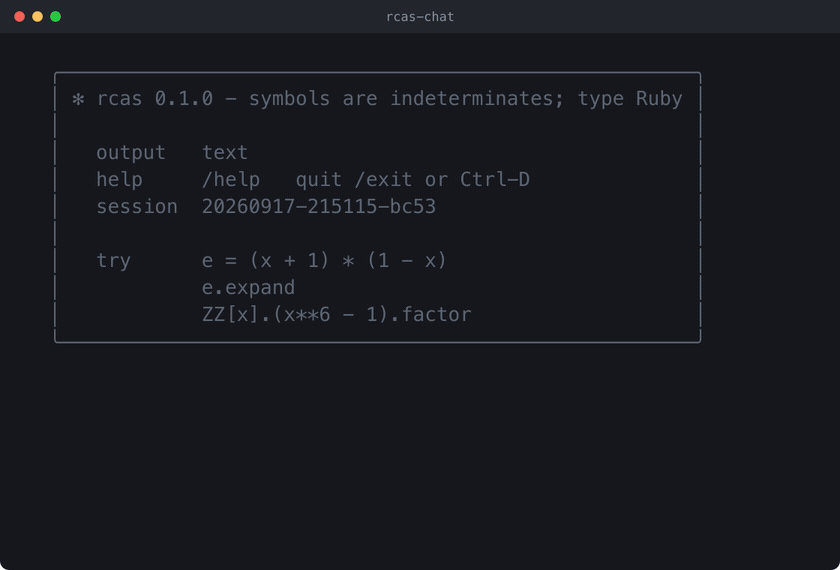

<p align="center">
  <br>
  <em>Computer Algebra To Fiddle Around With</em>™
</p>

# rcas

A computer algebra system that lives inside Ruby. Symbols are indeterminates,
the ordinary operators build expression trees, and irb is the REPL:

```
$ bin/rcas
rcas> e = (x + 1) * (1 - x)
=> (x + 1)*(1 - x)
rcas> e.expand
=> 1 - x**2
rcas> integrate(exp(x) * sin(x), x)
=> -(cos(x)*exp(x))/2 + exp(x)*sin(x)/2
rcas> solve(x**2 - 2, x)
=> [-2**(1/2), 2**(1/2)]
```

A minute of it, from exact arithmetic to typeset answers:

<p align="center">
  
</p>

The longer tour through everything rcas can do is an eight-minute video,
[on YouTube](https://youtu.be/cdB88qxeqL8); the file itself is
[rcas-tour.mp4](https://github.com/no-dashes/rcas/releases/download/screencasts/rcas-tour.mp4),
kept with the releases rather than in the repository, so a clone stays small.
Both are built from a script of input lines by
[tools/screencast](tools/screencast) - the script is replayed against a real
session, so what you see is what rcas prints.

Every function explains itself, with the mathematics, the method and the
sources it follows:

```
rcas> doc(:factor)
factor(obj, extension: nil, recombination: nil)
  factor(x**2 - 1), factor(360), factor(f, extension: sqrt(2)); recombination: :van_hoeij, :zassenhaus or :auto
  also: e.factor
  maths: Write a polynomial as a unit times powers of irreducible factors,
         over the integers or rationals (or an algebraic extension), or an
         integer as a product of primes. The factorization is unique.
  method: Squarefree decomposition [Yun76], factoring modulo a prime by
          Cantor-Zassenhaus [CZ81], Hensel lifting of that factorization
          and recombination - by subsets [Zas69], or for many modular
          factors by van Hoeij's lattice [vHo02]; ...
  sources: [Yun76] D. Y. Y. Yun, On square-free decomposition algorithms,
           Proc. SYMSAC '76, ACM 1976, 26-35.
           https://doi.org/10.1145/800205.806320
           ...
```

This file covers installation and getting a session running. Everything
about *using* rcas, from expressions and calculus to polynomial rings,
finite fields, linear algebra and differential equations, is in
[MANUAL.md](MANUAL.md), whose transcripts are checked by the test suite.
What rcas does *not* do is listed in
[MANUAL.md, What is not implemented](MANUAL.md#what-is-not-implemented);
how it is built and how it compares with Sage, SymPy, MuPAD and Maxima is
in [DESIGN.md](DESIGN.md). How it was made, and how it was checked, is at
the [end of this file](#how-and-why).

## Requirements

- Ruby 3.3 or newer (developed on 3.3.10; the suite also passes under
  4.0, whose default parser is Prism). No gems are needed for the core
  library or `bin/rcas`; everything is standard library.
- Big-number performance benefits from a Ruby built with GMP
  (`ruby -e 'p Integer::GMP_VERSION'` shows whether yours is); factoring
  large polynomials is noticeably slower without it.

Optional, only for the typeset output and the chat front end:

- Plots need nothing: `plot(sin(x))` draws in any terminal, `plot3d(x*y, x:
  -2..2, y: -2..2)` draws a surface in one, and `save("f.svg")` writes a
  picture. `plot(...).to_png` and `show` use the same Chrome as below.
- The window front end `bin/rcas-app` borrows a browser engine instead of
  shipping one: it needs a Google Chrome, Chromium, Brave or Microsoft Edge
  on the machine (`RCAS_BROWSER` names another), and `npm install` for the
  KaTeX it typesets with. Nothing is bundled and nothing goes over the
  network; see MANUAL.md, Appendix C.
- Typeset pictures (`show`, `to_png`, and `bin/rcas-chat`): either `node`
  plus `npm install` in the project directory (fetches KaTeX, see
  `package.json`) and a local Google Chrome / Chromium, or a TeX
  installation with `latex` and `dvipng`. Pictures display inline in iTerm2.
- Optional and off unless you set it up: with the `anthropic` gem and
  credentials in `ANTHROPIC_API_KEY` (or a profile from `ant auth login`),
  `bin/rcas-chat` also answers questions in plain language. Without them
  the chat is a plain CAS front end and shows nothing about it.

## Installing and running it

rcas is a gem with no dependencies beyond the Ruby it runs on (`irb` and
`bigdecimal` are named because Ruby 3.4 and later bundle them rather than
build them in):

```
$ gem build rcas.gemspec && gem install ./rcas-0.2.0.gem
$ rcas              # the same three programs as below, on your PATH
```

or run it from a checkout, which is what the rest of this file assumes:

```
$ git clone https://github.com/no-dashes/rcas && cd rcas
$ bin/rcas          # irb with rcas loaded: bare names are variables
$ bin/rcas-chat     # terminal front end with typeset output
$ bin/rcas-app      # a window: a worksheet of In/Out cells (--install for the Dock)
```

Inside `bin/rcas`, an undefined bare name such as `x` (or `α`, `β₁`: any
Ruby identifier) becomes the indeterminate `:x`, the functions (`sin`,
`integrate`, `solve`, ...) and the constants (`PI`/`π`, `E`, `I`, `oo`/`∞`,
`NN ZZ QQ RR CC`) are in scope, and `hold { ... }` keeps input unevaluated. See MANUAL.md, "Sessions and
setup", for the details.

**Caveat.** This is otherwise a plain irb, with one deliberate departure:
Kernel's printers `p`, `pp`, `j` and `jj` are undefined in the session so
that `p` can be an indeterminate (a prime, say). Print with `puts`, `print`
or `Kernel.p(expr)` instead. The same holds in `bin/rcas-chat`.

## Using the library from Ruby

```ruby
require "rcas"

e = (:x + 1) * (1 - :x)          # symbols are indeterminates
e.expand                         # => 1 - x**2
RCAS.integrate(RCAS.sin(:x), :x) # => -cos(x)

include RCAS::Functions          # bare sin, integrate, solve, ...
include RCAS::Sets               # NN ZZ QQ RR CC
include RCAS::Constants          # PI E I OO
```

`lib/rcas.rb` is the only entry point; it requires the rest of `lib/rcas/`.

## Files and settings

rcas itself keeps no state. `bin/rcas-chat` and `bin/rcas-app` write to
`~/.rcas` (another directory with `RCAS_HOME`):

| path | contents |
|---|---|
| `~/.rcas/settings.json` | your defaults: output mode, backend, scale, theme, wrap width, model, fallbacks |
| `~/.rcas/sessions/*.json` | one file per chat session: transcript, conversation with Claude and the session's settings, saved after every input (`RCAS_SESSION_DIR` moves the directory) |
| `~/.rcas/history` | the input history of the chat prompt |
| `~/.rcas/app/` | the browser profile of the `bin/rcas-app` window, so that it is a separate process from your browsing |
| `/tmp/rcas/` | pictures of typeset output while a session runs; a session deletes the pictures it created when it ends (`RCAS_CACHE_DIR` moves the directory) |

Defaults are changed in four ways, in increasing precedence:
`~/.rcas/settings.json`, environment variables, command-line flags, and
`/` commands inside a session, which are also remembered in that
session's file and restored by `--resume`. The easiest way to fill
`settings.json` is to set things up in a session and run `/settings save`;
`/settings` shows the values in force and what the file says, `/settings
reset` deletes the file. The file is plain JSON:

```json
{
  "output": "latex",
  "backend": "katex",
  "scale": 1.5,
  "theme": "dark",
  "plotstyle": "image"
}
```

| setting | environment | flag | in the session |
|---|---|---|---|
| output mode: `text`, `tex` (picture only), `both`, `latex` (text + source). Default: `both` in iTerm2 when a renderer is installed, `text` otherwise | `RCAS_TEX_INLINE=0` forces text | `--output=MODE`, `--tex`, `--no-tex` | `/output MODE` |
| typesetting backend `katex` or `latex` (default: whichever is installed, KaTeX first) | `RCAS_TEX_BACKEND` | `--backend=katex\|latex` | `/backend katex\|latex` |
| picture zoom, colour theme | `RCAS_TEX_SCALE`, `RCAS_TEX_THEME=light\|dark` | | `/scale N`, `/theme dark\|light` |
| how plots are shown: `text` (braille art, the default) or `image` (a picture, where the terminal and Chrome allow it) | `RCAS_PLOT_STYLE` | | `/plotstyle text\|image` |
| print `ℤ`, `π`, `∞` instead of `ZZ`, `pi`, `oo` (off by default) | `RCAS_UNICODE=1` | | `/unicode on\|off` |
| number the session's lines in the prompt, `rcas[3]> ` (on by default; `In[3]` and `Out[3]` work either way) | `RCAS_NUMBERED=0` turns it off | | `/numbered on\|off` |
| line width for wrapping long results (default: terminal width) | `RCAS_TEX_WRAP`, `COLUMNS` | | |
| plain-language questions (optional, see above): credentials | `ANTHROPIC_API_KEY` or `ANTHROPIC_AUTH_TOKEN` | | |
| their model (default `claude-opus-5`) and server-side fallback on refusal; settings keys `model`, `fallbacks` | `RCAS_MODEL`, `RCAS_FALLBACKS=0` | `--model ID` | `/model ID`, `/fallbacks on\|off` |
| helper binaries for KaTeX rendering | `RCAS_NODE`, `RCAS_CHROME`, `RCAS_KATEX_DIR` | | |
| colours off | `NO_COLOR` | `--no-color` | |
| location of settings, history and sessions | `RCAS_HOME` (default `~/.rcas`) | | |

Everything in the first column except colours and the KaTeX helpers can be
stored in `settings.json` under the keys `output`, `backend`, `scale`,
`theme`, `wrap`, `plotstyle`, `unicode`, `numbered`, `model`, `fallbacks`.

Sessions: `-c` / `--continue` reopens the most recent one, `-r` / `--resume`
opens a picker, `--resume NAME` (or an id prefix, or a list number) goes
straight to one; inside a session `/sessions`, `/rename NAME`, `/save FILE`
and `/reset`. The full command list is in MANUAL.md, Appendix B.

## Tests

```
$ ruby -S rake
```

runs the whole suite, including `test/manual_test.rb`, which executes every
`rcas>` transcript in MANUAL.md and compares the printed results. The task
sets `RCAS_STRICT=1`: where the library catches an error to answer "not
decided here", a `NoMethodError` or `NameError` is re-raised instead,
because that is a bug and not mathematics. Set it yourself when running a
single file (`RCAS_STRICT=1 ruby -Ilib -Itest test/solve_test.rb`).

The core suite needs nothing beyond the standard library. A few tests
drive optional parts and skip, with the reason, when those are missing:
the chat tests that script a Claude conversation need the `anthropic`
gem, `test/js/app_race.js` (the worksheet's Enter key, run against the
real `app.js`) needs `node`, and the parser test needs Ruby 3.4 or later.

## Documentation

- [MANUAL.md](MANUAL.md): the user manual, with a table of contents,
  worked examples for every feature, a reference of functions, the
  [list of what is not implemented](MANUAL.md#what-is-not-implemented),
  and appendices on typeset output, `rcas-chat` and `rcas-app`.
- [DESIGN.md](DESIGN.md): the design - what `==` means, when rcas
  rewrites, the canonical form, domains, how undecidable questions are
  handled, a comparison with Sage, SymPy, MuPAD and Maxima, and the
  invariants and algorithms behind it.
- [CITATION.cff](CITATION.cff): how to cite rcas; `LICENSE`: MIT.

## How and why?

I did some research in computer algebra, using MuPAD mostly. Since I left
university I always missed the topic, but never had the time to dig into
it again. And since I use ruby all the time, I considered implementing a
CAS core in ruby, but never got past the playing around stage.

With Claude, I now was able to outsource the nitty gritty details and only
focus on my ideas on *how* such a thing could be built. To be precise
about who did what:

- **Designed by me:** the shape of the system - a CAS that extends Ruby
  instead of inventing a language, with Ruby symbols as the indeterminates,
  Ruby operators building the trees and irb as the REPL; MuPAD's
  `hold`/`eval` and domains as values; honest unevaluated answers instead
  of guesses; the vocabulary; which features exist and in what order; and
  the decisions where computer algebra systems disagree (principal roots
  and `surd`, complete solutions over the complex numbers, Karr's
  convention for reversed sums, and the others in
  [DESIGN.md](DESIGN.md#settled-design-decisions)).
- **Generated by Claude:** almost all of the code, the tests and the
  manual, under that direction. 107 of the first 129 commits carry a
  Claude co-author line.
- **Checked by:** 1284 tests (`ruby -S rake`), with property checks
  where the mathematics offers one - an antiderivative is differentiated
  back, an ODE solution substituted, a closed-form sum evaluated at small
  n; the manual itself, whose 961 `rcas>` lines the suite runs and compares
  with the printed results line for line; rounds of outside review that
  went looking for wrong answers, where every counterexample was
  reproduced and now has a regression test of its own
  (`test/review*_test.rb`); and sources: every non-trivial algorithm names
  where it comes from in its code, and 87 of the 89 references in
  [MANUAL.md, section 4](MANUAL.md#4-sources) carry a link (a DOI for 25
  of them).

**Beware:** this is a personal project, not a verified system. It is
tested hard and it refuses rather than guesses where it can tell, but it
can still give wrong answers. Check anything that matters by a second
route.
